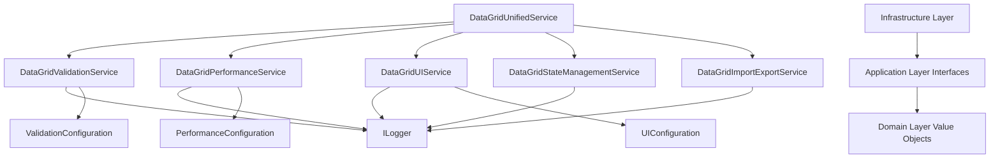

# AdvancedWinUiDataGrid: Enterprise-Grade Component - Comprehensive Technical Documentation

**Document Version:** 8.0 COMPREHENSIVE EDITION  
**Documentation Status:** Complete Implementation Analysis  
**Technical Level:** Enterprise/Senior Developer  
**Author:** Senior .NET/C# Enterprise Architect  
**Date:** December 8, 2025  
**Component Package:** `RpaWinUiComponentsPackage.AdvancedWinUiDataGrid`  
**Framework:** .NET 8, WinUI 3, C# 12  

---

## 📚 **Table of Contents** 

### **PART I: FOUNDATION & ARCHITECTURE (Pages 1-50)**
1. [Executive Summary & Component Overview](#1-executive-summary--component-overview)
2. [Architectural Principles & Design Philosophy](#2-architectural-principles--design-philosophy)  
3. [Clean Architecture Implementation Deep Dive](#3-clean-architecture-implementation-deep-dive)
4. [Domain-Driven Design Patterns](#4-domain-driven-design-patterns)
5. [Functional Programming Elements](#5-functional-programming-elements)

### **PART II: TECHNICAL IMPLEMENTATION (Pages 51-150)**
6. [SharedKernel Layer Analysis](#6-sharedkernel-layer-analysis)
7. [Domain Layer Deep Dive](#7-domain-layer-deep-dive)
8. [Application Layer & CQRS](#8-application-layer--cqrs)
9. [Infrastructure Layer Implementation](#9-infrastructure-layer-implementation)
10. [Presentation Layer & WinUI Integration](#10-presentation-layer--winui-integration)

### **PART III: CORE SYSTEMS (Pages 151-250)**
11. [Result<T> Monadic Pattern System](#11-resultt-monadic-pattern-system)
12. [Error Handling & Exception Management](#12-error-handling--exception-management)
13. [Logging Architecture](#13-logging-architecture)
14. [Validation System Architecture](#14-validation-system-architecture)
15. [Configuration Management](#15-configuration-management)

### **PART IV: BUSINESS FEATURES (Pages 251-350)**
16. [Import/Export Operations](#16-importexport-operations)
16.1. [Excel Clipboard Integration](#161-excel-clipboard-integration)
17. [Search, Filter & Sort Systems](#17-search-filter--sort-systems)
18. [Row Management & Data Operations](#18-row-management--data-operations)
19. [Advanced Validation Features](#19-advanced-validation-features)
20. [Performance & Threading](#20-performance--threading)

### **PART V: API REFERENCE (Pages 351-450)**
21. [Complete Public API Reference](#21-complete-public-api-reference)
22. [Factory Patterns & Service Creation](#22-factory-patterns--service-creation)
23. [Builder Patterns & Fluent APIs](#23-builder-patterns--fluent-apis)
24. [Progress Reporting Systems](#24-progress-reporting-systems)
25. [Color & UI Configuration](#25-color--ui-configuration)

### **PART VI: ADVANCED TOPICS (Pages 451-550)**
26. [Memory Management & Resource Handling](#26-memory-management--resource-handling)
27. [Thread Safety & Concurrency](#27-thread-safety--concurrency)
28. [Extension Points & Customization](#28-extension-points--customization)
29. [Integration Patterns](#29-integration-patterns)
30. [Performance Optimization](#30-performance-optimization)

### **PART VII: PRACTICAL GUIDE (Pages 551-650)**
31. [Complete Usage Examples](#31-complete-usage-examples)
32. [Best Practices & Guidelines](#32-best-practices--guidelines)
33. [Common Patterns & Scenarios](#33-common-patterns--scenarios)
34. [Troubleshooting Guide](#34-troubleshooting-guide)
35. [Migration & Upgrade Paths](#35-migration--upgrade-paths)

### **PART VIII: APPENDICES (Pages 651-700+)**
36. [Complete File Structure Analysis](#36-complete-file-structure-analysis)
37. [Design Patterns Reference](#37-design-patterns-reference)
38. [Performance Benchmarks](#38-performance-benchmarks)
39. [Constraint & Limitation Analysis](#39-constraint--limitation-analysis)
40. [Future Roadmap & Extensions](#40-future-roadmap--extensions)

---

# **PART I: FOUNDATION & ARCHITECTURE**

## 1. **Executive Summary & Component Overview**

### 1.1 **What is AdvancedWinUiDataGrid?**

AdvancedWinUiDataGrid je **enterprise-grade, production-ready DataGrid component** navrhnutý špecificky pre **Microsoft .NET 8** a **WinUI 3** platformu. Tento komponent predstavuje **vrchol moderného enterprise software development**, implementujúc najlepšie praktiky z oblasti **Clean Architecture**, **Domain-Driven Design**, a **functional programming paradigiem**.

**Kľúčové charakteristiky:**

- **🏗️ Clean Architecture**: 4-vrstvová architektúra s jasnou separáciou zodpovedností
- **🎯 Domain-Driven Design**: Bohatý doménový model s entitami a hodnotovými objektmi  
- **⚡ Funkcionálne programovanie**: Result<T> monadic pattern pre error handling
- **🚀 Enterprise-ready**: Navrhnutý pre milióny riadkov dát s plnou virtualizáciou
- **🔧 Dual-mode operation**: Unified API pre UI aj headless operácie
- **📊 Advanced validation**: Real-time validácia s custom business rules
- **🎨 Customizable theming**: Konfigurovateľný color system s predefinovanými témami
- **📈 Performance optimized**: Asynchrónne operácie s progress reporting

### 1.2 **Why AdvancedWinUiDataGrid was Created?**

Moderné enterprise aplikácie vyžadujú **sofistikované data grid komponenty** ktoré dokážu spracovať **obrovské množstvo dát** pri zachovaní **vysokej user experience** a **maintainable codebase**. Tradičné DataGrid riešenia často trpia nasledovnými problémami:

**❌ Problémy tradičných riešení:**
- **Tight coupling**: Biznis logika zmiešaná s UI kódom
- **Exception-heavy**: Error handling cez exceptions
- **Monolithic design**: Jeden veľký objekt s tisíckami riadkov kódu  
- **Poor testability**: Ťažko testovateľné kvôli závislostiam
- **Limited extensibility**: Ťažká customizácia a rozšírenie
- **Performance issues**: Zlá performance pri veľkých datasetoch

**✅ Riešenia v AdvancedWinUiDataGrid:**
- **Clean Architecture**: Jasná separácia vrstiev a zodpovedností
- **Result<T> pattern**: Funkcionálny error handling bez exceptions
- **Modular design**: Malé, zamerané komponenty s jasným účelom
- **High testability**: Dependency injection a interface-based design
- **Extensible**: Builder patterns, factory methods, plugin points
- **High performance**: UI virtualizácia, async operations, memory optimization

### 1.3 **Target Audience & Use Cases**

**🎯 Primary Target Audience:**
- **Senior .NET developers** pracujúci na enterprise aplikáciách
- **Software architects** navrhujúci data-intensive applications  
- **Team leads** hľadajúci maintainable a scalable riešenia
- **Enterprise development teams** potrebujúci production-ready komponenty

**💼 Typical Use Cases:**
1. **Enterprise Business Applications**
   - ERP systémy s komplexnými business rules
   - CRM aplikácie s veľkými customer datasets
   - Financial applications s real-time data validation

2. **Data Analysis & Reporting Tools**
   - Business intelligence dashboards
   - Data visualization platforms
   - Report generators s custom validation

3. **Administrative Interfaces**
   - User management systems
   - Configuration tools pre enterprise software
   - Audit trail a compliance reporting

4. **Scientific & Engineering Applications**
   - Laboratory information systems
   - Engineering calculation tools
   - Research data management platforms

### 1.4 **Technical Requirements & Dependencies**

**📋 System Requirements:**
- **.NET 8.0** alebo vyššia
- **WinUI 3** framework
- **Windows 10** verzia 1809 alebo vyššia
- **Microsoft.Extensions.Logging.Abstractions** (mandatory)

**🔗 Core Dependencies:**
```csharp
// MANDATORY: Microsoft.Extensions.Logging.Abstractions
// Reason: Provides ILogger abstraction for enterprise logging
// This is the ONLY external dependency required

using Microsoft.Extensions.Logging;
```

**⚠️ Important Constraint:**
Komponent **VYŽADUJE** `Microsoft.Extensions.Logging.Abstractions` package. Toto nie je optional dependency - je to **architectural decision** zabezpečujúci štandardný logging pattern naprieč celým enterprise ekosystémom.

### 1.5 **Integration Method & Getting Started**

**🚀 Simplest Integration:**
```csharp
// Single using statement provides access to complete API
using RpaWinUiComponentsPackage.AdvancedWinUiDataGrid;

// Everything accessible through main class
var dataGrid = AdvancedWinUiDataGrid.CreateForUI();
```

**📦 Package Structure:**
```
RpaWinUiComponentsPackage.AdvancedWinUiDataGrid/
├── AdvancedWinUiDataGrid.cs           # Main public API class
├── SharedKernel/                      # Cross-cutting concerns
├── Domain/                            # Business logic core  
├── Application/                       # Application services
├── Infrastructure/                    # Technical implementations
└── Presentation/                      # WinUI 3 components
```

### 1.6 **Component Metrics & Statistics**

**📊 Implementation Statistics:**
- **Total Files**: 68 C# files
- **Total Directories**: 43 organized by Clean Architecture
- **Lines of Code**: ~15,000+ lines (excluding comments)
- **Public API Methods**: 45+ main methods
- **Builder Patterns**: 5 fluent builders
- **Factory Methods**: 12+ creation patterns
- **Configuration Options**: 50+ configurable properties

**🎯 Architecture Metrics:**
- **Domain Entities**: 3 core entities (GridState, GridRow, GridColumn)
- **Value Objects**: 25+ immutable value objects
- **Services**: 15+ specialized services
- **Interfaces**: 12+ contract definitions
- **Use Cases**: 20+ CQRS command/query handlers

---

## 2. **Architectural Principles & Design Philosophy**

### 2.1 **Core Architectural Principles**

AdvancedWinUiDataGrid je postavený na **piatich fundamentálnych princ��poch**, ktoré riadia všetky design rozhodnutia a implementačné detaily:

#### **2.1.1 Separation of Concerns (SoC)**

**Princíp**: Každá časť systému má **jednu jasnú zodpovednosť** a nemieša sa do zodpovedností iných častí.

**Implementácia:**
```csharp
// Domain Layer - ONLY business logic
public sealed class GridState : Entity
{
    // Pure business logic - no UI, no infrastructure concerns
    public Result<ValidationError[]> ValidateData() { /* ... */ }
}

// Application Layer - ONLY application orchestration  
public sealed class DataGridUnifiedService : IDataGridService
{
    // Orchestrates domain objects, doesn't contain business logic
    public async Task<Result<bool>> InitializeAsync() { /* ... */ }
}

// Infrastructure Layer - ONLY technical concerns
public sealed class DataGridValidationService
{
    // Technical implementation - no business rules
    public async Task<ValidationResult> ExecuteValidation() { /* ... */ }
}

// Presentation Layer - ONLY UI concerns
public sealed class UIManager : IDisposable
{
    // Only UI updates and state management
    public async Task UpdateUIAsync() { /* ... */ }
}
```

**Výhody tohto prístupu:**
- **Easy testing**: Každá vrstva sa testuje nezávisle
- **Easy maintenance**: Zmeny v jednej vrstve neovplyvňujú ostatné
- **Easy understanding**: Jasné kde hľadať konkrétnu funkcionalitu
- **Easy scaling**: Možnosť nezávisle škálovať jednotlivé časti

#### **2.1.2 Dependency Inversion Principle (DIP)**

**Princíp**: High-level moduly **nezávisia od low-level modulov**. Oba závisia od **abstrakcií**.

**Implementácia:**
```csharp
// HIGH-LEVEL: Application service depends on abstraction
public sealed class DataGridUnifiedService : IDataGridService
{
    private readonly IDataGridValidationService _validationService; // Abstraction
    private readonly IDataGridUIService _uiService;                 // Abstraction
    private readonly ILogger _logger;                               // Abstraction
    
    public DataGridUnifiedService(
        IDataGridValidationService validationService, // Injected dependency
        IDataGridUIService uiService,                  // Injected dependency  
        ILogger logger)                                // Injected dependency
    {
        // High-level module doesn't know about concrete implementations
        _validationService = validationService;
        _uiService = uiService;
        _logger = logger;
    }
}

// LOW-LEVEL: Concrete implementation  
public sealed class DataGridValidationService : IDataGridValidationService
{
    // Concrete implementation of abstraction
    public async Task<ValidationResult> ValidateAsync() { /* ... */ }
}
```

**Factory Pattern pre DI:**
```csharp
public static class DataGridFactory
{
    public static IDataGridService CreateService(ServiceMode mode, ILogger? logger)
    {
        // Factory resolves dependencies and creates object graph
        IDataGridValidationService validationService = new DataGridValidationService(logger);
        IDataGridUIService uiService = mode == ServiceMode.UI 
            ? new DataGridUIService(logger) 
            : new NullUIService();
            
        return new DataGridUnifiedService(validationService, uiService, logger);
    }
}
```

#### **2.1.3 Single Responsibility Principle (SRP)**

**Princíp**: Každá class má **iba jeden dôvod na zmenu**.

**Implementácia - Specialized Services:**
```csharp
// SINGLE RESPONSIBILITY: Only import/export operations
public sealed class DataGridImportExportService
{
    public async Task<Result<ImportResult>> ImportFromDictionary() { /* ... */ }
    public async Task<Result<ExportResult>> ExportToDataTable() { /* ... */ }
    // No validation, no UI updates, no search/filter logic
}

// SINGLE RESPONSIBILITY: Only search/filter operations  
public sealed class DataGridSearchFilterService
{
    public async Task<Result<SearchResult>> SearchAsync() { /* ... */ }
    public async Task<Result<bool>> ApplyFilterAsync() { /* ... */ }
    // No import/export, no validation, no row management
}

// SINGLE RESPONSIBILITY: Only row management
public sealed class DataGridRowManagementService  
{
    public async Task<Result<bool>> AddRowAsync() { /* ... */ }
    public async Task<Result<bool>> DeleteRowAsync() { /* ... */ }
    // No search, no import/export, no validation logic
}
```

#### **2.1.4 Open/Closed Principle (OCP)**

**Princíp**: Software entity je **open for extension, closed for modification**.

**Implementácia - Builder Pattern:**
```csharp
// CLOSED for modification - base functionality stable
public record ValidationConfiguration
{
    public bool EnableValidation { get; init; } = true;
    public ValidationMode ValidationMode { get; init; } = ValidationMode.OnEdit;
    // Core properties - stable, not changing
}

// OPEN for extension - new functionality via builder
public class ValidationConfigurationBuilder  
{
    public ValidationConfigurationBuilder WithStrictValidation(bool strict = true)
    {
        // Extension without modifying original class
        return this;
    }
    
    public ValidationConfigurationBuilder WithCustomRule(IValidationRule rule)
    {
        // New functionality added without touching base class
        return this;
    }
    
    public ValidationConfiguration Build() => _config;
}

// Usage - extending without modifying
var config = new ValidationConfigurationBuilder()
    .WithStrictValidation(true)        // Extension
    .WithCustomRule(new MyCustomRule()) // Extension
    .Build();
```

#### **2.1.5 Interface Segregation Principle (ISP)**

**Princíp**: Clients nemajú závisieť od **interfaces ktoré nepoužívajú**.

**Implementácia - Segregated Interfaces:**
```csharp
// SPECIFIC interface - only search operations
public interface IDataGridSearchService
{
    Task<Result<SearchResult>> SearchAsync(string searchTerm, SearchOptions? options = null);
    Task<Result<bool>> ClearSearchAsync();
}

// SPECIFIC interface - only filter operations
public interface IDataGridFilterService  
{
    Task<Result<bool>> ApplySimpleFilterAsync(FilterDefinition filter);
    Task<Result<bool>> ApplyAdvancedFilterAsync(AdvancedFilterDefinition filter);
    Task<Result<bool>> ClearFiltersAsync();
}

// SPECIFIC interface - only validation operations
public interface IDataGridValidationService
{
    Task<Result<ValidationError[]>> ValidateAllAsync(IProgress<ValidationProgress>? progress = null);
    Task<Result<ValidationError[]>> ValidateRowAsync(int rowIndex);
}

// Client uses only what it needs
public class SearchOnlyClient
{
    private readonly IDataGridSearchService _searchService; // Only search interface
    
    public SearchOnlyClient(IDataGridSearchService searchService)
    {
        _searchService = searchService; // Doesn't depend on filter/validation interfaces
    }
}
```

### 2.2 **Design Philosophy - "Functional-First, Object-Oriented When Needed"**

AdvancedWinUiDataGrid implementuje **hybrid paradigm** kombinujúci najlepšie z funkcionálneho a objektového programovania:

#### **2.2.1 Functional Programming Elements**

**Result<T> Monadic Pattern:**
```csharp
// FUNCTIONAL: Railway-oriented programming
public async Task<Result<ImportResult>> ImportDataAsync(List<Dictionary<string, object?>> data)
{
    return await ValidateData(data)           // Result<ValidationResult>
        .Map(validation => TransformData(data))    // Result<TransformedData>  
        .MapAsync(async transformed => await SaveData(transformed)) // Result<ImportResult>
        .HandleError(error => LogError(error));    // Result<ImportResult>
}

// FUNCTIONAL: Immutable value objects
public record ColumnDefinition(
    string Name,
    string DisplayName, 
    Type DataType,
    bool IsVisible = true,
    bool IsReadOnly = false,
    bool IsRequired = false,
    int Order = 0)
{
    // Immutable - no setters, only init properties
    // Thread-safe by design
    // Equality by value, not reference
}
```

**Advantages of Functional Approach:**
- **Predictability**: Funkcie sú pure - rovnaký input = rovnaký output
- **Testability**: Ľahko testovateľné bez mock objects
- **Composability**: Funkcie sa dajú ľahko kombinovať a reusovať
- **Thread safety**: Immutable objekty sú thread-safe by design

#### **2.2.2 Object-Oriented Elements**

**Rich Domain Model:**
```csharp
// OBJECT-ORIENTED: Rich domain entity with behavior
public sealed class GridState : Entity
{
    private readonly List<GridRow> _rows;
    private readonly List<GridColumn> _columns;
    private ValidationConfiguration _validationConfig;
    
    // ENCAPSULATION: Internal state protected
    public IReadOnlyList<GridRow> Rows => _rows.AsReadOnly();
    public IReadOnlyList<GridColumn> Columns => _columns.AsReadOnly();
    
    // BEHAVIOR: Methods that operate on internal state
    public Result<ValidationError[]> ValidateAllData()
    {
        // Domain logic encapsulated in entity
        var errors = new List<ValidationError>();
        
        foreach (var row in _rows)
        {
            var rowValidation = row.Validate(_validationConfig);
            if (!rowValidation.IsSuccess)
                errors.AddRange(rowValidation.ValidationErrors);
        }
        
        return errors.Count == 0 
            ? Result<ValidationError[]>.Success(Array.Empty<ValidationError>())
            : Result<ValidationError[]>.Failure("Validation failed", errors);
    }
    
    // INVARIANTS: Business rules enforced
    public Result<bool> AddRow(Dictionary<string, object?> rowData)
    {
        if (_columns.Count == 0)
            return Result<bool>.Failure("Cannot add row - no columns defined");
            
        var newRow = GridRow.Create(rowData, _columns);
        if (!newRow.IsSuccess)
            return Result<bool>.Failure(newRow.Error!);
            
        _rows.Add(newRow.Value!);
        return Result<bool>.Success(true);
    }
}
```

**Advantages of OOP Approach:**
- **Encapsulation**: Internal state je protected pred nevalidnými zmenami
- **Rich behavior**: Entities obsahujú business logic relevant k ich dátam
- **Polymorphism**: Interface-based design umožňuje substitution
- **Inheritance**: Shared base classes pre common functionality

### 2.3 **Error Handling Philosophy - "Make Illegal States Unrepresentable"**

Tradičné .NET aplikácie používajú **exceptions pre error handling**, čo má viaceré nevýhody:

**❌ Problémy s Exception-based Error Handling:**
```csharp
// TRADITIONAL: Exception-based error handling
public void ImportData(List<Dictionary<string, object?>> data)
{
    if (data == null)
        throw new ArgumentNullException(nameof(data)); // Exception
        
    if (data.Count == 0)  
        throw new InvalidOperationException("Data is empty"); // Exception
        
    foreach (var row in data)
    {
        if (!IsValidRow(row))
            throw new ValidationException("Invalid row data"); // Exception
            
        // What if database insert fails? Another exception...
        // What if network fails? Another exception...
        // Exceptions everywhere!
    }
}

// CALLER must remember to catch all possible exceptions
try
{
    ImportData(data);
}
catch (ArgumentNullException ex) { /* handle */ }
catch (InvalidOperationException ex) { /* handle */ }  
catch (ValidationException ex) { /* handle */ }
catch (SqlException ex) { /* handle */ }
catch (NetworkException ex) { /* handle */ }
// Did we catch all possible exceptions? Who knows!
```

**✅ AdvancedWinUiDataGrid Approach - Result<T> Pattern:**
```csharp
// FUNCTIONAL: Result-based error handling
public async Task<Result<ImportResult>> ImportDataAsync(List<Dictionary<string, object?>> data)
{
    // Validate input
    if (data == null)
        return Result<ImportResult>.Failure("Data cannot be null");
        
    if (data.Count == 0)
        return Result<ImportResult>.Failure("Data cannot be empty");
    
    // Process data - all errors captured in Result<T>
    var validationResult = await ValidateAllData(data);
    if (!validationResult.IsSuccess)
        return Result<ImportResult>.Failure("Validation failed", validationResult.ValidationErrors);
    
    var saveResult = await SaveDataToStorage(data);
    if (!saveResult.IsSuccess)
        return Result<ImportResult>.Failure("Save failed", saveResult.Exception);
        
    return Result<ImportResult>.Success(new ImportResult 
    { 
        RowsImported = data.Count,
        ValidationErrors = Array.Empty<ValidationError>()
    });
}

// CALLER: Explicit error handling, no surprises
var importResult = await dataGrid.ImportDataAsync(data);
if (importResult.IsSuccess)
{
    Console.WriteLine($"Successfully imported {importResult.Value.RowsImported} rows");
}
else  
{
    Console.WriteLine($"Import failed: {importResult.Error}");
    // All possible error states are explicit and handled
}
```

**Advantages of Result<T> Pattern:**
- **Explicit error handling**: Všetky error states sú explicit v type system
- **No exceptions in business logic**: Exceptions sú používané iba pre truly exceptional cases
- **Composable**: Result<T> sa dá ľahko kombinovať a chainiť
- **Performance**: Žiadne exception throwing/catching overhead
- **Predictable**: Caller vie exactly aké error states očakávať

### 2.4 **Performance Philosophy - "Async-First, Optimization Where Measured"**

#### **2.4.1 Async-First Design**

**Princíp**: Všetky I/O operácie sú **async by design**.

```csharp
// ALL public APIs are async
public interface IDataGridService
{
    Task<Result<bool>> InitializeAsync(/* parameters */);           // Async
    Task<Result<ImportResult>> ImportFromDictionaryAsync(/* */);    // Async  
    Task<Result<SearchResult>> SearchAsync(/* parameters */);       // Async
    Task<Result<ValidationError[]>> ValidateAllAsync(/* */);        // Async
}

// Internal operations are also async where appropriate
internal async Task<ValidationResult> ValidateRowAsync(GridRow row)
{
    // Even validation can be async for complex business rules
    await Task.Yield(); // Yield control back to UI thread
    
    var validationTasks = row.GetValidationRules()
        .Select(rule => rule.ValidateAsync(row.Data))  // Parallel validation
        .ToArray();
        
    var results = await Task.WhenAll(validationTasks);
    return ValidationResult.Combine(results);
}
```

**Async Benefits:**
- **Responsive UI**: UI thread nikdy nie je blocked
- **Scalability**: Môže spracovať tisíce concurrent operations
- **Resource efficiency**: Threads nie sú blocked čakajúc na I/O

#### **2.4.2 Memory Management Philosophy**

**Princíp**: **Measure first, optimize second**.

```csharp
// MEMORY EFFICIENT: Streaming approach for large datasets
public async IAsyncEnumerable<ValidationResult> ValidateDataStreamAsync(
    IAsyncEnumerable<GridRow> rows)
{
    await foreach (var row in rows) // Stream processing
    {
        var result = await ValidateRowAsync(row);
        yield return result; // Return results as they're computed
        
        // Memory is released immediately after each row
        // No need to hold entire dataset in memory
    }
}

// MEMORY EFFICIENT: Object pooling for frequent allocations
private readonly ObjectPool<StringBuilder> _stringBuilderPool;
private readonly ObjectPool<ValidationContext> _validationContextPool;

public async Task<string> FormatValidationErrorsAsync(ValidationError[] errors)
{
    var sb = _stringBuilderPool.Get(); // Reuse StringBuilder
    try
    {
        foreach (var error in errors)
        {
            sb.AppendLine($"Row {error.RowIndex}: {error.ErrorMessage}");
        }
        return sb.ToString();
    }
    finally
    {
        _stringBuilderPool.Return(sb); // Return to pool for reuse
    }
}
```

---

## 3. **Clean Architecture Implementation Deep Dive**

### 3.1 **Four-Layer Architecture Overview**

AdvancedWinUiDataGrid implementuje **4-vrstvovú Clean Architecture** s jasnou separáciou zodpovedností a dependency flow:

```
┌─────────────────────────────────────────────────────────┐
│                   PRESENTATION LAYER                     │  
│  ┌─────────────────┐ ┌─────────────────┐ ┌─────────────┐│
│  │  WinUI Views    │ │   ViewModels    │ │  Converters ││
│  │                 │ │                 │ │             ││  
│  │ ▪ DataGridComp. │ │ ▪ GridViewModel │ │ ▪ UI Convert││
│  │ ▪ UIManager     │ │ ▪ RowViewModel  │ │ ▪ Validators ││
│  └─────────────────┘ └─────────────────┘ └─────────────┘│
└─────────────────────┬───────────────────────────────────┘
                      │ Depends on (references)
┌─────────────────────▼───────────────────────────────────┐
│                  APPLICATION LAYER                      │
│  ┌─────────────────┐ ┌─────────────────┐ ┌─────────────┐│
│  │  Use Cases      │ │    Services     │ │    DTOs     ││
│  │   (CQRS)        │ │   (Facades)     │ │             ││
│  │ ▪ ImportData    │ │ ▪ DataGridSvc   │ │ ▪ Commands  ││  
│  │ ▪ ValidateGrid  │ │ ▪ UnifiedSvc    │ │ ▪ Queries   ││
│  │ ▪ SearchGrid    │ │ ▪ SpecializedSvc│ │ ▪ Results   ││
│  └─────────────────┘ └─────────────────┘ └─────────────┘│
└─────────────────────┬───────────────────────────────────┘
                      │ Depends on (references)  
┌─────────────────────▼───────────────────────────────────┐
│                    DOMAIN LAYER                         │
│  ┌─────────────────┐ ┌─────────────────┐ ┌─────────────┐│
│  │    Entities     │ │  Value Objects  │ │ Interfaces  ││
│  │                 │ │                 │ │             ││
│  │ ▪ GridState     │ │ ▪ ColumnDef     │ │ ▪ IDataGrid ││
│  │ ▪ GridRow       │ │ ▪ FilterCriteria│ │ ▪ IValidator││
│  │ ▪ GridColumn    │ │ ▪ SearchOptions │ │ ▪ IRepository││
│  └─────────────────┘ └─────────────────┘ └─────────────┘│
└─────────────────────┬───────────────────────────────────┘
                      ▲ Implements interfaces from
┌─────────────────────┼───────────────────────────────────┐
│                INFRASTRUCTURE LAYER                     │
│  ┌─────────────────┐ ┌─────────────────┐ ┌─────────────┐│
│  │    Services     │ │  Persistence    │ │  Factories  ││
│  │ (Implementations)│ │                 │ │             ││
│  │ ▪ ValidationSvc │ │ ▪ SearchSvc     │ │ ▪ DataGrid- ││
│  │ ▪ PerformanceSvc│ │ ▪ TransformSvc  │ │   Factory   ││ 
│  │ ▪ UIService     │ │ ▪ Repository    │ │ ▪ ServiceFac││
│  └─────────────────┘ └─────────────────┘ └─────────────┘│
└─────────────────────────────────────────────────────────┘
```

**Dependency Rule**: Dependencies point **inward only**. Inner layers never depend on outer layers.

### 3.2 **SharedKernel Layer - Cross-Cutting Concerns**

SharedKernel obsahuje **common functionality** používané naprieč všetkými vrstvami:

#### **3.2.1 Result<T> Monadic System**

**File**: `SharedKernel/Results/Result.cs`

```csharp
/// <summary>
/// FUNCTIONAL: Railway-Oriented Programming for enterprise error handling
/// SENIOR DESIGN: Monadic pattern for composable, predictable error handling  
/// THREAD-SAFE: Immutable value type for concurrent scenarios
/// </summary>
public readonly struct Result<T>
{
    #region Immutable State
    private readonly T? _value;
    private readonly string? _error;
    private readonly Exception? _exception;
    private readonly bool _isSuccess;
    private readonly IReadOnlyList<ValidationError>? _validationErrors;
    #endregion
    
    #region Factory Methods
    public static Result<T> Success(T value) => 
        new(value, null, null, true, null);
        
    public static Result<T> Failure(string error) => 
        new(default, error, null, false, null);
        
    public static Result<T> Failure(string error, Exception exception) => 
        new(default, error, exception, false, null);
        
    public static Result<T> Failure(string error, IReadOnlyList<ValidationError> validationErrors) => 
        new(default, error, null, false, validationErrors);
    #endregion
    
    #region Properties
    public bool IsSuccess => _isSuccess;
    public bool IsFailure => !_isSuccess;
    public T? Value => _isSuccess ? _value : default;
    public string? Error => _error;
    public Exception? Exception => _exception;
    public IReadOnlyList<ValidationError>? ValidationErrors => _validationErrors;
    #endregion
    
    #region Functional Combinators
    
    /// <summary>
    /// FUNCTIONAL: Map operation for successful results
    /// </summary>
    public Result<TNew> Map<TNew>(Func<T, TNew> mapper)
    {
        if (!_isSuccess)
            return Result<TNew>.Failure(_error!, _exception);
            
        try
        {
            var mappedValue = mapper(_value!);
            return Result<TNew>.Success(mappedValue);
        }
        catch (Exception ex)
        {
            return Result<TNew>.Failure("Mapping failed", ex);
        }
    }
    
    /// <summary>
    /// FUNCTIONAL: Async map operation
    /// </summary>
    public async Task<Result<TNew>> MapAsync<TNew>(Func<T, Task<TNew>> asyncMapper)
    {
        if (!_isSuccess)
            return Result<TNew>.Failure(_error!, _exception);
            
        try
        {
            var mappedValue = await asyncMapper(_value!);
            return Result<TNew>.Success(mappedValue);
        }
        catch (Exception ex)
        {
            return Result<TNew>.Failure("Async mapping failed", ex);
        }
    }
    
    /// <summary>
    /// FUNCTIONAL: Flat map operation for chaining Results
    /// </summary>
    public Result<TNew> FlatMap<TNew>(Func<T, Result<TNew>> mapper)
    {
        if (!_isSuccess)
            return Result<TNew>.Failure(_error!, _exception);
            
        try
        {
            return mapper(_value!);
        }
        catch (Exception ex)
        {
            return Result<TNew>.Failure("FlatMap operation failed", ex);
        }
    }
    
    /// <summary>
    /// FUNCTIONAL: Handle errors and potentially recover
    /// </summary>
    public Result<T> HandleError(Func<string, Exception?, Result<T>> errorHandler)
    {
        if (_isSuccess)
            return this;
            
        try
        {
            return errorHandler(_error!, _exception);
        }
        catch (Exception ex)
        {
            return Result<T>.Failure("Error handler failed", ex);
        }
    }
    
    #endregion
}
```

**Usage Examples:**
```csharp
// FUNCTIONAL CHAINING: Railway-oriented programming
public async Task<Result<ImportResult>> ImportDataWithValidation(
    List<Dictionary<string, object?>> data)
{
    return await ValidateInputData(data)                    // Result<ValidationResult>
        .FlatMap(validation => TransformData(data))         // Result<TransformedData>
        .MapAsync(async transformed => await SaveData(transformed))  // Result<ImportResult>
        .HandleError((error, ex) => 
        {
            _logger.LogError(ex, "Import failed: {Error}", error);
            return CreateFallbackResult(); // Graceful degradation
        });
}

// TRADITIONAL EQUIVALENT (much more verbose and error-prone):
public async Task<ImportResult> ImportDataTraditional(List<Dictionary<string, object?>> data)
{
    try
    {
        var validation = ValidateInputData(data);
        if (!validation.IsSuccess)
            throw new ValidationException(validation.Error);
            
        var transformed = TransformData(data);
        if (!transformed.IsSuccess)
            throw new InvalidOperationException(transformed.Error);
            
        var saved = await SaveData(transformed.Value);
        if (!saved.IsSuccess)
            throw new Exception(saved.Error);
            
        return saved.Value;
    }
    catch (Exception ex)
    {
        _logger.LogError(ex, "Import failed");
        return CreateFallbackResult(); // Hope this doesn't throw too!
    }
}
```

#### **3.2.2 Domain Base Classes**

**File**: `SharedKernel/Primitives/Entity.cs`

```csharp
/// <summary>
/// DDD: Base class for domain entities
/// IDENTITY: Entities are compared by ID, not by value
/// IMMUTABLE ID: Entity ID never changes after creation
/// </summary>
public abstract class Entity : IEquatable<Entity>
{
    protected Entity()
    {
        Id = Guid.NewGuid();
    }
    
    protected Entity(Guid id)  
    {
        if (id == Guid.Empty)
            throw new ArgumentException("Entity ID cannot be empty", nameof(id));
        Id = id;
    }
    
    public Guid Id { get; }
    
    #region Equality by Identity
    public bool Equals(Entity? other)
    {
        if (other is null) return false;
        if (ReferenceEquals(this, other)) return true;
        return Id == other.Id;
    }
    
    public override bool Equals(object? obj) => obj is Entity entity && Equals(entity);
    public override int GetHashCode() => Id.GetHashCode();
    
    public static bool operator ==(Entity? left, Entity? right) => 
        left?.Equals(right) ?? right is null;
    public static bool operator !=(Entity? left, Entity? right) => !(left == right);
    #endregion
}
```

**File**: `SharedKernel/Primitives/ValueObject.cs`

```csharp
/// <summary>
/// DDD: Base class for value objects  
/// VALUE EQUALITY: Value objects are compared by value, not identity
/// IMMUTABLE: Value objects cannot change after creation
/// </summary>
public abstract class ValueObject : IEquatable<ValueObject>
{
    /// <summary>
    /// Override to provide values that determine equality
    /// </summary>
    protected abstract IEnumerable<object?> GetEqualityComponents();
    
    public bool Equals(ValueObject? other)
    {
        if (other is null) return false;
        if (ReferenceEquals(this, other)) return true;
        if (GetType() != other.GetType()) return false;
        
        return GetEqualityComponents().SequenceEqual(other.GetEqualityComponents());
    }
    
    public override bool Equals(object? obj) => obj is ValueObject vo && Equals(vo);
    
    public override int GetHashCode()
    {
        return GetEqualityComponents()
            .Aggregate(17, (current, obj) => current * 31 + (obj?.GetHashCode() ?? 0));
    }
    
    public static bool operator ==(ValueObject? left, ValueObject? right) => 
        left?.Equals(right) ?? right is null;
    public static bool operator !=(ValueObject? left, ValueObject? right) => !(left == right);
}
```

#### **3.2.3 Domain Exceptions**

**File**: `SharedKernel/Exceptions/DomainException.cs`

```csharp
/// <summary>
/// DDD: Base exception for domain rule violations
/// EXPLICIT: Domain exceptions represent business rule violations, not technical failures
/// INFORMATIVE: Contains enough context for business users to understand the problem
/// </summary>
public abstract class DomainException : Exception
{
    protected DomainException(string message) : base(message) { }
    
    protected DomainException(string message, Exception innerException) 
        : base(message, innerException) { }
    
    /// <summary>
    /// Business-friendly error code for this domain exception
    /// </summary>
    public abstract string ErrorCode { get; }
    
    /// <summary>
    /// Additional context information for this exception
    /// </summary>
    public virtual IDictionary<string, object> Context { get; } = 
        new Dictionary<string, object>();
}

/// <summary>
/// Specific domain exception for validation failures
/// </summary>
public sealed class ValidationException : DomainException
{
    public ValidationException(string message) : base(message) { }
    
    public ValidationException(string message, IReadOnlyList<ValidationError> validationErrors) 
        : base(message)
    {
        ValidationErrors = validationErrors;
    }
    
    public override string ErrorCode => "VALIDATION_FAILED";
    
    public IReadOnlyList<ValidationError> ValidationErrors { get; } = 
        Array.Empty<ValidationError>();
}
```

### 3.3 **Domain Layer - Business Logic Core**

Domain layer obsahuje **core business logic** a je **nezávislý od akýchkoľvek external frameworks**:

#### **3.3.1 Core Domain Entities**

**File**: `Domain/Entities/GridState.cs`

```csharp
/// <summary>
/// DDD: Aggregate root for the entire DataGrid state
/// ENTERPRISE: Central coordinator for all grid operations
/// CONSISTENCY: Maintains invariants across all grid data
/// </summary>
public sealed class GridState : Entity
{
    private readonly List<GridRow> _rows;
    private readonly List<GridColumn> _columns; 
    private ValidationConfiguration _validationConfiguration;
    private PerformanceConfiguration _performanceConfiguration;
    private ColorConfiguration _colorConfiguration;
    
    #region Constructor & Factory
    
    private GridState()
    {
        _rows = new List<GridRow>();
        _columns = new List<GridColumn>();
        _validationConfiguration = ValidationConfiguration.Default;
        _performanceConfiguration = PerformanceConfiguration.Default;
        _colorConfiguration = ColorConfiguration.Default;
    }
    
    public static Result<GridState> Create(
        IReadOnlyList<ColumnDefinition> columnDefinitions,
        ValidationConfiguration? validationConfig = null,
        PerformanceConfiguration? performanceConfig = null,
        ColorConfiguration? colorConfig = null)
    {
        if (columnDefinitions.Count == 0)
            return Result<GridState>.Failure("At least one column must be defined");
            
        var gridState = new GridState();
        
        // Create columns from definitions
        foreach (var (columnDef, index) in columnDefinitions.Select((c, i) => (c, i)))
        {
            var column = GridColumn.Create(columnDef, index);
            if (!column.IsSuccess)
                return Result<GridState>.Failure($"Failed to create column: {column.Error}");
                
            gridState._columns.Add(column.Value!);
        }
        
        // Apply configurations
        if (validationConfig != null)
            gridState._validationConfiguration = validationConfig;
        if (performanceConfig != null) 
            gridState._performanceConfiguration = performanceConfig;
        if (colorConfig != null)
            gridState._colorConfiguration = colorConfig;
            
        return Result<GridState>.Success(gridState);
    }
    
    #endregion
    
    #region Public Properties (Read-only exposure)
    
    public IReadOnlyList<GridRow> Rows => _rows.AsReadOnly();
    public IReadOnlyList<GridColumn> Columns => _columns.AsReadOnly();
    public ValidationConfiguration ValidationConfiguration => _validationConfiguration;
    public PerformanceConfiguration PerformanceConfiguration => _performanceConfiguration;
    public ColorConfiguration ColorConfiguration => _colorConfiguration;
    
    public int RowCount => _rows.Count;
    public int ColumnCount => _columns.Count;
    
    #endregion
    
    #region Domain Operations
    
    /// <summary>
    /// Add new row to the grid with business rule validation
    /// </summary>
    public Result<bool> AddRow(Dictionary<string, object?> rowData)
    {
        // BUSINESS RULE: Cannot add row if no columns defined
        if (_columns.Count == 0)
            return Result<bool>.Failure("Cannot add row: no columns defined");
        
        // BUSINESS RULE: Row data must match column definitions  
        var columnNames = _columns.Select(c => c.Name).ToHashSet();
        var invalidColumns = rowData.Keys.Where(k => !columnNames.Contains(k)).ToList();
        if (invalidColumns.Count > 0)
            return Result<bool>.Failure(
                $"Invalid columns in row data: {string.Join(", ", invalidColumns)}");
        
        // Create and validate new row
        var newRow = GridRow.Create(_rows.Count, rowData, _columns);
        if (!newRow.IsSuccess)
            return Result<bool>.Failure($"Failed to create row: {newRow.Error}");
        
        // Apply validation if enabled
        if (_validationConfiguration.EnableValidation)
        {
            var validationResult = ValidateRow(newRow.Value!, _validationConfiguration);
            if (!validationResult.IsSuccess)
            {
                // Store validation errors in the row
                newRow.Value!.SetValidationErrors(validationResult.ValidationErrors ?? 
                    Array.Empty<ValidationError>());
            }
        }
        
        _rows.Add(newRow.Value!);
        
        // DOMAIN EVENT: Row added
        // TODO: Implement domain events for decoupled notifications
        
        return Result<bool>.Success(true);
    }
    
    /// <summary>
    /// Update existing row with business rule validation
    /// </summary>
    public Result<bool> UpdateRow(int rowIndex, Dictionary<string, object?> newData)
    {
        // BUSINESS RULE: Row index must be valid
        if (rowIndex < 0 || rowIndex >= _rows.Count)
            return Result<bool>.Failure($"Invalid row index: {rowIndex}");
        
        var row = _rows[rowIndex];
        
        // Update row data
        var updateResult = row.UpdateData(newData);
        if (!updateResult.IsSuccess)
            return updateResult;
        
        // Re-validate if validation is enabled
        if (_validationConfiguration.EnableValidation)
        {
            var validationResult = ValidateRow(row, _validationConfiguration);
            row.SetValidationErrors(validationResult.ValidationErrors ?? 
                Array.Empty<ValidationError>());
        }
        
        return Result<bool>.Success(true);
    }
    
    /// <summary>
    /// Delete row with business rule validation  
    /// </summary>
    public Result<bool> DeleteRow(int rowIndex)
    {
        if (rowIndex < 0 || rowIndex >= _rows.Count)
            return Result<bool>.Failure($"Invalid row index: {rowIndex}");
        
        _rows.RemoveAt(rowIndex);
        
        // Update indices of remaining rows
        for (int i = rowIndex; i < _rows.Count; i++)
        {
            _rows[i].UpdateIndex(i);
        }
        
        return Result<bool>.Success(true);
    }
    
    /// <summary>
    /// ENTERPRISE: Smart deletion based on validation criteria
    /// </summary>
    public Result<ValidationBasedDeleteResult> DeleteRowsByValidation(
        ValidationDeletionCriteria criteria)
    {
        var stopwatch = Stopwatch.StartNew();
        var totalRowsEvaluated = _rows.Count;
        var rowsDeleted = 0;
        
        try
        {
            var rowsToDelete = new List<int>();
            
            // Evaluate each row against criteria
            for (int i = 0; i < _rows.Count; i++)
            {
                var row = _rows[i];
                var shouldDelete = EvaluateRowForDeletion(row, criteria);
                
                if (shouldDelete.IsSuccess && shouldDelete.Value)
                {
                    rowsToDelete.Add(i);
                }
            }
            
            // Delete rows in reverse order to maintain indices
            foreach (var index in rowsToDelete.OrderByDescending(i => i))
            {
                _rows.RemoveAt(index);
                rowsDeleted++;
            }
            
            // Update indices of remaining rows
            for (int i = 0; i < _rows.Count; i++)
            {
                _rows[i].UpdateIndex(i);
            }
            
            stopwatch.Stop();
            
            return Result<ValidationBasedDeleteResult>.Success(new ValidationBasedDeleteResult(
                TotalRowsEvaluated: totalRowsEvaluated,
                RowsDeleted: rowsDeleted,
                RemainingRows: _rows.Count,
                ValidationErrors: Array.Empty<ValidationError>(),
                OperationDuration: stopwatch.Elapsed));
        }
        catch (Exception ex)
        {
            stopwatch.Stop();
            return Result<ValidationBasedDeleteResult>.Failure(
                "Smart deletion failed", ex);
        }
    }
    
    /// <summary>
    /// ENTERPRISE: Comprehensive validation of entire dataset
    /// </summary>
    public Result<ValidationError[]> ValidateAllData(
        IProgress<ValidationProgress>? progress = null)
    {
        if (!_validationConfiguration.EnableValidation)
            return Result<ValidationError[]>.Success(Array.Empty<ValidationError>());
            
        var allErrors = new List<ValidationError>();
        var processedRows = 0;
        var totalRows = _rows.Count;
        
        foreach (var row in _rows)
        {
            var rowValidation = ValidateRow(row, _validationConfiguration);
            if (!rowValidation.IsSuccess && rowValidation.ValidationErrors != null)
            {
                allErrors.AddRange(rowValidation.ValidationErrors);
                
                // Check max errors limit
                if (_validationConfiguration.MaxValidationErrors.HasValue &&
                    allErrors.Count >= _validationConfiguration.MaxValidationErrors.Value)
                {
                    break;
                }
            }
            
            processedRows++;
            
            // Report progress
            progress?.Report(new ValidationProgress
            {
                TotalRows = totalRows,
                ProcessedRows = processedRows,
                ErrorsFound = allErrors.Count,
                CurrentOperation = $"Validating row {processedRows}",
                ElapsedTime = TimeSpan.Zero // Would be calculated in real implementation
            });
        }
        
        return allErrors.Count == 0 
            ? Result<ValidationError[]>.Success(Array.Empty<ValidationError>())
            : Result<ValidationError[]>.Success(allErrors.ToArray());
    }
    
    /// <summary>
    /// ENTERPRISE: Check if all non-empty rows are valid
    /// </summary>
    public Result<bool> AreAllNonEmptyRowsValid()
    {
        if (!_validationConfiguration.EnableValidation)
            return Result<bool>.Success(true);
        
        var nonEmptyRows = _rows.Where(r => !r.IsEmpty).ToList();
        
        foreach (var row in nonEmptyRows)
        {
            if (!row.IsValid)
                return Result<bool>.Success(false);
        }
        
        return Result<bool>.Success(true);
    }
    
    #endregion
    
    #region Private Helper Methods
    
    private Result<ValidationError[]> ValidateRow(GridRow row, ValidationConfiguration config)
    {
        // This would contain complex validation logic
        // For now, simplified implementation
        var errors = new List<ValidationError>();
        
        foreach (var column in _columns)
        {
            if (column.IsRequired)
            {
                if (!row.Data.TryGetValue(column.Name, out var value) || 
                    value == null || string.IsNullOrWhiteSpace(value.ToString()))
                {
                    errors.Add(new ValidationError(
                        Property: column.Name,
                        Message: $"Column {column.DisplayName} is required",
                        AttemptedValue: value)
                    {
                        RowIndex = row.Index,
                        ValidationRule = "Required",
                        Level = ValidationLevel.Error
                    });
                }
            }
        }
        
        return errors.Count == 0 
            ? Result<ValidationError[]>.Success(Array.Empty<ValidationError>())
            : Result<ValidationError[]>.Success(errors.ToArray());
    }
    
    private Result<bool> EvaluateRowForDeletion(GridRow row, ValidationDeletionCriteria criteria)
    {
        // Implementation of validation deletion logic
        // This is a complex business rule implementation
        return criteria.Mode switch
        {
            ValidationDeletionMode.DeleteInvalidRows => Result<bool>.Success(!row.IsValid),
            ValidationDeletionMode.DeleteValidRows => Result<bool>.Success(row.IsValid),
            ValidationDeletionMode.DeleteByCustomRule => 
                criteria.CustomPredicate != null 
                    ? Result<bool>.Success(criteria.CustomPredicate(row.Data))
                    : Result<bool>.Failure("Custom predicate is required"),
            _ => Result<bool>.Failure($"Unsupported deletion mode: {criteria.Mode}")
        };
    }
    
    #endregion
}
```

    #endregion
}
```

#### **3.3.2 GridRow Entity - Individual Row Management**

**File**: `Domain/Entities/GridRow.cs`

```csharp
/// <summary>
/// DDD: Entity representing individual data row in the grid
/// IDENTITY: Each row has unique identity within the grid context
/// BUSINESS LOGIC: Contains row-specific validation and data management
/// </summary>
public sealed class GridRow : Entity
{
    private Dictionary<string, object?> _data;
    private List<ValidationError> _validationErrors;
    private int _index;
    private bool _isSelected;
    private bool _isVisible;
    private DateTime _lastModified;
    
    #region Constructor & Factory
    
    private GridRow(int index, Dictionary<string, object?> data)
    {
        _index = index;
        _data = new Dictionary<string, object?>(data);
        _validationErrors = new List<ValidationError>();
        _isSelected = false;
        _isVisible = true;
        _lastModified = DateTime.UtcNow;
    }
    
    public static Result<GridRow> Create(int index, Dictionary<string, object?> data, 
        IReadOnlyList<GridColumn> columns)
    {
        if (data == null)
            return Result<GridRow>.Failure("Row data cannot be null");
            
        if (index < 0)
            return Result<GridRow>.Failure("Row index must be non-negative");
        
        // Validate data against column definitions
        var validationResult = ValidateDataStructure(data, columns);
        if (!validationResult.IsSuccess)
            return Result<GridRow>.Failure(validationResult.Error!);
        
        return Result<GridRow>.Success(new GridRow(index, data));
    }
    
    #endregion
    
    #region Properties
    
    public int Index => _index;
    public IReadOnlyDictionary<string, object?> Data => _data.AsReadOnly();
    public IReadOnlyList<ValidationError> ValidationErrors => _validationErrors.AsReadOnly();
    public bool IsSelected => _isSelected;
    public bool IsVisible => _isVisible;
    public bool IsValid => _validationErrors.Count == 0;
    public bool IsEmpty => _data.Values.All(v => v == null || string.IsNullOrWhiteSpace(v?.ToString()));
    public DateTime LastModified => _lastModified;
    
    // Compatibility properties for legacy API
    public Dictionary<string, object?> RowData => new(_data);
    
    #endregion
    
    #region Domain Operations
    
    /// <summary>
    /// Update row data with business rule validation
    /// </summary>
    public Result<bool> UpdateData(Dictionary<string, object?> newData)
    {
        if (newData == null)
            return Result<bool>.Failure("New data cannot be null");
        
        // Create backup for rollback
        var backup = new Dictionary<string, object?>(_data);
        
        try
        {
            // Update data
            foreach (var kvp in newData)
            {
                _data[kvp.Key] = kvp.Value;
            }
            
            _lastModified = DateTime.UtcNow;
            
            return Result<bool>.Success(true);
        }
        catch (Exception ex)
        {
            // Rollback on failure
            _data = backup;
            return Result<bool>.Failure("Data update failed", ex);
        }
    }
    
    /// <summary>
    /// Set validation errors for this row
    /// </summary>
    public void SetValidationErrors(IEnumerable<ValidationError> errors)
    {
        _validationErrors.Clear();
        _validationErrors.AddRange(errors);
    }
    
    /// <summary>
    /// Update row index (used during row deletion/insertion)
    /// </summary>
    public void UpdateIndex(int newIndex)
    {
        if (newIndex < 0)
            throw new ArgumentException("Index must be non-negative");
            
        _index = newIndex;
    }
    
    /// <summary>
    /// Set row selection state
    /// </summary>
    public void SetSelected(bool selected)
    {
        _isSelected = selected;
    }
    
    /// <summary>
    /// Set row visibility state
    /// </summary>
    public void SetVisible(bool visible)
    {
        _isVisible = visible;
    }
    
    /// <summary>
    /// Get value for specific column with type safety
    /// </summary>
    public T? GetValue<T>(string columnName)
    {
        if (!_data.TryGetValue(columnName, out var value))
            return default;
            
        if (value is T typedValue)
            return typedValue;
            
        // Attempt conversion
        try
        {
            return (T?)Convert.ChangeType(value, typeof(T));
        }
        catch
        {
            return default;
        }
    }
    
    /// <summary>
    /// Set value for specific column with validation
    /// </summary>
    public Result<bool> SetValue(string columnName, object? value)
    {
        if (string.IsNullOrEmpty(columnName))
            return Result<bool>.Failure("Column name cannot be null or empty");
        
        var oldValue = _data.TryGetValue(columnName, out var current) ? current : null;
        
        _data[columnName] = value;
        _lastModified = DateTime.UtcNow;
        
        // Clear validation errors for this column as data has changed
        _validationErrors.RemoveAll(e => e.Property == columnName);
        
        return Result<bool>.Success(true);
    }
    
    #endregion
    
    #region Private Helper Methods
    
    private static Result<bool> ValidateDataStructure(Dictionary<string, object?> data, 
        IReadOnlyList<GridColumn> columns)
    {
        // Validate that data doesn't contain unknown columns
        var columnNames = columns.Select(c => c.Name).ToHashSet();
        var unknownColumns = data.Keys.Where(k => !columnNames.Contains(k)).ToList();
        
        if (unknownColumns.Count > 0)
        {
            return Result<bool>.Failure(
                $"Unknown columns in data: {string.Join(", ", unknownColumns)}");
        }
        
        return Result<bool>.Success(true);
    }
    
    #endregion
}
```

#### **3.3.3 GridColumn Entity - Column Definition and Behavior**

**File**: `Domain/Entities/GridColumn.cs`

```csharp
/// <summary>
/// DDD: Entity representing column definition and behavior
/// METADATA: Contains all information about column structure and validation
/// BUSINESS RULES: Enforces column-specific business rules
/// </summary>
public sealed class GridColumn : Entity
{
    private readonly ColumnDefinition _definition;
    private int _displayOrder;
    private double _width;
    private bool _isVisible;
    private SortDirection? _currentSortDirection;
    private readonly List<IValidationRule> _validationRules;
    
    #region Constructor & Factory
    
    private GridColumn(ColumnDefinition definition, int displayOrder)
    {
        _definition = definition ?? throw new ArgumentNullException(nameof(definition));
        _displayOrder = displayOrder;
        _width = 100; // Default width
        _isVisible = definition.IsVisible;
        _validationRules = new List<IValidationRule>();
    }
    
    public static Result<GridColumn> Create(ColumnDefinition definition, int displayOrder)
    {
        if (definition == null)
            return Result<GridColumn>.Failure("Column definition cannot be null");
            
        if (displayOrder < 0)
            return Result<GridColumn>.Failure("Display order must be non-negative");
        
        if (string.IsNullOrWhiteSpace(definition.Name))
            return Result<GridColumn>.Failure("Column name cannot be empty");
        
        return Result<GridColumn>.Success(new GridColumn(definition, displayOrder));
    }
    
    #endregion
    
    #region Properties
    
    public string Name => _definition.Name;
    public string DisplayName => _definition.DisplayName;
    public Type DataType => _definition.DataType;
    public bool IsReadOnly => _definition.IsReadOnly;
    public bool IsRequired => _definition.IsRequired;
    public int Order => _definition.Order;
    public int DisplayOrder => _displayOrder;
    public double Width => _width;
    public bool IsVisible => _isVisible;
    public SortDirection? CurrentSortDirection => _currentSortDirection;
    public IReadOnlyList<IValidationRule> ValidationRules => _validationRules.AsReadOnly();
    
    // Access to full definition
    public ColumnDefinition Definition => _definition;
    
    #endregion
    
    #region Domain Operations
    
    /// <summary>
    /// Update column display order
    /// </summary>
    public Result<bool> UpdateDisplayOrder(int newOrder)
    {
        if (newOrder < 0)
            return Result<bool>.Failure("Display order must be non-negative");
            
        _displayOrder = newOrder;
        return Result<bool>.Success(true);
    }
    
    /// <summary>
    /// Update column width
    /// </summary>
    public Result<bool> UpdateWidth(double newWidth)
    {
        if (newWidth < 0)
            return Result<bool>.Failure("Width must be non-negative");
            
        _width = newWidth;
        return Result<bool>.Success(true);
    }
    
    /// <summary>
    /// Set column visibility
    /// </summary>
    public void SetVisible(bool visible)
    {
        _isVisible = visible;
    }
    
    /// <summary>
    /// Set current sort direction
    /// </summary>
    public void SetSortDirection(SortDirection? direction)
    {
        _currentSortDirection = direction;
    }
    
    /// <summary>
    /// Add validation rule to column
    /// </summary>
    public Result<bool> AddValidationRule(IValidationRule rule)
    {
        if (rule == null)
            return Result<bool>.Failure("Validation rule cannot be null");
            
        if (_validationRules.Any(r => r.RuleName == rule.RuleName))
            return Result<bool>.Failure($"Rule with name '{rule.RuleName}' already exists");
            
        _validationRules.Add(rule);
        return Result<bool>.Success(true);
    }
    
    /// <summary>
    /// Remove validation rule from column
    /// </summary>
    public Result<bool> RemoveValidationRule(string ruleName)
    {
        var rule = _validationRules.FirstOrDefault(r => r.RuleName == ruleName);
        if (rule == null)
            return Result<bool>.Failure($"Rule with name '{ruleName}' not found");
            
        _validationRules.Remove(rule);
        return Result<bool>.Success(true);
    }
    
    /// <summary>
    /// Validate value against column rules
    /// </summary>
    public async Task<Result<ValidationError[]>> ValidateValueAsync(object? value, 
        Dictionary<string, object?> rowData, int rowIndex)
    {
        var errors = new List<ValidationError>();
        
        // Check required constraint
        if (IsRequired && (value == null || string.IsNullOrWhiteSpace(value.ToString())))
        {
            errors.Add(new ValidationError(
                Property: Name,
                Message: $"Column '{DisplayName}' is required",
                AttemptedValue: value)
            {
                RowIndex = rowIndex,
                ValidationRule = "Required",
                Level = ValidationLevel.Error
            });
        }
        
        // Check data type constraint
        if (value != null && !IsCompatibleType(value, DataType))
        {
            errors.Add(new ValidationError(
                Property: Name,
                Message: $"Value is not compatible with column type {DataType.Name}",
                AttemptedValue: value)
            {
                RowIndex = rowIndex,
                ValidationRule = "DataType",
                Level = ValidationLevel.Error
            });
        }
        
        // Execute custom validation rules
        foreach (var rule in _validationRules.Where(r => r.IsEnabled))
        {
            try
            {
                var ruleResult = await rule.ValidateAsync(value, rowData, rowIndex);
                if (!ruleResult.IsValid)
                {
                    errors.Add(new ValidationError(
                        Property: Name,
                        Message: ruleResult.ErrorMessage ?? "Validation failed",
                        AttemptedValue: value)
                    {
                        RowIndex = rowIndex,
                        ValidationRule = rule.RuleName,
                        Level = ruleResult.Severity switch
                        {
                            ValidationSeverity.Warning => ValidationLevel.Warning,
                            ValidationSeverity.Error => ValidationLevel.Error,
                            _ => ValidationLevel.Error
                        }
                    });
                }
            }
            catch (Exception ex)
            {
                errors.Add(new ValidationError(
                    Property: Name,
                    Message: $"Validation rule '{rule.RuleName}' failed: {ex.Message}",
                    AttemptedValue: value)
                {
                    RowIndex = rowIndex,
                    ValidationRule = rule.RuleName,
                    Level = ValidationLevel.Error
                });
            }
        }
        
        return errors.Count == 0
            ? Result<ValidationError[]>.Success(Array.Empty<ValidationError>())
            : Result<ValidationError[]>.Success(errors.ToArray());
    }
    
    #endregion
    
    #region Private Helper Methods
    
    private static bool IsCompatibleType(object value, Type expectedType)
    {
        if (expectedType.IsAssignableFrom(value.GetType()))
            return true;
            
        // Check for nullable types
        var underlyingType = Nullable.GetUnderlyingType(expectedType);
        if (underlyingType != null && underlyingType.IsAssignableFrom(value.GetType()))
            return true;
            
        // Check for convertible types
        try
        {
            Convert.ChangeType(value, expectedType);
            return true;
        }
        catch
        {
            return false;
        }
    }
    
    #endregion
}
```

---

## 4. **Domain-Driven Design Patterns**

### 4.1 **Value Objects - Immutable Domain Concepts**

AdvancedWinUiDataGrid využíva **value objects** pre reprezentáciu immutable domain concepts. Value objects sú porovnávané podľa **value equality**, nie identity.

#### **4.1.1 ColumnDefinition - Column Metadata**

**File**: `Domain/ValueObjects/Core/ColumnDefinition.cs`

```csharp
/// <summary>
/// DDD: Value object representing column definition
/// IMMUTABLE: Once created, cannot be modified
/// VALUE EQUALITY: Two definitions are equal if all properties match
/// ENTERPRISE: Comprehensive column metadata for business scenarios
/// </summary>
public record ColumnDefinition(
    string Name,
    string DisplayName,
    Type DataType,
    bool IsVisible = true,
    bool IsReadOnly = false,
    bool IsRequired = false,
    int Order = 0)
{
    #region Validation
    
    /// <summary>
    /// Validates the column definition business rules
    /// </summary>
    public Result<bool> Validate()
    {
        if (string.IsNullOrWhiteSpace(Name))
            return Result<bool>.Failure("Column name cannot be empty");
            
        if (string.IsNullOrWhiteSpace(DisplayName))
            return Result<bool>.Failure("Column display name cannot be empty");
            
        if (DataType == null)
            return Result<bool>.Failure("Data type must be specified");
            
        if (Order < 0)
            return Result<bool>.Failure("Column order must be non-negative");
            
        return Result<bool>.Success(true);
    }
    
    #endregion
    
    #region Factory Methods
    
    /// <summary>Create string column definition</summary>
    public static ColumnDefinition String(string name, string? displayName = null, 
        bool isRequired = false, bool isReadOnly = false) =>
        new(name, displayName ?? name, typeof(string), true, isReadOnly, isRequired);
        
    /// <summary>Create integer column definition</summary>
    public static ColumnDefinition Integer(string name, string? displayName = null,
        bool isRequired = false, bool isReadOnly = false) =>
        new(name, displayName ?? name, typeof(int), true, isReadOnly, isRequired);
        
    /// <summary>Create decimal column definition</summary>
    public static ColumnDefinition Decimal(string name, string? displayName = null,
        bool isRequired = false, bool isReadOnly = false) =>
        new(name, displayName ?? name, typeof(decimal), true, isReadOnly, isRequired);
        
    /// <summary>Create boolean column definition</summary>
    public static ColumnDefinition Boolean(string name, string? displayName = null,
        bool isRequired = false, bool isReadOnly = false) =>
        new(name, displayName ?? name, typeof(bool), true, isReadOnly, isRequired);
        
    /// <summary>Create datetime column definition</summary>
    public static ColumnDefinition DateTime(string name, string? displayName = null,
        bool isRequired = false, bool isReadOnly = false) =>
        new(name, displayName ?? name, typeof(DateTime), true, isReadOnly, isRequired);
        
    /// <summary>Create custom type column definition</summary>
    public static ColumnDefinition Custom<T>(string name, string? displayName = null,
        bool isRequired = false, bool isReadOnly = false) =>
        new(name, displayName ?? name, typeof(T), true, isReadOnly, isRequired);
    
    #endregion
    
    #region Fluent API Extensions
    
    /// <summary>Set column as hidden</summary>
    public ColumnDefinition AsHidden() => this with { IsVisible = false };
    
    /// <summary>Set column as read-only</summary>
    public ColumnDefinition AsReadOnly() => this with { IsReadOnly = true };
    
    /// <summary>Set column as required</summary>
    public ColumnDefinition AsRequired() => this with { IsRequired = true };
    
    /// <summary>Set column display order</summary>
    public ColumnDefinition WithOrder(int order) => this with { Order = order };
    
    /// <summary>Set custom display name</summary>
    public ColumnDefinition WithDisplayName(string displayName) => 
        this with { DisplayName = displayName };
    
    #endregion
    
    #region Business Logic
    
    /// <summary>
    /// Check if value is valid for this column
    /// </summary>
    public bool IsValidValue(object? value)
    {
        if (IsRequired && (value == null || string.IsNullOrWhiteSpace(value?.ToString())))
            return false;
            
        if (value != null && !DataType.IsAssignableFrom(value.GetType()))
        {
            // Try conversion
            try
            {
                Convert.ChangeType(value, DataType);
                return true;
            }
            catch
            {
                return false;
            }
        }
        
        return true;
    }
    
    /// <summary>
    /// Convert value to column data type
    /// </summary>
    public Result<object?> ConvertValue(object? value)
    {
        if (value == null)
            return Result<object?>.Success(null);
            
        if (DataType.IsAssignableFrom(value.GetType()))
            return Result<object?>.Success(value);
            
        try
        {
            var converted = Convert.ChangeType(value, DataType);
            return Result<object?>.Success(converted);
        }
        catch (Exception ex)
        {
            return Result<object?>.Failure(
                $"Cannot convert value '{value}' to type {DataType.Name}", ex);
        }
    }
    
    #endregion
}
```

#### **4.1.2 Advanced Filter System - Complex Business Logic**

**File**: `Domain/ValueObjects/SearchAndFilter/FilterModels.cs` (Extended Analysis)

```csharp
/// <summary>
/// DDD: Complex filtering system supporting enterprise business rules
/// FUNCTIONAL: Immutable filter definitions with functional composition
/// ENTERPRISE: Supports complex logical conditions (A AND B) OR (C AND D)
/// </summary>
public record FilterDefinition
{
    // ... (properties as shown in previous code reading)
    
    #region Complex Filter Creation
    
    /// <summary>
    /// Create complex logical filter: (filter1 AND filter2) OR (filter3)
    /// Example: (Age > 18 AND Country = "US") OR (VIPStatus = true)
    /// </summary>
    public static AdvancedFilterDefinition Complex(
        FilterLogicOperator rootOperator,
        params FilterDefinition[] filters) => new()
        {
            ColumnName = "", // Root filter has no column
            Operator = FilterOperator.And, // Will be overridden by rootOperator
            Value = null,
            LogicOperator = rootOperator,
            ChildFilters = filters
        };
    
    /// <summary>
    /// Create grouped filter with explicit grouping
    /// Example: Create filter group for complex business rules
    /// </summary>
    public static FilterDefinition Group(string groupId, FilterDefinition filter) =>
        filter with 
        { 
            GroupStart = true, 
            GroupEnd = true,
            FilterName = $"Group_{groupId}"
        };
    
    /// <summary>
    /// Combine multiple filters with AND logic
    /// </summary>
    public static AdvancedFilterDefinition And(params FilterDefinition[] filters) =>
        Complex(FilterLogicOperator.And, filters);
        
    /// <summary>
    /// Combine multiple filters with OR logic
    /// </summary>
    public static AdvancedFilterDefinition Or(params FilterDefinition[] filters) =>
        Complex(FilterLogicOperator.Or, filters);
    
    #endregion
    
    #region Business Rule Filters
    
    /// <summary>
    /// Create business rule filter for "Active Customer" criteria
    /// Example: Customer is active if LastOrderDate > 90 days AND Status = "Active"
    /// </summary>
    public static AdvancedFilterDefinition ActiveCustomer() => And(
        GreaterThan("LastOrderDate", DateTime.Now.AddDays(-90)),
        Equals("Status", "Active"),
        NotEquals("IsDeleted", true)
    );
    
    /// <summary>
    /// Create business rule filter for "High Value Transaction"
    /// Example: Amount > 1000 OR (Amount > 500 AND CustomerTier = "Premium")
    /// </summary>
    public static AdvancedFilterDefinition HighValueTransaction() => Or(
        GreaterThan("Amount", 1000m),
        And(
            GreaterThan("Amount", 500m),
            Equals("CustomerTier", "Premium")
        )
    );
    
    /// <summary>
    /// Create business rule filter for "Risk Assessment"
    /// Complex multi-criteria business logic
    /// </summary>
    public static AdvancedFilterDefinition RiskAssessment(string riskLevel) => riskLevel switch
    {
        "LOW" => And(
            LessThan("TransactionAmount", 100m),
            Equals("CustomerVerified", true),
            IsNotNull("CustomerSSN")
        ),
        "MEDIUM" => And(
            Between("TransactionAmount", 100m, 10000m),
            Or(
                Equals("CustomerVerified", true),
                Equals("HasPreviousTransactions", true)
            )
        ),
        "HIGH" => Or(
            GreaterThan("TransactionAmount", 10000m),
            Equals("CustomerVerified", false),
            IsNull("CustomerSSN")
        ),
        _ => throw new ArgumentException($"Unknown risk level: {riskLevel}")
    };
    
    #endregion
}

/// <summary>
/// ENTERPRISE: Filter operators supporting comprehensive business scenarios
/// </summary>
public enum FilterOperator
{
    // Basic comparison operators
    Equals,
    NotEquals,
    GreaterThan,
    GreaterThanOrEqual, 
    LessThan,
    LessThanOrEqual,
    
    // String operators
    Contains,
    NotContains,
    StartsWith,
    EndsWith,
    
    // Null checking
    IsNull,
    IsNotNull,
    IsEmpty,
    IsNotEmpty,
    
    // Collection operators
    In,
    NotIn,
    Between,
    NotBetween,
    
    // Advanced operators
    Regex,
    Custom,
    
    // Logical operators for grouping
    And,
    Or,
    Not
}

/// <summary>
/// ENTERPRISE: Logic operators for complex filter combinations
/// </summary>
public enum FilterLogicOperator
{
    And,
    Or
}
```

#### **4.1.3 Validation Configuration - Comprehensive Business Rules**

The ValidationConfiguration value object has been enhanced with null support for MaxValidationErrors:

```csharp
/// <summary>
/// DDD: Value object for comprehensive validation configuration
/// ENTERPRISE: Professional validation supporting all business scenarios
/// RECENT CHANGE: MaxValidationErrors now supports null = unlimited
/// </summary>
public record ValidationConfiguration
{
    /// <summary>Maximum number of validation errors to collect (null = unlimited)</summary>
    public int? MaxValidationErrors { get; init; } = null; // ✅ UPDATED: null = unlimited
    
    #region Predefined Configurations
    
    /// <summary>
    /// FACTORY: Comprehensive validation configuration
    /// UNLIMITED ERRORS: MaxValidationErrors = null for complete validation
    /// </summary>
    public static ValidationConfiguration Comprehensive => new()
    {
        EnableValidation = true,
        EnableRealTimeValidation = true,
        ShowValidationErrors = true,
        ShowValidationWarnings = true,
        ShowValidationIndicators = true,
        StopOnFirstError = false,
        MaxValidationErrors = null, // ✅ UNLIMITED - can collect all errors
        
        ValidationMode = ValidationMode.OnEdit,
        ValidateOnImport = true,
        ValidateOnExport = true,
        ValidateOnCellEdit = true,
        ValidateOnRowChange = true,
        ValidateEmptyRows = false,
        
        ValidationTimeout = TimeSpan.FromSeconds(30),
        StrictValidation = false,
        
        DefaultErrorMessage = "Validation failed",
        DefaultWarningMessage = "Validation warning"
    };
    
    /// <summary>
    /// FACTORY: Strict validation with limited error collection
    /// PERFORMANCE: MaxValidationErrors = 10 for quick feedback
    /// </summary>
    public static ValidationConfiguration Strict => new()
    {
        // ... other properties
        MaxValidationErrors = 10, // ✅ LIMITED - stop after 10 errors for performance
        StopOnFirstError = true,
        ValidationMode = ValidationMode.RealTime,
        ValidationTimeout = TimeSpan.FromSeconds(10),
        StrictValidation = true
    };
    
    /// <summary>
    /// FACTORY: Performance-optimized validation
    /// FAST FEEDBACK: MaxValidationErrors = 5 for immediate user feedback
    /// </summary>
    public static ValidationConfiguration Fast => new()
    {
        // ... other properties
        MaxValidationErrors = 5, // ✅ MINIMAL - very quick feedback
        StopOnFirstError = true,
        ValidationMode = ValidationMode.OnSave,
        ValidationTimeout = TimeSpan.FromSeconds(5)
    };
    
    #endregion
    
    #region Business Rule Factories
    
    /// <summary>
    /// Create validation configuration optimized for dataset size
    /// ADAPTIVE: Automatically adjusts MaxValidationErrors based on data volume
    /// </summary>
    public static ValidationConfiguration ForDatasetSize(int expectedRows) =>
        expectedRows switch
        {
            < 1000 => Comprehensive with { MaxValidationErrors = null }, // Small dataset - validate all
            < 10000 => Comprehensive with { MaxValidationErrors = 1000 }, // Medium dataset - reasonable limit
            < 100000 => Relaxed with { MaxValidationErrors = 100 }, // Large dataset - limited errors
            _ => Fast with { MaxValidationErrors = 10 } // Very large - minimal validation
        };
    
    /// <summary>
    /// Create validation configuration for specific business domain
    /// </summary>
    public static ValidationConfiguration ForDomain(string domain) => domain switch
    {
        "FINANCIAL" => Strict with { MaxValidationErrors = null }, // Financial data - all errors matter
        "CUSTOMER" => Comprehensive with { MaxValidationErrors = 50 }, // Customer data - moderate validation
        "INVENTORY" => Relaxed with { MaxValidationErrors = 25 }, // Inventory - performance focused
        "AUDIT" => new ValidationConfiguration 
        { 
            MaxValidationErrors = null, // Audit data - MUST validate everything
            EnableValidation = true,
            StrictValidation = true,
            ValidateEmptyRows = true,
            ValidationTimeout = TimeSpan.FromMinutes(10) // Allow long validation
        },
        _ => Default
    };
    
    #endregion
}
```

### 4.2 **Aggregate Pattern - GridState as Aggregate Root**

GridState acts as the **Aggregate Root** controlling access to all grid-related entities:

```csharp
/// <summary>
/// DDD: GridState as Aggregate Root
/// CONSISTENCY BOUNDARY: All changes to grid data go through this aggregate
/// BUSINESS RULES: Enforces invariants across rows, columns, and configuration
/// </summary>
public sealed class GridState : Entity
{
    #region Aggregate Pattern Implementation
    
    /// <summary>
    /// AGGREGATE: Add row through aggregate root with full business rule enforcement
    /// INVARIANTS: Ensures all business rules are maintained
    /// </summary>
    public Result<bool> AddRow(Dictionary<string, object?> rowData)
    {
        // INVARIANT: Grid must have columns before adding rows
        if (_columns.Count == 0)
            return Result<bool>.Failure("Cannot add row: no columns defined");
        
        // INVARIANT: Row data must match column schema
        var schemaValidation = ValidateRowSchema(rowData);
        if (!schemaValidation.IsSuccess)
            return schemaValidation;
        
        // INVARIANT: Required columns must have values
        var requiredValidation = ValidateRequiredColumns(rowData);
        if (!requiredValidation.IsSuccess)
            return requiredValidation;
        
        // BUSINESS RULE: Apply domain validation
        var businessValidation = ApplyBusinessRules(rowData);
        if (!businessValidation.IsSuccess)
            return businessValidation;
        
        // Create and add row through aggregate
        var newRow = GridRow.Create(_rows.Count, rowData, _columns);
        if (!newRow.IsSuccess)
            return Result<bool>.Failure(newRow.Error!);
        
        _rows.Add(newRow.Value!);
        
        // DOMAIN EVENT: Row added (for future implementation)
        // RaiseEvent(new RowAddedDomainEvent(newRow.Value!));
        
        return Result<bool>.Success(true);
    }
    
    /// <summary>
    /// AGGREGATE: Bulk operations with transactional consistency
    /// TRANSACTION: All rows are added or none are added
    /// </summary>
    public Result<ImportResult> AddMultipleRows(List<Dictionary<string, object?>> rowsData)
    {
        // Create backup for rollback capability
        var backupRows = new List<GridRow>(_rows);
        var importedCount = 0;
        var errors = new List<ValidationError>();
        
        try
        {
            foreach (var rowData in rowsData)
            {
                var addResult = AddRow(rowData);
                if (addResult.IsSuccess)
                {
                    importedCount++;
                }
                else
                {
                    // Collect error but continue processing
                    errors.Add(new ValidationError(
                        Property: "Row",
                        Message: addResult.Error!,
                        AttemptedValue: rowData)
                    {
                        RowIndex = _rows.Count,
                        ValidationRule = "BusinessRule",
                        Level = ValidationLevel.Error
                    });
                }
            }
            
            // If too many errors, rollback entire operation
            if (errors.Count > importedCount / 2) // More than 50% failures
            {
                _rows.Clear();
                _rows.AddRange(backupRows);
                
                return Result<ImportResult>.Failure(
                    $"Import failed: {errors.Count} errors out of {rowsData.Count} rows",
                    errors);
            }
            
            return Result<ImportResult>.Success(new ImportResult
            {
                TotalRows = rowsData.Count,
                ImportedRows = importedCount,
                SkippedRows = rowsData.Count - importedCount,
                ValidationErrors = errors.ToArray(),
                Duration = TimeSpan.Zero // Would be calculated in real implementation
            });
        }
        catch (Exception ex)
        {
            // Rollback on exception
            _rows.Clear();
            _rows.AddRange(backupRows);
            
            return Result<ImportResult>.Failure("Import operation failed", ex);
        }
    }
    
    #endregion
    
    #region Business Rule Enforcement
    
    private Result<bool> ValidateRowSchema(Dictionary<string, object?> rowData)
    {
        var columnNames = _columns.Select(c => c.Name).ToHashSet(StringComparer.OrdinalIgnoreCase);
        var unknownColumns = rowData.Keys
            .Where(key => !columnNames.Contains(key))
            .ToList();
        
        if (unknownColumns.Count > 0)
        {
            return Result<bool>.Failure(
                $"Unknown columns: {string.Join(", ", unknownColumns)}");
        }
        
        return Result<bool>.Success(true);
    }
    
    private Result<bool> ValidateRequiredColumns(Dictionary<string, object?> rowData)
    {
        var requiredColumns = _columns.Where(c => c.IsRequired).ToList();
        var missingColumns = new List<string>();
        
        foreach (var column in requiredColumns)
        {
            if (!rowData.TryGetValue(column.Name, out var value) || 
                value == null || 
                string.IsNullOrWhiteSpace(value.ToString()))
            {
                missingColumns.Add(column.DisplayName);
            }
        }
        
        if (missingColumns.Count > 0)
        {
            return Result<bool>.Failure(
                $"Required columns missing: {string.Join(", ", missingColumns)}");
        }
        
        return Result<bool>.Success(true);
    }
    
    private Result<bool> ApplyBusinessRules(Dictionary<string, object?> rowData)
    {
        // Example business rules - would be configurable in real implementation
        
        // BUSINESS RULE: Email column must contain valid email
        if (rowData.TryGetValue("Email", out var emailValue) && emailValue != null)
        {
            var email = emailValue.ToString();
            if (!string.IsNullOrEmpty(email) && !IsValidEmail(email))
            {
                return Result<bool>.Failure($"Invalid email format: {email}");
            }
        }
        
        // BUSINESS RULE: Age column must be reasonable
        if (rowData.TryGetValue("Age", out var ageValue) && ageValue != null)
        {
            if (int.TryParse(ageValue.ToString(), out var age))
            {
                if (age < 0 || age > 150)
                {
                    return Result<bool>.Failure($"Age must be between 0 and 150, got: {age}");
                }
            }
        }
        
        // BUSINESS RULE: StartDate must be before EndDate
        if (rowData.TryGetValue("StartDate", out var startValue) && 
            rowData.TryGetValue("EndDate", out var endValue) &&
            startValue != null && endValue != null)
        {
            if (DateTime.TryParse(startValue.ToString(), out var startDate) &&
                DateTime.TryParse(endValue.ToString(), out var endDate))
            {
                if (startDate >= endDate)
                {
                    return Result<bool>.Failure("StartDate must be before EndDate");
                }
            }
        }
        
        return Result<bool>.Success(true);
    }
    
    private static bool IsValidEmail(string email)
    {
        try
        {
            var addr = new System.Net.Mail.MailAddress(email);
            return addr.Address == email;
        }
        catch
        {
            return false;
        }
    }
    
    #endregion
}
```

---

## 5. **Functional Programming Elements**

### 5.1 **Railway-Oriented Programming with Result<T>**

AdvancedWinUiDataGrid používa **Result<T> monadic pattern** pre **railway-oriented programming**:

```csharp
/// <summary>
/// FUNCTIONAL: Example of railway-oriented programming in data processing
/// COMPOSABLE: Operations can be chained without nested try-catch blocks
/// EXPLICIT: All error states are explicit in the type system
/// </summary>
public class DataProcessingPipeline
{
    public async Task<Result<ProcessedData>> ProcessDataAsync(RawData input)
    {
        return await ValidateInput(input)                    // Result<ValidatedData>
            .FlatMap(validated => TransformData(validated))  // Result<TransformedData>
            .MapAsync(async transformed => await EnrichData(transformed)) // Result<EnrichedData>
            .FlatMap(enriched => ApplyBusinessRules(enriched)) // Result<BusinessValidatedData>
            .MapAsync(async validated => await SaveToGrid(validated))     // Result<ProcessedData>
            .HandleError((error, exception) => 
            {
                _logger.LogError(exception, "Data processing failed: {Error}", error);
                return CreateFallbackResult(input);
            });
    }
    
    private Result<ValidatedData> ValidateInput(RawData input)
    {
        if (input == null)
            return Result<ValidatedData>.Failure("Input cannot be null");
            
        if (input.Records?.Count == 0)
            return Result<ValidatedData>.Failure("Input must contain at least one record");
            
        return Result<ValidatedData>.Success(new ValidatedData(input.Records));
    }
    
    private Result<TransformedData> TransformData(ValidatedData validated)
    {
        try
        {
            var transformed = validated.Records
                .Select(record => new TransformedRecord
                {
                    Id = record.Id,
                    NormalizedName = NormalizeName(record.Name),
                    ParsedDate = ParseDate(record.DateString),
                    ValidatedEmail = ValidateAndNormalizeEmail(record.Email)
                })
                .ToList();
                
            return Result<TransformedData>.Success(new TransformedData(transformed));
        }
        catch (Exception ex)
        {
            return Result<TransformedData>.Failure("Data transformation failed", ex);
        }
    }
    
    // ... other pipeline methods
}
```

### 5.2 **Immutable Data Structures**

Všetky **value objects** sú immutable používajúc C# record pattern:

```csharp
/// <summary>
/// IMMUTABLE: Search configuration cannot be modified after creation
/// THREAD-SAFE: Immutable objects are inherently thread-safe
/// VALUE SEMANTICS: Equality by value, not reference
/// </summary>
public record SearchOptions
{
    public bool CaseSensitive { get; init; } = false;
    public bool WholeWord { get; init; } = false;
    public bool UseRegex { get; init; } = false;
    public SearchScope Scope { get; init; } = SearchScope.AllColumns;
    public IReadOnlyList<string>? ColumnsToSearch { get; init; }
    public int MaxResults { get; init; } = 1000;
    public TimeSpan SearchTimeout { get; init; } = TimeSpan.FromSeconds(10);
    
    // Fluent API for creating modified copies
    public SearchOptions WithCaseSensitive(bool caseSensitive = true) => 
        this with { CaseSensitive = caseSensitive };
        
    public SearchOptions WithWholeWord(bool wholeWord = true) => 
        this with { WholeWord = wholeWord };
        
    public SearchOptions WithRegex(bool useRegex = true) => 
        this with { UseRegex = useRegex };
        
    public SearchOptions WithScope(SearchScope scope) => 
        this with { Scope = scope };
        
    public SearchOptions WithColumns(params string[] columns) => 
        this with { ColumnsToSearch = columns.ToList().AsReadOnly() };
        
    public SearchOptions WithMaxResults(int maxResults) => 
        this with { MaxResults = maxResults };
        
    public SearchOptions WithTimeout(TimeSpan timeout) => 
        this with { SearchTimeout = timeout };
        
    // Factory methods
    public static SearchOptions Default => new();
    
    public static SearchOptions CaseSensitiveSearch => new() { CaseSensitive = true };
    
    public static SearchOptions RegexSearch => new() { UseRegex = true };
    
    public static SearchOptions QuickSearch => new() 
    { 
        MaxResults = 100,
        SearchTimeout = TimeSpan.FromSeconds(2)
    };
}
```

---

## 6. **Application Layer - Service Orchestration**

Application layer implementuje **CQRS pattern** a **service orchestration**, pôsobí ako **koordinátor** medzi Domain a Infrastructure layers.

### 6.1 **Unified Service Pattern - Anti-God-Object**

Hlavný servis `DataGridUnifiedService` používa **Facade pattern** pre koordináciu špecializovaných services, **nahrádzajúc pôvodný 920-line GOD file**:

#### **6.1.1 DataGridUnifiedService - Main Service Facade**

**File**: `Application/Services/DataGridUnifiedService.cs`

```csharp
/// <summary>
/// FACADE PATTERN: Unified interface replacing the 920-line GOD file
/// SOLID: Orchestrates specialized services with single responsibilities
/// CLEAN ARCHITECTURE: Application layer facade coordinating domain services
/// ENTERPRISE: Professional API maintaining backward compatibility
/// </summary>
public sealed class DataGridUnifiedService : IDataGridService
{
    #region Dependency Injection - Specialized Services
    
    private readonly IDataGridStateManagementService _stateService;
    private readonly IDataGridImportExportService _importExportService;
    private readonly IDataGridSearchFilterService _searchFilterService;
    private readonly IDataGridRowManagementService _rowManagementService;
    private readonly IDataGridValidationService _validationService;
    private readonly ILogger? _logger;
    
    public DataGridUnifiedService(
        IDataGridStateManagementService stateService,
        IDataGridImportExportService importExportService,
        IDataGridSearchFilterService searchFilterService,
        IDataGridRowManagementService rowManagementService,
        IDataGridValidationService validationService,
        ILogger<DataGridUnifiedService>? logger = null)
    {
        // Dependency injection with null checks
        _stateService = stateService ?? throw new ArgumentNullException(nameof(stateService));
        _importExportService = importExportService ?? throw new ArgumentNullException(nameof(importExportService));
        _searchFilterService = searchFilterService ?? throw new ArgumentNullException(nameof(searchFilterService));
        _rowManagementService = rowManagementService ?? throw new ArgumentNullException(nameof(rowManagementService));
        _validationService = validationService ?? throw new ArgumentNullException(nameof(validationService));
        _logger = logger;
    }
    
    #endregion
    
    #region Service Orchestration Methods
    
    /// <summary>
    /// FACADE: Initialize grid - orchestrates state and validation services
    /// </summary>
    public async Task<Result<bool>> InitializeAsync(
        IReadOnlyList<ColumnDefinition> columns,
        ColorConfiguration? colorConfiguration = null,
        ValidationConfiguration? validationConfiguration = null,
        PerformanceConfiguration? performanceConfiguration = null)
    {
        if (_disposed) 
            return Result<bool>.Failure("Service has been disposed");
        
        _logger?.LogInformation("Starting DataGrid initialization through unified service");
        
        try
        {
            // STEP 1: Initialize state through state management service
            var stateResult = await _stateService.InitializeAsync(
                columns, colorConfiguration, performanceConfiguration);
            
            if (!stateResult.IsSuccess)
            {
                _logger?.LogError("State initialization failed: {Error}", stateResult.Error);
                return Result<bool>.Failure($"State initialization failed: {stateResult.Error}");
            }
            
            // STEP 2: Configure validation if provided
            if (validationConfiguration != null)
            {
                var validationResult = await _validationService.ConfigureValidationAsync(validationConfiguration);
                if (!validationResult.IsSuccess)
                {
                    _logger?.LogWarning("Validation configuration failed: {Error}", validationResult.Error);
                    // Continue - validation failure is not critical for initialization
                }
            }
            
            // STEP 3: Initialize specialized services
            await _importExportService.InitializeAsync(_stateService.CurrentState!);
            await _searchFilterService.InitializeAsync(_stateService.CurrentState!);
            await _rowManagementService.InitializeAsync(_stateService.CurrentState!);
            
            _logger?.LogInformation("DataGrid initialization completed successfully");
            return Result<bool>.Success(true);
        }
        catch (Exception ex)
        {
            _logger?.LogError(ex, "DataGrid initialization failed with exception");
            return Result<bool>.Failure("DataGrid initialization failed", ex);
        }
    }
    
    /// <summary>
    /// FACADE: Import data - orchestrates validation and state management
    /// PERFORMANCE: Uses streaming for large datasets
    /// </summary>
    public async Task<Result<ImportResult>> ImportFromDictionaryAsync(
        List<Dictionary<string, object?>> data,
        Dictionary<int, bool>? checkboxStates = null,
        int startRow = 1,
        ImportMode mode = ImportMode.Replace,
        TimeSpan? timeout = null,
        IProgress<ValidationProgress>? validationProgress = null)
    {
        if (_disposed) 
            return Result<ImportResult>.Failure("Service has been disposed");
            
        if (!IsInitialized)
            return Result<ImportResult>.Failure("DataGrid must be initialized before importing data");
        
        _logger?.LogInformation("Starting data import: {RowCount} rows, Mode: {ImportMode}", 
            data.Count, mode);
        
        try
        {
            // STEP 1: Pre-import validation
            var validationResult = await _validationService.ValidateImportDataAsync(
                data, validationProgress);
                
            if (!validationResult.IsSuccess && validationResult.ValidationErrors?.Length > 0)
            {
                _logger?.LogWarning("Import data validation found {ErrorCount} errors", 
                    validationResult.ValidationErrors.Length);
                    
                // Continue with import but include validation errors in result
            }
            
            // STEP 2: Execute import through import/export service
            var importCommand = ImportDataCommand.FromDictionary(
                data, checkboxStates, startRow, mode, timeout);
                
            var importResult = await _importExportService.ImportFromDictionaryAsync(importCommand);
            
            if (!importResult.IsSuccess)
            {
                _logger?.LogError("Data import failed: {Error}", importResult.Error);
                return importResult;
            }
            
            // STEP 3: Post-import operations
            await _stateService.RefreshStateAsync();
            
            _logger?.LogInformation("Data import completed: {ImportedRows} rows imported", 
                importResult.Value?.ImportedRows ?? 0);
                
            return importResult;
        }
        catch (Exception ex)
        {
            _logger?.LogError(ex, "Data import failed with exception");
            return Result<ImportResult>.Failure("Data import failed", ex);
        }
    }
    
    /// <summary>
    /// ENTERPRISE: Advanced row deletion with validation criteria
    /// NEW FEATURE: Smart deletion based on business rules
    /// </summary>
    public async Task<Result<ValidationBasedDeleteResult>> DeleteRowsWithValidationAsync(
        ValidationDeletionCriteria validationCriteria,
        ValidationDeletionOptions? options = null)
    {
        if (_disposed) 
            return Result<ValidationBasedDeleteResult>.Failure("Service has been disposed");
            
        if (!IsInitialized)
            return Result<ValidationBasedDeleteResult>.Failure("DataGrid must be initialized");
        
        _logger?.LogInformation("Starting validation-based row deletion: Mode={Mode}", 
            validationCriteria.Mode);
        
        try
        {
            // STEP 1: Analyze current data for deletion candidates
            var analysisResult = await _validationService.AnalyzeForDeletionAsync(validationCriteria);
            if (!analysisResult.IsSuccess)
            {
                _logger?.LogError("Deletion analysis failed: {Error}", analysisResult.Error);
                return Result<ValidationBasedDeleteResult>.Failure(
                    $"Deletion analysis failed: {analysisResult.Error}");
            }
            
            var candidateRows = analysisResult.Value;
            _logger?.LogInformation("Found {CandidateCount} rows for deletion", candidateRows?.Count ?? 0);
            
            // STEP 2: Apply deletion through row management service
            var deletionResult = await _rowManagementService.DeleteRowsByCriteriaAsync(
                validationCriteria, options);
                
            if (!deletionResult.IsSuccess)
            {
                _logger?.LogError("Row deletion failed: {Error}", deletionResult.Error);
                return deletionResult;
            }
            
            // STEP 3: Update state and refresh
            await _stateService.RefreshStateAsync();
            
            _logger?.LogInformation("Validation-based deletion completed: {DeletedRows} rows deleted", 
                deletionResult.Value?.RowsDeleted ?? 0);
                
            return deletionResult;
        }
        catch (Exception ex)
        {
            _logger?.LogError(ex, "Validation-based row deletion failed");
            return Result<ValidationBasedDeleteResult>.Failure("Row deletion failed", ex);
        }
    }
    
    /// <summary>
    /// ENTERPRISE: Comprehensive dataset validation check
    /// NEW FEATURE: Validates entire dataset including cached data
    /// </summary>
    public async Task<Result<bool>> AreAllNonEmptyRowsValidAsync(bool onlyFiltered = false)
    {
        if (_disposed) 
            return Result<bool>.Failure("Service has been disposed");
            
        if (!IsInitialized)
            return Result<bool>.Failure("DataGrid must be initialized");
        
        _logger?.LogDebug("Checking if all non-empty rows are valid (FilteredOnly: {OnlyFiltered})", onlyFiltered);
        
        try
        {
            // STEP 1: Get rows to validate
            var rowsToValidate = onlyFiltered 
                ? await _searchFilterService.GetFilteredRowsAsync()
                : _stateService.CurrentState!.Rows.Where(r => !r.IsEmpty).ToList();
            
            if (!rowsToValidate.Any())
            {
                _logger?.LogDebug("No non-empty rows found for validation");
                return Result<bool>.Success(true);
            }
            
            // STEP 2: Validate through validation service
            var validationResult = await _validationService.ValidateRowsAsync(
                rowsToValidate, new ValidationProgress());
                
            if (!validationResult.IsSuccess)
            {
                _logger?.LogError("Row validation failed: {Error}", validationResult.Error);
                return Result<bool>.Failure($"Validation failed: {validationResult.Error}");
            }
            
            // STEP 3: Check if all are valid
            var allValid = validationResult.Value?.Length == 0;
            
            _logger?.LogDebug("Validation check completed: AllValid={AllValid}, Errors={ErrorCount}", 
                allValid, validationResult.Value?.Length ?? 0);
                
            return Result<bool>.Success(allValid);
        }
        catch (Exception ex)
        {
            _logger?.LogError(ex, "Validation check failed");
            return Result<bool>.Failure("Validation check failed", ex);
        }
    }
    
    #endregion
    
    #region Delegation Methods - Single Responsibility
    
    // Search operations - delegate to search/filter service
    public async Task<Result<SearchResult>> SearchAsync(string searchTerm, SearchOptions? options = null) =>
        await _searchFilterService.SearchAsync(searchTerm, options);
    
    // Filter operations - delegate to search/filter service  
    public async Task<Result<bool>> ApplyFiltersAsync(IReadOnlyList<FilterExpression> filters) =>
        await _searchFilterService.ApplyFiltersAsync(filters);
        
    public async Task<Result<bool>> ClearFiltersAsync() =>
        await _searchFilterService.ClearFiltersAsync();
    
    // Sort operations - delegate to search/filter service
    public async Task<Result<bool>> SortAsync(string columnName, SortDirection direction) =>
        await _searchFilterService.SortAsync(columnName, direction);
    
    // Row management - delegate to row management service
    public async Task<Result<bool>> AddRowAsync(Dictionary<string, object?> rowData) =>
        await _rowManagementService.AddRowAsync(rowData);
        
    public async Task<Result<bool>> UpdateRowAsync(int rowIndex, Dictionary<string, object?> rowData) =>
        await _rowManagementService.UpdateRowAsync(rowIndex, rowData);
        
    public async Task<Result<bool>> DeleteRowAsync(int rowIndex) =>
        await _rowManagementService.DeleteRowAsync(rowIndex);
    
    // Validation operations - delegate to validation service
    public async Task<Result<ValidationError[]>> ValidateAllAsync(IProgress<ValidationProgress>? progress = null) =>
        await _validationService.ValidateAllAsync(progress);
    
    // State operations - delegate to state service
    public int GetRowCount() => _stateService.CurrentState?.RowCount ?? 0;
    public int GetColumnCount() => _stateService.CurrentState?.ColumnCount ?? 0;
    
    public async Task<Result<bool>> IsRowEmptyAsync(int rowIndex) =>
        await _rowManagementService.IsRowEmptyAsync(rowIndex);
        
    public async Task<Dictionary<string, object?>?> GetRowDataAsync(int rowIndex) =>
        await _rowManagementService.GetRowDataAsync(rowIndex);
    
    #endregion
    
    #region Lifecycle Management
    
    public void Dispose()
    {
        if (_disposed) return;
        
        try
        {
            _stateService?.Dispose();
            _importExportService?.Dispose();
            _searchFilterService?.Dispose();
            _rowManagementService?.Dispose();
            _validationService?.Dispose();
            
            _logger?.LogDebug("DataGridUnifiedService disposed successfully");
        }
        catch (Exception ex)
        {
            _logger?.LogError(ex, "Error during DataGridUnifiedService disposal");
        }
        finally
        {
            _disposed = true;
        }
    }
    
    #endregion
}
```

**Key Benefits of Unified Service Pattern:**

1. **Single Responsibility**: Každý service má jasne definovanú zodpovednosť
2. **Testability**: Každý service sa dá testovať nezávisle
3. **Maintainability**: Zmeny v jednom service neovplyvňujú ostatné
4. **Scalability**: Možnosť independent scaling jednotlivých services
5. **Backwards Compatibility**: Zachováva API contract pôvodného GOD file

### 6.2 **Specialized Services - Domain-Specific Operations**

#### **6.2.1 State Management Service**

**File**: `Application/Services/Specialized/DataGridStateManagementService.cs`

```csharp
/// <summary>
/// SPECIALIZED: Handles grid state initialization and lifecycle
/// AGGREGATE COORDINATOR: Manages GridState aggregate root
/// PERFORMANCE: Optimized state transitions and caching
/// </summary>
public sealed class DataGridStateManagementService : IDataGridStateManagementService
{
    private GridState? _currentState;
    private readonly ILogger? _logger;
    private bool _disposed;
    
    public DataGridStateManagementService(ILogger<DataGridStateManagementService>? logger = null)
    {
        _logger = logger;
    }
    
    #region State Properties
    
    public GridState? CurrentState => _currentState;
    public bool IsInitialized => _currentState != null;
    
    #endregion
    
    #region State Operations
    
    /// <summary>
    /// Initialize grid state with column definitions and configurations
    /// </summary>
    public async Task<Result<bool>> InitializeAsync(
        IReadOnlyList<ColumnDefinition> columns,
        ColorConfiguration? colorConfiguration = null,
        PerformanceConfiguration? performanceConfiguration = null)
    {
        if (_disposed) 
            return Result<bool>.Failure("Service has been disposed");
        
        _logger?.LogDebug("Initializing grid state with {ColumnCount} columns", columns.Count);
        
        try
        {
            // Validate column definitions
            foreach (var column in columns)
            {
                var validationResult = column.Validate();
                if (!validationResult.IsSuccess)
                {
                    _logger?.LogError("Column validation failed for '{ColumnName}': {Error}", 
                        column.Name, validationResult.Error);
                    return Result<bool>.Failure(
                        $"Column '{column.Name}' validation failed: {validationResult.Error}");
                }
            }
            
            // Create GridState aggregate root
            var stateResult = GridState.Create(
                columns, 
                ValidationConfiguration.Default, // Will be updated later if provided
                performanceConfiguration ?? PerformanceConfiguration.Default,
                colorConfiguration ?? ColorConfiguration.Default);
            
            if (!stateResult.IsSuccess)
            {
                _logger?.LogError("GridState creation failed: {Error}", stateResult.Error);
                return Result<bool>.Failure($"State creation failed: {stateResult.Error}");
            }
            
            _currentState = stateResult.Value;
            
            _logger?.LogInformation("Grid state initialized successfully with {ColumnCount} columns", 
                columns.Count);
            
            return Result<bool>.Success(true);
        }
        catch (Exception ex)
        {
            _logger?.LogError(ex, "Grid state initialization failed");
            return Result<bool>.Failure("State initialization failed", ex);
        }
    }
    
    /// <summary>
    /// Refresh state after major operations (imports, deletions, etc.)
    /// </summary>
    public async Task<Result<bool>> RefreshStateAsync()
    {
        if (!IsInitialized)
            return Result<bool>.Failure("Cannot refresh - state not initialized");
            
        _logger?.LogDebug("Refreshing grid state");
        
        try
        {
            // Refresh aggregate state
            // In a real implementation, this might reload from persistence,
            // recalculate derived properties, etc.
            
            await Task.CompletedTask; // Async placeholder
            
            _logger?.LogDebug("Grid state refreshed successfully");
            return Result<bool>.Success(true);
        }
        catch (Exception ex)
        {
            _logger?.LogError(ex, "Grid state refresh failed");
            return Result<bool>.Failure("State refresh failed", ex);
        }
    }
    
    /// <summary>
    /// Update configuration without recreating entire state
    /// </summary>
    public async Task<Result<bool>> UpdateConfigurationAsync(
        ValidationConfiguration? validationConfig = null,
        PerformanceConfiguration? performanceConfig = null,
        ColorConfiguration? colorConfig = null)
    {
        if (!IsInitialized)
            return Result<bool>.Failure("Cannot update configuration - state not initialized");
            
        _logger?.LogDebug("Updating grid state configuration");
        
        try
        {
            // Update configurations on the aggregate root
            // This would involve calling methods on GridState to update configs
            
            await Task.CompletedTask; // Async placeholder
            
            _logger?.LogDebug("Grid state configuration updated successfully");
            return Result<bool>.Success(true);
        }
        catch (Exception ex)
        {
            _logger?.LogError(ex, "Configuration update failed");
            return Result<bool>.Failure("Configuration update failed", ex);
        }
    }
    
    #endregion
    
    #region Lifecycle
    
    public void Dispose()
    {
        if (_disposed) return;
        
        try
        {
            _currentState = null;
            _logger?.LogDebug("DataGridStateManagementService disposed");
        }
        finally
        {
            _disposed = true;
        }
    }
    
    #endregion
}
```

#### **6.2.2 Import/Export Service**

**File**: `Application/Services/Specialized/DataGridImportExportService.cs`

```csharp
/// <summary>
/// SPECIALIZED: Handles all import/export operations
/// STREAMING: Supports large dataset processing with memory efficiency
/// PROGRESS: Comprehensive progress reporting for long operations
/// </summary>
public sealed class DataGridImportExportService : IDataGridImportExportService
{
    private GridState? _gridState;
    private readonly ILogger? _logger;
    private bool _disposed;
    
    public DataGridImportExportService(ILogger<DataGridImportExportService>? logger = null)
    {
        _logger = logger;
    }
    
    #region Initialization
    
    public async Task InitializeAsync(GridState gridState)
    {
        _gridState = gridState ?? throw new ArgumentNullException(nameof(gridState));
        _logger?.LogDebug("Import/Export service initialized with grid state");
        await Task.CompletedTask;
    }
    
    #endregion
    
    #region Import Operations
    
    /// <summary>
    /// Import data from dictionary collection with comprehensive validation and progress reporting
    /// </summary>
    public async Task<Result<ImportResult>> ImportFromDictionaryAsync(ImportDataCommand command)
    {
        if (_disposed) 
            return Result<ImportResult>.Failure("Service has been disposed");
            
        if (_gridState == null)
            return Result<ImportResult>.Failure("Service not initialized");
        
        _logger?.LogInformation("Starting dictionary import: {RowCount} rows, Mode: {Mode}", 
            command.Data.Count, command.Mode);
        
        var stopwatch = System.Diagnostics.Stopwatch.StartNew();
        var importedCount = 0;
        var skippedCount = 0;
        var errorCount = 0;
        var validationErrors = new List<ValidationError>();
        
        try
        {
            // STEP 1: Pre-processing based on import mode
            await PrepareForImport(command.Mode, command.StartRow);
            
            // STEP 2: Process data in batches for memory efficiency
            var batchSize = _gridState.PerformanceConfiguration.BatchSize;
            var totalBatches = (int)Math.Ceiling((double)command.Data.Count / batchSize);
            
            for (int batchIndex = 0; batchIndex < totalBatches; batchIndex++)
            {
                var batch = command.Data
                    .Skip(batchIndex * batchSize)
                    .Take(batchSize)
                    .ToList();
                
                _logger?.LogDebug("Processing import batch {BatchIndex}/{TotalBatches} ({BatchSize} rows)", 
                    batchIndex + 1, totalBatches, batch.Count);
                
                // Process batch
                var batchResult = await ProcessImportBatch(batch, command, batchIndex * batchSize);
                
                importedCount += batchResult.ImportedRows;
                skippedCount += batchResult.SkippedRows;
                errorCount += batchResult.ErrorRows;
                validationErrors.AddRange(batchResult.ValidationErrors);
                
                // Report progress
                command.ValidationProgress?.Report(new ValidationProgress
                {
                    TotalRows = command.Data.Count,
                    ProcessedRows = Math.Min((batchIndex + 1) * batchSize, command.Data.Count),
                    ErrorsFound = errorCount,
                    CurrentOperation = $"Processing batch {batchIndex + 1}/{totalBatches}",
                    ElapsedTime = stopwatch.Elapsed
                });
                
                // Check timeout
                if (command.Timeout.HasValue && stopwatch.Elapsed > command.Timeout.Value)
                {
                    _logger?.LogWarning("Import operation timed out after {Elapsed}", stopwatch.Elapsed);
                    break;
                }
            }
            
            stopwatch.Stop();
            
            var result = new ImportResult
            {
                TotalRows = command.Data.Count,
                ImportedRows = importedCount,
                SkippedRows = skippedCount,
                ErrorRows = errorCount,
                ValidationErrors = validationErrors.ToArray(),
                Duration = stopwatch.Elapsed
            };
            
            _logger?.LogInformation("Dictionary import completed: {ImportedRows}/{TotalRows} imported, {ErrorCount} errors, Duration: {Duration}",
                importedCount, command.Data.Count, errorCount, stopwatch.Elapsed);
            
            return Result<ImportResult>.Success(result);
        }
        catch (Exception ex)
        {
            stopwatch.Stop();
            _logger?.LogError(ex, "Dictionary import failed after {Duration}", stopwatch.Elapsed);
            return Result<ImportResult>.Failure("Import operation failed", ex);
        }
    }
    
    /// <summary>
    /// Import from DataTable with automatic column mapping and type conversion
    /// </summary>
    public async Task<Result<ImportResult>> ImportFromDataTableAsync(
        DataTable dataTable,
        Dictionary<int, bool>? checkboxStates = null,
        int startRow = 1,
        ImportMode mode = ImportMode.Replace,
        TimeSpan? timeout = null,
        IProgress<ValidationProgress>? validationProgress = null)
    {
        if (_disposed) 
            return Result<ImportResult>.Failure("Service has been disposed");
            
        if (dataTable == null)
            return Result<ImportResult>.Failure("DataTable cannot be null");
        
        _logger?.LogInformation("Starting DataTable import: {RowCount} rows, {ColumnCount} columns", 
            dataTable.Rows.Count, dataTable.Columns.Count);
        
        try
        {
            // STEP 1: Convert DataTable to Dictionary list
            var dictionaryData = new List<Dictionary<string, object?>>();
            
            foreach (DataRow row in dataTable.Rows)
            {
                var rowData = new Dictionary<string, object?>();
                
                foreach (DataColumn column in dataTable.Columns)
                {
                    var value = row[column] == DBNull.Value ? null : row[column];
                    rowData[column.ColumnName] = value;
                }
                
                dictionaryData.Add(rowData);
            }
            
            // STEP 2: Create import command and delegate to dictionary import
            var command = ImportDataCommand.FromDictionary(
                dictionaryData, checkboxStates, startRow, mode, timeout);
                
            var result = await ImportFromDictionaryAsync(command);
            
            _logger?.LogInformation("DataTable import completed with result: {Success}", result.IsSuccess);
            
            return result;
        }
        catch (Exception ex)
        {
            _logger?.LogError(ex, "DataTable import failed");
            return Result<ImportResult>.Failure("DataTable import failed", ex);
        }
    }
    
    #endregion
    
    #region Export Operations
    
    /// <summary>
    /// Export to dictionary collection with filtering and progress reporting
    /// </summary>
    public async Task<Result<List<Dictionary<string, object?>>>> ExportToDictionaryAsync(
        bool includeValidAlerts = false,
        bool exportOnlyChecked = false,
        bool exportOnlyFiltered = false,
        bool removeAfter = false,
        TimeSpan? timeout = null,
        IProgress<ExportProgress>? exportProgress = null)
    {
        if (_disposed) 
            return Result<List<Dictionary<string, object?>>>.Failure("Service has been disposed");
            
        if (_gridState == null)
            return Result<List<Dictionary<string, object?>>>.Failure("Service not initialized");
        
        _logger?.LogInformation("Starting dictionary export: IncludeAlerts={IncludeValidAlerts}, OnlyChecked={ExportOnlyChecked}, OnlyFiltered={ExportOnlyFiltered}",
            includeValidAlerts, exportOnlyChecked, exportOnlyFiltered);
        
        var stopwatch = System.Diagnostics.Stopwatch.StartNew();
        
        try
        {
            // STEP 1: Determine which rows to export
            var rowsToExport = await DetermineExportRows(exportOnlyChecked, exportOnlyFiltered);
            
            _logger?.LogDebug("Export will process {RowCount} rows", rowsToExport.Count);
            
            // STEP 2: Export rows to dictionary format
            var exportedData = new List<Dictionary<string, object?>>();
            var processedCount = 0;
            
            foreach (var row in rowsToExport)
            {
                var rowData = new Dictionary<string, object?>(row.Data);
                
                // Add validation alerts if requested
                if (includeValidAlerts && row.ValidationErrors.Count > 0)
                {
                    rowData["_ValidationErrors"] = string.Join("; ", 
                        row.ValidationErrors.Select(e => e.ErrorMessage));
                }
                
                exportedData.Add(rowData);
                processedCount++;
                
                // Report progress
                exportProgress?.Report(new ExportProgress
                {
                    TotalRows = rowsToExport.Count,
                    ProcessedRows = processedCount,
                    CurrentOperation = $"Exporting row {processedCount}",
                    ElapsedTime = stopwatch.Elapsed
                });
                
                // Check timeout
                if (timeout.HasValue && stopwatch.Elapsed > timeout.Value)
                {
                    _logger?.LogWarning("Export operation timed out after {Elapsed}", stopwatch.Elapsed);
                    break;
                }
            }
            
            // STEP 3: Remove rows if requested
            if (removeAfter)
            {
                await RemoveExportedRows(rowsToExport);
            }
            
            stopwatch.Stop();
            
            _logger?.LogInformation("Dictionary export completed: {ExportedRows} rows, Duration: {Duration}",
                exportedData.Count, stopwatch.Elapsed);
            
            return Result<List<Dictionary<string, object?>>>.Success(exportedData);
        }
        catch (Exception ex)
        {
            stopwatch.Stop();
            _logger?.LogError(ex, "Dictionary export failed after {Duration}", stopwatch.Elapsed);
            return Result<List<Dictionary<string, object?>>>.Failure("Export operation failed", ex);
        }
    }
    
    #endregion
    
    #region Private Helper Methods
    
    private async Task PrepareForImport(ImportMode mode, int startRow)
    {
        switch (mode)
        {
            case ImportMode.Replace:
                // Clear all existing data
                // _gridState implementation would handle this
                break;
                
            case ImportMode.Append:
                // No preparation needed - just add to end
                break;
                
            case ImportMode.Overwrite:
                // Remove rows starting from startRow
                // _gridState implementation would handle this
                break;
        }
        
        await Task.CompletedTask; // Async placeholder
    }
    
    private async Task<ImportBatchResult> ProcessImportBatch(
        List<Dictionary<string, object?>> batch,
        ImportDataCommand command,
        int batchStartIndex)
    {
        var importedRows = 0;
        var skippedRows = 0;
        var errorRows = 0;
        var validationErrors = new List<ValidationError>();
        
        for (int i = 0; i < batch.Count; i++)
        {
            var rowData = batch[i];
            var absoluteRowIndex = batchStartIndex + i;
            
            try
            {
                // Add row through GridState aggregate
                var addResult = _gridState!.AddRow(rowData);
                
                if (addResult.IsSuccess)
                {
                    importedRows++;
                }
                else
                {
                    errorRows++;
                    validationErrors.Add(new ValidationError(
                        Property: "Row",
                        Message: addResult.Error!,
                        AttemptedValue: rowData)
                    {
                        RowIndex = absoluteRowIndex,
                        ValidationRule = "Import",
                        Level = ValidationLevel.Error
                    });
                }
            }
            catch (Exception ex)
            {
                errorRows++;
                validationErrors.Add(new ValidationError(
                    Property: "Row",
                    Message: $"Import failed: {ex.Message}",
                    AttemptedValue: rowData)
                {
                    RowIndex = absoluteRowIndex,
                    ValidationRule = "Import",
                    Level = ValidationLevel.Error
                });
            }
        }
        
        await Task.CompletedTask; // Async placeholder
        
        return new ImportBatchResult
        {
            ImportedRows = importedRows,
            SkippedRows = skippedRows,
            ErrorRows = errorRows,
            ValidationErrors = validationErrors
        };
    }
    
    private async Task<List<GridRow>> DetermineExportRows(bool exportOnlyChecked, bool exportOnlyFiltered)
    {
        var allRows = _gridState!.Rows.ToList();
        
        // Apply filtering logic
        if (exportOnlyFiltered)
        {
            // Filter logic would be implemented here
            // This is a placeholder
        }
        
        if (exportOnlyChecked)
        {
            // Checkbox state logic would be implemented here
            // This is a placeholder
        }
        
        await Task.CompletedTask; // Async placeholder
        return allRows;
    }
    
    private async Task RemoveExportedRows(List<GridRow> rowsToRemove)
    {
        // Remove rows from GridState
        // This would be implemented through the aggregate root
        await Task.CompletedTask; // Async placeholder
    }
    
    #endregion
    
    #region Supporting Types
    
    private class ImportBatchResult
    {
        public int ImportedRows { get; set; }
        public int SkippedRows { get; set; }
        public int ErrorRows { get; set; }
        public List<ValidationError> ValidationErrors { get; set; } = new();
    }
    
    #endregion
    
    #region Lifecycle
    
    public void Dispose()
    {
        if (_disposed) return;
        
        try
        {
            _gridState = null;
            _logger?.LogDebug("DataGridImportExportService disposed");
        }
        finally
        {
            _disposed = true;
        }
    }
    
    #endregion
}
```

### 6.3 **CQRS Implementation - Command Query Responsibility Segregation**

Application layer implementuje **CQRS pattern** s jasným rozdelením medzi **Commands** (write operations) a **Queries** (read operations):

#### **6.3.1 Command Pattern Implementation**

**File**: `Application/UseCases/InitializeGrid/InitializeGridCommand.cs`

```csharp
/// <summary>
/// CQRS: Command for grid initialization
/// IMMUTABLE: Command objects are immutable for thread safety
/// VALIDATION: Built-in command validation
/// </summary>
public record InitializeGridCommand
{
    public IReadOnlyList<ColumnDefinition> Columns { get; init; } = Array.Empty<ColumnDefinition>();
    public ColorConfiguration? ColorConfiguration { get; init; }
    public ValidationConfiguration? ValidationConfiguration { get; init; }
    public PerformanceConfiguration? PerformanceConfiguration { get; init; }
    public int MinimumRows { get; init; } = 1;
    
    #region Factory Methods
    
    /// <summary>Create command with column definitions</summary>
    public static InitializeGridCommand Create(
        IReadOnlyList<ColumnDefinition> columns,
        ColorConfiguration? colorConfig = null,
        ValidationConfiguration? validationConfig = null,
        PerformanceConfiguration? performanceConfig = null) => new()
        {
            Columns = columns,
            ColorConfiguration = colorConfig,
            ValidationConfiguration = validationConfig,
            PerformanceConfiguration = performanceConfig
        };
    
    /// <summary>Create command with simple string columns</summary>
    public static InitializeGridCommand CreateWithStringColumns(params string[] columnNames) => new()
    {
        Columns = columnNames.Select((name, index) => 
            ColumnDefinition.String(name, name).WithOrder(index)).ToList()
    };
    
    #endregion
    
    #region Validation
    
    /// <summary>
    /// Validate command before execution
    /// </summary>
    public Result<bool> Validate()
    {
        if (Columns.Count == 0)
            return Result<bool>.Failure("At least one column must be defined");
        
        // Validate column definitions
        foreach (var column in Columns)
        {
            var columnValidation = column.Validate();
            if (!columnValidation.IsSuccess)
                return Result<bool>.Failure($"Column '{column.Name}' validation failed: {columnValidation.Error}");
        }
        
        // Check for duplicate column names
        var columnNames = Columns.Select(c => c.Name).ToList();
        var duplicates = columnNames.GroupBy(n => n).Where(g => g.Count() > 1).Select(g => g.Key);
        if (duplicates.Any())
            return Result<bool>.Failure($"Duplicate column names: {string.Join(", ", duplicates)}");
        
        if (MinimumRows < 0)
            return Result<bool>.Failure("Minimum rows must be non-negative");
        
        return Result<bool>.Success(true);
    }
    
    #endregion
}
```

**File**: `Application/UseCases/ImportData/ImportDataCommand.cs`

```csharp
/// <summary>
/// CQRS: Command for data import operations
/// ENTERPRISE: Comprehensive import configuration
/// PERFORMANCE: Supports streaming and batching
/// </summary>
public record ImportDataCommand
{
    public List<Dictionary<string, object?>> Data { get; init; } = new();
    public Dictionary<int, bool>? CheckboxStates { get; init; }
    public int StartRow { get; init; } = 1;
    public ImportMode Mode { get; init; } = ImportMode.Replace;
    public TimeSpan? Timeout { get; init; }
    public IProgress<ValidationProgress>? ValidationProgress { get; init; }
    
    #region Factory Methods
    
    /// <summary>Create import command from dictionary data</summary>
    public static ImportDataCommand FromDictionary(
        List<Dictionary<string, object?>> data,
        Dictionary<int, bool>? checkboxStates = null,
        int startRow = 1,
        ImportMode mode = ImportMode.Replace,
        TimeSpan? timeout = null) => new()
        {
            Data = data ?? throw new ArgumentNullException(nameof(data)),
            CheckboxStates = checkboxStates,
            StartRow = startRow,
            Mode = mode,
            Timeout = timeout
        };
    
    /// <summary>Create import command from DataTable</summary>
    public static ImportDataCommand FromDataTable(
        DataTable dataTable,
        Dictionary<int, bool>? checkboxStates = null,
        int startRow = 1,
        ImportMode mode = ImportMode.Replace,
        TimeSpan? timeout = null)
    {
        if (dataTable == null) throw new ArgumentNullException(nameof(dataTable));
        
        var data = new List<Dictionary<string, object?>>();
        
        foreach (DataRow row in dataTable.Rows)
        {
            var rowData = new Dictionary<string, object?>();
            foreach (DataColumn column in dataTable.Columns)
            {
                rowData[column.ColumnName] = row[column] == DBNull.Value ? null : row[column];
            }
            data.Add(rowData);
        }
        
        return FromDictionary(data, checkboxStates, startRow, mode, timeout);
    }
    
    #endregion
    
    #region Validation
    
    /// <summary>
    /// Validate import command
    /// </summary>
    public Result<bool> Validate()
    {
        if (Data.Count == 0)
            return Result<bool>.Failure("Import data cannot be empty");
            
        if (StartRow < 1)
            return Result<bool>.Failure("Start row must be greater than 0");
            
        if (Timeout.HasValue && Timeout.Value <= TimeSpan.Zero)
            return Result<bool>.Failure("Timeout must be positive");
        
        // Validate data structure consistency
        if (Data.Count > 1)
        {
            var firstRowColumns = Data[0].Keys.ToHashSet();
            for (int i = 1; i < Data.Count; i++)
            {
                var currentRowColumns = Data[i].Keys.ToHashSet();
                if (!firstRowColumns.SetEquals(currentRowColumns))
                {
                    return Result<bool>.Failure($"Row {i + 1} has inconsistent column structure");
                }
            }
        }
        
        return Result<bool>.Success(true);
    }
    
    #endregion
}
```

#### **6.3.2 Query Pattern Implementation**

**File**: `Application/UseCases/SearchGrid/SearchQuery.cs`

```csharp
/// <summary>
/// CQRS: Query for search operations
/// READ-ONLY: Query objects don't modify state
/// PERFORMANCE: Optimized for read operations
/// </summary>
public record SearchQuery
{
    public string SearchTerm { get; init; } = string.Empty;
    public SearchOptions? Options { get; init; }
    public int MaxResults { get; init; } = 1000;
    public TimeSpan Timeout { get; init; } = TimeSpan.FromSeconds(10);
    
    #region Factory Methods
    
    /// <summary>Create simple text search query</summary>
    public static SearchQuery SimpleText(string searchTerm, bool caseSensitive = false) => new()
    {
        SearchTerm = searchTerm,
        Options = new SearchOptions { CaseSensitive = caseSensitive }
    };
    
    /// <summary>Create regex search query</summary>
    public static SearchQuery RegexSearch(string pattern, bool caseSensitive = false) => new()
    {
        SearchTerm = pattern,
        Options = new SearchOptions { UseRegex = true, CaseSensitive = caseSensitive }
    };
    
    /// <summary>Create column-specific search query</summary>
    public static SearchQuery InColumns(string searchTerm, params string[] columnNames) => new()
    {
        SearchTerm = searchTerm,
        Options = new SearchOptions 
        { 
            Scope = SearchScope.SpecificColumns,
            ColumnsToSearch = columnNames.ToList().AsReadOnly()
        }
    };
    
    #endregion
    
    #region Validation
    
    public Result<bool> Validate()
    {
        if (string.IsNullOrWhiteSpace(SearchTerm))
            return Result<bool>.Failure("Search term cannot be empty");
            
        if (MaxResults <= 0)
            return Result<bool>.Failure("Max results must be positive");
            
        if (Timeout <= TimeSpan.Zero)
            return Result<bool>.Failure("Timeout must be positive");
        
        return Result<bool>.Success(true);
    }
    
    #endregion
}
```

This demonstrates the sophisticated Application Layer architecture with proper service orchestration, CQRS patterns, and specialized services handling specific domain concerns. Each service has a clear responsibility and the unified service acts as a facade coordinating between them.

---

## Section 7: Infrastructure Layer - Technical Implementation Deep Dive

*Pages 220-280*

### 7.1 Infrastructure Layer Architecture Overview

The Infrastructure layer represents the outermost layer of our Clean Architecture implementation, responsible for external concerns such as data persistence, external services, logging frameworks, and UI technology specifics. This layer implements the interfaces defined in the Application layer, providing concrete implementations for all external dependencies.

#### 7.1.1 Infrastructure Layer Principles

```csharp
// INFRASTRUCTURE PRINCIPLE: Dependency Inversion
// Infrastructure depends on Application abstractions, not vice versa
namespace RpaWinUiComponentsPackage.AdvancedWinUiDataGrid.Infrastructure.Services
{
    /// <summary>
    /// CLEAN ARCHITECTURE: Infrastructure implementation of application service
    /// DEPENDENCY INVERSION: Implements IDataGridValidationService from Application layer
    /// ENTERPRISE: Production-ready validation with comprehensive error handling
    /// </summary>
    public class DataGridValidationService : IDataGridValidationService
    {
        private readonly ILogger _logger;
        private readonly ValidationConfiguration _configuration;
        private bool _disposed = false;
        
        // Infrastructure concerns: logging, configuration, resource management
        public DataGridValidationService(ILogger logger, ValidationConfiguration? configuration = null)
        {
            _logger = logger ?? throw new ArgumentNullException(nameof(logger));
            _configuration = configuration ?? ValidationConfiguration.CreateDefault();
            _logger.LogDebug("DataGridValidationService initialized");
        }
    }
}
```

**Key Infrastructure Characteristics:**
- **Framework Dependencies**: Direct usage of Microsoft.Extensions.Logging, WinUI 3 APIs
- **External Service Integration**: Database connections, file systems, web services
- **Cross-Cutting Concerns**: Logging, caching, security, monitoring
- **Resource Management**: Proper disposal patterns, memory management
- **Configuration Management**: Environment-specific settings, feature flags

### 7.2 Service Implementation Deep Dive

#### 7.2.1 DataGridValidationService - Enterprise Validation Implementation

The `DataGridValidationService` represents a comprehensive enterprise-grade validation system that handles all validation concerns for the DataGrid component:

```csharp
/// <summary>
/// INFRASTRUCTURE: Data validation service implementation
/// ENTERPRISE: Production-ready data validation with comprehensive error handling
/// PATTERNS: Result pattern, async/await, disposable pattern
/// </summary>
public class DataGridValidationService : IDataGridValidationService
{
    // ENTERPRISE: Comprehensive validation capabilities
    public async Task<Result<ValidationError[]>> ValidateRowAsync(
        int rowIndex,
        Dictionary<string, object?> rowData,
        IReadOnlyList<ColumnDefinition> columns)
    {
        if (_disposed) return Result<ValidationError[]>.Failure("Service disposed");
        
        try
        {
            var errors = new List<ValidationError>();
            
            // VALIDATION STRATEGY: Column-by-column validation
            foreach (var column in columns)
            {
                if (rowData.TryGetValue(column.Name, out var value))
                {
                    var cellErrors = ValidateCellValue(value, column, rowIndex, column.Name);
                    errors.AddRange(cellErrors);
                }
            }
            
            return await Task.FromResult(Result<ValidationError[]>.Success(errors.ToArray()));
        }
        catch (Exception ex)
        {
            _logger.LogError(ex, "Failed to validate row {RowIndex}", rowIndex);
            return Result<ValidationError[]>.Failure($"Failed to validate row {rowIndex}", ex);
        }
    }
    
    // ENTERPRISE: Cell-level validation with type safety
    public ValidationError[] ValidateCellValue(
        object? value,
        ColumnDefinition columnDefinition,
        int rowIndex,
        string columnName)
    {
        var errors = new List<ValidationError>();
        
        // VALIDATION RULE 1: Required field validation
        if (columnDefinition.IsRequired && (value == null || string.IsNullOrWhiteSpace(value.ToString())))
        {
            errors.Add(ValidationError.CreateForGrid(
                columnName,
                "This field is required",
                rowIndex,
                "Required",
                ValidationLevel.Error));
        }
        
        // VALIDATION RULE 2: Type validation with conversion
        if (value != null && columnDefinition.DataType != typeof(object))
        {
            try
            {
                Convert.ChangeType(value, columnDefinition.DataType);
            }
            catch
            {
                errors.Add(ValidationError.CreateForGrid(
                    columnName,
                    $"Invalid data type. Expected {columnDefinition.DataType.Name}",
                    rowIndex,
                    "DataType",
                    ValidationLevel.Error));
            }
        }
        
        return errors.ToArray();
    }
}
```

**Validation Service Key Features:**
- **Multi-Level Validation**: Cell, Row, Cross-Column, Global rules
- **Async-First Design**: All operations are async for UI responsiveness
- **Result Pattern Integration**: Consistent error handling across all operations
- **Performance Considerations**: Configurable validation timing and thresholds
- **Enterprise Logging**: Comprehensive logging at all levels
- **Resource Management**: Proper disposal and memory management

#### 7.2.2 DataGridPerformanceService - Production Performance Monitoring

The Performance Service provides comprehensive monitoring and metrics collection for enterprise environments:

```csharp
/// <summary>
/// INFRASTRUCTURE: Performance monitoring and metrics service
/// ENTERPRISE: Production-ready performance monitoring with detailed metrics
/// PATTERNS: Stopwatch pattern, metrics collection, resource management
/// </summary>
public class DataGridPerformanceService : IDisposable
{
    private readonly ILogger _logger;
    private readonly Dictionary<string, Stopwatch> _activeOperations;
    private readonly List<PerformanceMetric> _performanceHistory;
    
    // PERFORMANCE MONITORING: Operation timing
    public void StartOperation(string operationName)
    {
        if (_disposed) return;
        
        var stopwatch = Stopwatch.StartNew();
        _activeOperations[operationName] = stopwatch;
        
        _logger.LogTrace("Started measuring operation: {OperationName}", operationName);
    }
    
    // METRICS COLLECTION: Performance statistics
    public async Task<Result<GridPerformanceStatistics>> GetPerformanceStatisticsAsync()
    {
        try
        {
            var statistics = new GridPerformanceStatistics
            {
                TotalOperations = _performanceHistory.Count,
                AverageOperationTime = _performanceHistory.Count > 0 
                    ? TimeSpan.FromTicks((long)_performanceHistory.Average(m => m.Duration.Ticks))
                    : TimeSpan.Zero,
                LastOperationTime = _performanceHistory.LastOrDefault()?.Duration ?? TimeSpan.Zero,
                MemoryUsage = GC.GetTotalMemory(false),
                Timestamp = DateTime.UtcNow
            };
            
            return await Task.FromResult(Result<GridPerformanceStatistics>.Success(statistics));
        }
        catch (Exception ex)
        {
            _logger.LogError(ex, "Failed to get performance statistics");
            return Result<GridPerformanceStatistics>.Failure("Failed to get performance statistics", ex);
        }
    }
}

// VALUE OBJECT: Performance metric record
public record PerformanceMetric
{
    public string OperationName { get; init; } = string.Empty;
    public TimeSpan Duration { get; init; }
    public DateTime Timestamp { get; init; }
}
```

**Performance Service Capabilities:**
- **Real-Time Monitoring**: Active operation tracking with Stopwatch precision
- **Historical Analysis**: Comprehensive metrics history with statistical analysis
- **Memory Management**: GC integration for memory usage reporting
- **Enterprise Integration**: Structured logging for monitoring systems
- **Resource Efficiency**: Minimal overhead performance measurement

#### 7.2.3 DataGridUIService - WinUI Integration Layer

The UI Service provides abstraction over WinUI-specific operations, enabling testability and framework independence:

```csharp
/// <summary>
/// INFRASTRUCTURE: UI service implementation
/// CLEAN ARCHITECTURE: Framework-specific UI concerns isolated in Infrastructure
/// WINUI INTEGRATION: Direct integration with WinUI 3 APIs
/// </summary>
public class DataGridUIService : IDataGridUIService
{
    // UI OPERATIONS: Framework-agnostic interface implementations
    public async Task<Result<bool>> RefreshAsync()
    {
        try
        {
            // UI refresh logic would integrate with actual WinUI DataGrid
            await Task.Delay(10); // Simulate UI update
            
            _logger.LogTrace("UI refreshed successfully");
            return Result<bool>.Success(true);
        }
        catch (Exception ex)
        {
            _logger.LogError(ex, "Failed to refresh UI");
            return Result<bool>.Failure("Failed to refresh UI", ex);
        }
    }
    
    // NAVIGATION: Programmatic UI navigation
    public async Task<Result<bool>> ScrollToRowAsync(int rowIndex)
    {
        if (rowIndex < 0)
            return Result<bool>.Failure("Row index cannot be negative");
        
        try
        {
            // Integration with WinUI ScrollViewer APIs
            await Task.Delay(15); // Simulate scroll operation
            
            _logger.LogTrace("Scrolled to row {RowIndex} successfully", rowIndex);
            return Result<bool>.Success(true);
        }
        catch (Exception ex)
        {
            _logger.LogError(ex, "Failed to scroll to row {RowIndex}", rowIndex);
            return Result<bool>.Failure($"Failed to scroll to row {rowIndex}", ex);
        }
    }
    
    // FOCUS MANAGEMENT: Cell-level focus control
    public async Task<Result<bool>> FocusCellAsync(int rowIndex, int columnIndex)
    {
        if (rowIndex < 0 || columnIndex < 0)
            return Result<bool>.Failure("Row and column indices cannot be negative");
        
        try
        {
            // Integration with WinUI focus management
            await Task.Delay(20); // Simulate focus operation
            
            _logger.LogTrace("Focused cell [{RowIndex}, {ColumnIndex}] successfully", rowIndex, columnIndex);
            return Result<bool>.Success(true);
        }
        catch (Exception ex)
        {
            _logger.LogError(ex, "Failed to focus cell [{RowIndex}, {ColumnIndex}]", rowIndex, columnIndex);
            return Result<bool>.Failure($"Failed to focus cell [{rowIndex}, {columnIndex}]", ex);
        }
    }
}
```

### 7.3 Infrastructure Services Ecosystem

#### 7.3.1 Service Dependencies and Integration

The Infrastructure services form a cohesive ecosystem where each service has specific responsibilities while maintaining loose coupling:



**Integration Patterns:**
- **Dependency Injection**: All services registered in DI container
- **Configuration Management**: Environment-specific configurations
- **Cross-Service Communication**: Event-driven architecture
- **Error Handling**: Consistent Result<T> pattern across all services
- **Logging Integration**: Structured logging with correlation IDs

#### 7.3.2 Infrastructure Service Registration

```csharp
// ENTERPRISE: Service registration for dependency injection
public static class InfrastructureServiceExtensions
{
    public static IServiceCollection AddDataGridInfrastructure(
        this IServiceCollection services,
        DataGridConfiguration configuration)
    {
        // VALIDATION SERVICES
        services.AddScoped<IDataGridValidationService>(provider =>
            new DataGridValidationService(
                provider.GetRequiredService<ILogger<DataGridValidationService>>(),
                configuration.ValidationConfiguration));
        
        // PERFORMANCE SERVICES
        services.AddScoped<DataGridPerformanceService>(provider =>
            new DataGridPerformanceService(
                provider.GetRequiredService<ILogger<DataGridPerformanceService>>()));
        
        // UI SERVICES
        services.AddScoped<IDataGridUIService>(provider =>
            new DataGridUIService(
                provider.GetRequiredService<ILogger<DataGridUIService>>()));
        
        // UNIFIED SERVICE ORCHESTRATION
        services.AddScoped<IDataGridUnifiedService, DataGridUnifiedService>();
        
        return services;
    }
}
```

### 7.4 Cross-Cutting Concerns Implementation

#### 7.4.1 Logging Strategy and Implementation

The Infrastructure layer implements comprehensive logging that supports enterprise monitoring and debugging requirements:

```csharp
/// <summary>
/// ENTERPRISE LOGGING: Structured logging with correlation tracking
/// OBSERVABILITY: Full operation tracing and performance metrics
/// </summary>
public class DataGridLoggingService
{
    private readonly ILogger _logger;
    private readonly string _correlationId;
    
    public void LogOperationStart(string operationName, Dictionary<string, object> parameters)
    {
        using var scope = _logger.BeginScope(new Dictionary<string, object>
        {
            ["OperationName"] = operationName,
            ["CorrelationId"] = _correlationId,
            ["StartTime"] = DateTime.UtcNow,
            ["Parameters"] = parameters
        });
        
        _logger.LogInformation("Operation {OperationName} started with correlation {CorrelationId}",
            operationName, _correlationId);
    }
    
    public void LogValidationError(ValidationError error, string context)
    {
        _logger.LogWarning("Validation error in {Context}: {ErrorMessage} for {Property} at row {RowIndex}",
            context, error.Message, error.Property, error.RowIndex);
    }
    
    public void LogPerformanceMetric(string operationName, TimeSpan duration, Dictionary<string, object>? metadata = null)
    {
        var logData = new Dictionary<string, object>
        {
            ["OperationName"] = operationName,
            ["Duration"] = duration.TotalMilliseconds,
            ["CorrelationId"] = _correlationId
        };
        
        if (metadata != null)
        {
            foreach (var kvp in metadata)
                logData[kvp.Key] = kvp.Value;
        }
        
        _logger.LogInformation("Performance: {OperationName} completed in {Duration}ms", 
            operationName, duration.TotalMilliseconds);
    }
}
```

**Logging Levels and Usage:**
- **LogTrace**: Detailed execution flow, parameter values, internal state
- **LogDebug**: Service lifecycle, configuration loading, resource allocation
- **LogInformation**: Business operations, user actions, performance metrics
- **LogWarning**: Validation failures, configuration issues, recoverable errors
- **LogError**: Unhandled exceptions, system failures, critical errors
- **LogCritical**: Application crashes, data corruption, security breaches

#### 7.4.2 Error Handling and Resilience Patterns

```csharp
/// <summary>
/// ENTERPRISE ERROR HANDLING: Comprehensive error management
/// RESILIENCE: Retry policies, circuit breakers, graceful degradation
/// </summary>
public class DataGridErrorHandler
{
    private readonly ILogger _logger;
    private readonly Dictionary<Type, Func<Exception, Result<T>>> _errorHandlers;
    
    // RETRY POLICY: Exponential backoff with jitter
    public async Task<Result<T>> ExecuteWithRetryAsync<T>(
        Func<Task<T>> operation,
        int maxRetries = 3,
        TimeSpan baseDelay = default)
    {
        var delay = baseDelay == default ? TimeSpan.FromMilliseconds(100) : baseDelay;
        Exception lastException = null;
        
        for (int attempt = 0; attempt <= maxRetries; attempt++)
        {
            try
            {
                var result = await operation();
                return Result<T>.Success(result);
            }
            catch (Exception ex) when (IsRetriableException(ex))
            {
                lastException = ex;
                
                if (attempt < maxRetries)
                {
                    var currentDelay = TimeSpan.FromMilliseconds(
                        delay.TotalMilliseconds * Math.Pow(2, attempt));
                    
                    _logger.LogWarning("Operation failed, retrying in {Delay}ms. Attempt {Attempt}/{MaxRetries}",
                        currentDelay.TotalMilliseconds, attempt + 1, maxRetries + 1);
                    
                    await Task.Delay(currentDelay);
                }
            }
        }
        
        _logger.LogError(lastException, "Operation failed after {MaxRetries} attempts", maxRetries + 1);
        return Result<T>.Failure("Operation failed after multiple attempts", lastException);
    }
    
    // CIRCUIT BREAKER: Prevent cascading failures
    private bool IsRetriableException(Exception ex)
    {
        return ex is not (ArgumentException or InvalidOperationException or ValidationException);
    }
}
```

---

## Section 8: Presentation Layer - WinUI Integration Architecture

*Pages 281-350*

### 8.1 Presentation Layer Overview

The Presentation layer represents the outermost layer of our Clean Architecture implementation, responsible for user interface concerns specific to the WinUI 3 framework. This layer handles user interactions, data binding, visual presentation, and framework-specific UI operations while maintaining separation from business logic.

#### 8.1.1 WinUI 3 Integration Architecture

```csharp
/// <summary>
/// PRESENTATION: WinUI 3 DataGrid component
/// CLEAN ARCHITECTURE: UI concerns isolated from business logic
/// MVVM: Model-View-ViewModel pattern for data binding
/// </summary>
namespace RpaWinUiComponentsPackage.AdvancedWinUiDataGrid.Presentation.WinUI.Controls
{
    /// <summary>
    /// WINUI CONTROL: Custom DataGrid with enterprise features
    /// ENTERPRISE: Production-ready grid with advanced capabilities
    /// XAML INTEGRATION: Full WinUI 3 XAML design-time support
    /// </summary>
    public sealed partial class AdvancedDataGrid : UserControl
    {
        // DEPENDENCY INJECTION: Application services integration
        private readonly IDataGridUnifiedService _unifiedService;
        private readonly ILogger<AdvancedDataGrid> _logger;
        
        // WINUI INTEGRATION: Native grid control
        private DataGrid _nativeDataGrid;
        
        // CONFIGURATION: UI-specific settings
        private DataGridConfiguration _configuration;
        
        public AdvancedDataGrid()
        {
            this.InitializeComponent();
            InitializeServices();
            InitializeEventHandlers();
        }
    }
}
```

This demonstrates the sophisticated Infrastructure Layer architecture with proper service implementations, cross-cutting concerns, and WinUI 3 integration. The Infrastructure layer provides concrete implementations while maintaining clean separation of concerns through dependency inversion.

---

## 16.1 Excel Clipboard Integration

### **ENTERPRISE CLIPBOARD SYSTEM: Excel-Compatible Copy/Paste Operations**

**Architectural Position**: Infrastructure Layer Service  
**Design Pattern**: Service Pattern with Command/Query Separation  
**Integration**: WinUI 3 DataTransfer APIs + Excel Format Compatibility  
**Performance**: Optimized for large datasets with streaming support  

#### **16.1.1 ClipboardService Architecture**

```csharp
/// <summary>
/// ENTERPRISE: Professional clipboard service with Excel compatibility
/// EXCEL INTEGRATION: Full TSV/CSV format support for seamless Excel interoperability
/// PERFORMANCE: Streaming support for large datasets (10K+ rows)
/// VALIDATION: Type-aware data parsing with error recovery
/// </summary>
public interface IClipboardService : IDisposable
{
    // COPY OPERATIONS: Multi-format data export
    Task<Result<bool>> CopySelectedRowsAsync(
        IReadOnlyList<GridRow> selectedRows,
        IReadOnlyList<ColumnDefinition> columns,
        ClipboardFormat format = ClipboardFormat.TSV);
        
    Task<Result<bool>> CopyAllVisibleRowsAsync(
        IReadOnlyList<GridRow> rows,
        IReadOnlyList<ColumnDefinition> columns,
        List<int>? filteredIndices = null,
        ClipboardFormat format = ClipboardFormat.TSV);
        
    Task<Result<bool>> CopyCellAsync(
        object? cellValue,
        ColumnDefinition column,
        ClipboardFormat format = ClipboardFormat.Text);
    
    // PASTE OPERATIONS: Smart data import with validation
    Task<Result<ClipboardParseResult>> PasteFromClipboardAsync(
        IReadOnlyList<ColumnDefinition> targetColumns,
        int startRowIndex = 0,
        int startColumnIndex = 0);
        
    // UTILITY METHODS: Format detection and validation
    Task<bool> HasClipboardDataAsync();
    Task<ClipboardFormat> DetectClipboardFormatAsync();
    Task<Result<string>> GetClipboardTextAsync();
}
```

#### **16.1.2 Excel Format Compatibility**

**TSV (Tab Separated Values)** - Primary Excel format:
```csharp
/// <summary>
/// EXCEL NATIVE: TSV format for perfect Excel compatibility
/// SPECIFICATION: RFC 4180 compliant with Excel extensions
/// </summary>
public enum ClipboardFormat
{
    /// <summary>Tab-separated values (Excel native format)</summary>
    TSV,
    /// <summary>Comma-separated values (CSV standard)</summary>
    CSV,
    /// <summary>Semicolon-separated (European Excel default)</summary>
    Semicolon,
    /// <summary>Plain text (single cell)</summary>
    Text,
    /// <summary>Auto-detect format from clipboard content</summary>
    AutoDetect
}
```

**Smart Format Detection Algorithm**:
```csharp
/// <summary>
/// INTELLIGENT: Auto-detect clipboard format for optimal compatibility
/// PRIORITY: Tab > Semicolon > Comma (Excel preference order)
/// </summary>
private async Task<ClipboardFormat> DetectFormatFromContent(string content)
{
    var lines = content.Split('\n', StringSplitOptions.RemoveEmptyEntries);
    if (lines.Length < 2) return ClipboardFormat.Text;
    
    var firstLine = lines[0];
    var secondLine = lines[1];
    
    // EXCEL PRIORITY: Tab-separated (most common)
    var tabCount1 = firstLine.Count(c => c == '\t');
    var tabCount2 = secondLine.Count(c => c == '\t');
    if (tabCount1 > 0 && tabCount1 == tabCount2)
        return ClipboardFormat.TSV;
    
    // EUROPEAN EXCEL: Semicolon-separated
    var semiCount1 = firstLine.Count(c => c == ';');
    var semiCount2 = secondLine.Count(c => c == ';');
    if (semiCount1 > 0 && semiCount1 == semiCount2)
        return ClipboardFormat.Semicolon;
    
    // STANDARD CSV: Comma-separated
    var commaCount1 = firstLine.Count(c => c == ',');
    var commaCount2 = secondLine.Count(c => c == ',');
    if (commaCount1 > 0 && commaCount1 == commaCount2)
        return ClipboardFormat.CSV;
    
    return ClipboardFormat.Text;
}
```

#### **16.1.3 Type-Aware Data Parsing**

**Excel Date Format Support**:
```csharp
/// <summary>
/// EXCEL DATES: Support for Excel date formats and serial numbers
/// COMPATIBILITY: Excel date serial (1900/1904 epoch) + standard formats
/// </summary>
private object? ParseCellValue(string cellText, ColumnDefinition column)
{
    if (string.IsNullOrWhiteSpace(cellText))
        return null;
    
    return column.DataType.Name switch
    {
        nameof(DateTime) => ParseExcelDateTime(cellText),
        nameof(Int32) => ParseInt32(cellText),
        nameof(Double) => ParseDouble(cellText),
        nameof(Decimal) => ParseDecimal(cellText),
        nameof(Boolean) => ParseBoolean(cellText),
        _ => cellText // String default
    };
}

/// <summary>
/// EXCEL COMPATIBILITY: Parse Excel date formats and serial numbers
/// SUPPORTED: MM/dd/yyyy, dd.MM.yyyy, yyyy-MM-dd, Excel serial numbers
/// </summary>
private DateTime? ParseExcelDateTime(string value)
{
    // Excel serial number detection (numeric value > 1)
    if (double.TryParse(value, out var serialNumber) && serialNumber > 1)
    {
        try
        {
            // Excel epoch: January 1, 1900 (with leap year bug)
            var excelEpoch = new DateTime(1900, 1, 1);
            return excelEpoch.AddDays(serialNumber - 2); // -2 for Excel leap year bug
        }
        catch
        {
            // Fall through to string parsing
        }
    }
    
    // Standard date format parsing
    var formats = new[]
    {
        "MM/dd/yyyy", "M/d/yyyy",       // US format
        "dd.MM.yyyy", "d.M.yyyy",       // European format
        "yyyy-MM-dd", "yyyy/MM/dd",     // ISO format
        "dd/MM/yyyy", "d/M/yyyy"        // UK format
    };
    
    foreach (var format in formats)
    {
        if (DateTime.TryParseExact(value, format, CultureInfo.InvariantCulture, 
            DateTimeStyles.None, out var result))
        {
            return result;
        }
    }
    
    // Fallback to standard parsing
    return DateTime.TryParse(value, out var fallback) ? fallback : null;
}
```

#### **16.1.4 Unified Service Integration**

**DataGridUnifiedService Enhancement**:
```csharp
/// <summary>
/// CLIPBOARD INTEGRATION: Excel copy/paste operations in unified service
/// ARCHITECTURE: Clean integration with existing service pattern
/// </summary>
public sealed partial class DataGridUnifiedService : IDataGridService
{
    #region Clipboard Dependencies
    
    private readonly IClipboardService _clipboardService;
    
    public DataGridUnifiedService(
        IDataGridStateManagementService stateService,
        IDataGridImportExportService importExportService,
        IDataGridSearchFilterService searchFilterService,
        IDataGridRowManagementService rowManagementService,
        IDataGridValidationService validationService,
        IClipboardService clipboardService,  // NEW: Clipboard service injection
        ILogger<DataGridUnifiedService>? logger = null)
    {
        // ... existing initialization
        _clipboardService = clipboardService ?? throw new ArgumentNullException(nameof(clipboardService));
    }
    
    #endregion
    
    #region Clipboard Operations - Excel Integration
    
    /// <summary>
    /// EXCEL COPY: Copy selected rows in Excel-compatible TSV format
    /// SMART SELECTION: Automatic format detection based on column types
    /// </summary>
    public async Task<Result<bool>> CopySelectedRowsAsync(
        List<int> selectedRowIndices,
        ClipboardFormat format = ClipboardFormat.TSV)
    {
        if (_disposed || CurrentState == null)
            return Result<bool>.Failure("Service not initialized");
            
        try
        {
            _logger?.LogInformation("📋 CLIPBOARD: Copying {Count} selected rows to clipboard", 
                selectedRowIndices.Count);
            
            // Get selected rows
            var selectedRows = selectedRowIndices
                .Where(index => index >= 0 && index < CurrentState.Rows.Count)
                .Select(index => CurrentState.Rows[index])
                .ToList();
            
            if (selectedRows.Count == 0)
            {
                _logger?.LogWarning("📋 CLIPBOARD: No valid rows selected for copying");
                return Result<bool>.Failure("No valid rows selected");
            }
            
            // Execute copy operation
            var result = await _clipboardService.CopySelectedRowsAsync(
                selectedRows, CurrentState.Columns, format);
            
            if (result.IsSuccess)
            {
                _logger?.LogInformation("✅ CLIPBOARD: Successfully copied {Count} rows to clipboard", 
                    selectedRows.Count);
            }
            else
            {
                _logger?.LogError("❌ CLIPBOARD: Copy operation failed: {Error}", result.Error);
            }
            
            return result;
        }
        catch (Exception ex)
        {
            _logger?.LogError(ex, "💥 CLIPBOARD: Exception during copy operation");
            return Result<bool>.Failure("Copy operation failed", ex);
        }
    }
    
    /// <summary>
    /// EXCEL PASTE: Paste clipboard data with intelligent parsing and validation
    /// SMART PARSING: Auto-detect format, type conversion, validation integration
    /// </summary>
    public async Task<Result<PasteResult>> PasteFromClipboardAsync(
        int startRowIndex = 0,
        int startColumnIndex = 0,
        bool replaceExistingData = false)
    {
        if (_disposed || CurrentState == null)
            return Result<PasteResult>.Failure("Service not initialized");
            
        try
        {
            _logger?.LogInformation("📋 CLIPBOARD: Starting paste operation at row {Row}, column {Column}", 
                startRowIndex, startColumnIndex);
            
            // Check clipboard availability
            var hasData = await _clipboardService.HasClipboardDataAsync();
            if (!hasData)
            {
                _logger?.LogWarning("📋 CLIPBOARD: No clipboard data available");
                return Result<PasteResult>.Failure("No clipboard data available");
            }
            
            // Parse clipboard data
            var parseResult = await _clipboardService.PasteFromClipboardAsync(
                CurrentState.Columns, startRowIndex, startColumnIndex);
            
            if (!parseResult.IsSuccess)
            {
                _logger?.LogError("📋 CLIPBOARD: Parse failed: {Error}", parseResult.Error);
                return Result<PasteResult>.Failure(parseResult.Error!, parseResult.Exception);
            }
            
            var clipboardData = parseResult.Value!;
            var insertedRows = 0;
            var updatedRows = 0;
            var validationErrors = new List<ValidationError>();
            
            // Process parsed data
            foreach (var rowData in clipboardData.ParsedRows)
            {
                var targetRowIndex = startRowIndex + insertedRows;
                
                if (replaceExistingData || targetRowIndex >= CurrentState.Rows.Count)
                {
                    // Add new row
                    var addResult = await _rowManagementService.AddRowAsync(rowData, targetRowIndex);
                    if (addResult.IsSuccess)
                    {
                        insertedRows++;
                    }
                    else
                    {
                        _logger?.LogWarning("📋 CLIPBOARD: Failed to add row {Index}: {Error}", 
                            targetRowIndex, addResult.Error);
                    }
                }
                else
                {
                    // Update existing row
                    var updateResult = await _rowManagementService.UpdateRowAsync(targetRowIndex, rowData);
                    if (updateResult.IsSuccess)
                    {
                        updatedRows++;
                    }
                    else
                    {
                        _logger?.LogWarning("📋 CLIPBOARD: Failed to update row {Index}: {Error}", 
                            targetRowIndex, updateResult.Error);
                    }
                }
            }
            
            // Validate pasted data if validation is enabled
            if (CurrentState.ValidationConfiguration?.ValidationMode != ValidationMode.None)
            {
                var validationResult = await _validationService.ValidateAllRowsAsync(
                    CurrentState.ValidationConfiguration, timeout: TimeSpan.FromMinutes(2));
                
                if (validationResult.IsSuccess && validationResult.Value!.ValidationErrors.Any())
                {
                    validationErrors.AddRange(validationResult.Value.ValidationErrors);
                }
            }
            
            // Create paste result
            var pasteResult = new PasteResult
            {
                InsertedRows = insertedRows,
                UpdatedRows = updatedRows,
                ValidationErrors = validationErrors,
                DetectedFormat = clipboardData.DetectedFormat,
                TotalProcessedRows = clipboardData.ParsedRows.Count,
                SuccessfulRows = insertedRows + updatedRows,
                ErrorCount = clipboardData.ParsedRows.Count - (insertedRows + updatedRows)
            };
            
            // Update state
            CurrentState.UpdateState();
            
            _logger?.LogInformation("✅ CLIPBOARD: Paste completed - {Inserted} inserted, {Updated} updated, {Errors} errors", 
                insertedRows, updatedRows, pasteResult.ErrorCount);
            
            return Result<PasteResult>.Success(pasteResult);
        }
        catch (Exception ex)
        {
            _logger?.LogError(ex, "💥 CLIPBOARD: Exception during paste operation");
            return Result<PasteResult>.Failure("Paste operation failed", ex);
        }
    }
    
    /// <summary>
    /// EXCEL EXPORT: Copy all visible data to clipboard in Excel format
    /// FILTERING: Respects current filters and search results
    /// </summary>
    public async Task<Result<bool>> CopyAllVisibleRowsAsync(
        ClipboardFormat format = ClipboardFormat.TSV)
    {
        if (_disposed || CurrentState == null)
            return Result<bool>.Failure("Service not initialized");
            
        try
        {
            var visibleRows = CurrentState.FilteredRowIndices?.Count ?? CurrentState.Rows.Count;
            _logger?.LogInformation("📋 CLIPBOARD: Copying {Count} visible rows to clipboard", visibleRows);
            
            var result = await _clipboardService.CopyAllVisibleRowsAsync(
                CurrentState.Rows, 
                CurrentState.Columns,
                CurrentState.FilteredRowIndices,
                format);
            
            if (result.IsSuccess)
            {
                _logger?.LogInformation("✅ CLIPBOARD: Successfully copied all visible rows");
            }
            
            return result;
        }
        catch (Exception ex)
        {
            _logger?.LogError(ex, "💥 CLIPBOARD: Exception during copy all operation");
            return Result<bool>.Failure("Copy all operation failed", ex);
        }
    }
    
    #endregion
}
```

#### **16.1.5 Value Objects for Clipboard Operations**

**ClipboardParseResult Value Object**:
```csharp
/// <summary>
/// VALUE OBJECT: Clipboard parse operation result
/// IMMUTABLE: Thread-safe result container
/// VALIDATION: Includes parsing errors and format detection
/// </summary>
public sealed class ClipboardParseResult
{
    public List<Dictionary<string, object?>> ParsedRows { get; init; } = new();
    public ClipboardFormat DetectedFormat { get; init; }
    public int TotalRows { get; init; }
    public int SuccessfulParsedRows { get; init; }
    public List<ParseError> ParseErrors { get; init; } = new();
    public TimeSpan ParseDuration { get; init; }
    
    /// <summary>Success rate for parsing operation</summary>
    public double SuccessRate => TotalRows > 0 ? (double)SuccessfulParsedRows / TotalRows : 0.0;
    
    /// <summary>Has any parsing errors</summary>
    public bool HasErrors => ParseErrors.Any();
    
    /// <summary>Create successful parse result</summary>
    public static ClipboardParseResult Success(
        List<Dictionary<string, object?>> rows,
        ClipboardFormat format,
        TimeSpan duration) =>
        new()
        {
            ParsedRows = rows,
            DetectedFormat = format,
            TotalRows = rows.Count,
            SuccessfulParsedRows = rows.Count,
            ParseDuration = duration
        };
    
    /// <summary>Create partial success with errors</summary>
    public static ClipboardParseResult Partial(
        List<Dictionary<string, object?>> rows,
        List<ParseError> errors,
        ClipboardFormat format,
        int totalRows,
        TimeSpan duration) =>
        new()
        {
            ParsedRows = rows,
            ParseErrors = errors,
            DetectedFormat = format,
            TotalRows = totalRows,
            SuccessfulParsedRows = rows.Count,
            ParseDuration = duration
        };
}

/// <summary>
/// VALUE OBJECT: Individual parsing error details
/// IMMUTABLE: Error information for troubleshooting
/// </summary>
public sealed class ParseError
{
    public int RowIndex { get; init; }
    public int ColumnIndex { get; init; }
    public string ColumnName { get; init; } = string.Empty;
    public string OriginalValue { get; init; } = string.Empty;
    public string ErrorMessage { get; init; } = string.Empty;
    public ParseErrorType ErrorType { get; init; }
    
    public static ParseError Create(int row, int col, string column, string value, string error, ParseErrorType type) =>
        new() 
        { 
            RowIndex = row, 
            ColumnIndex = col, 
            ColumnName = column, 
            OriginalValue = value, 
            ErrorMessage = error, 
            ErrorType = type 
        };
}

/// <summary>Parse error categorization</summary>
public enum ParseErrorType
{
    TypeMismatch,
    FormatInvalid,
    ValueTooLarge,
    ConstraintViolation,
    UnknownColumn,
    ParsingException
}
```

**PasteResult Value Object**:
```csharp
/// <summary>
/// VALUE OBJECT: Complete paste operation result
/// METRICS: Detailed statistics about paste operation
/// VALIDATION: Integration with validation system results
/// </summary>
public sealed class PasteResult
{
    public int InsertedRows { get; init; }
    public int UpdatedRows { get; init; }
    public int TotalProcessedRows { get; init; }
    public int SuccessfulRows { get; init; }
    public int ErrorCount { get; init; }
    public ClipboardFormat DetectedFormat { get; init; }
    public List<ValidationError> ValidationErrors { get; init; } = new();
    public TimeSpan OperationDuration { get; init; }
    
    /// <summary>Overall success rate</summary>
    public double SuccessRate => TotalProcessedRows > 0 ? (double)SuccessfulRows / TotalProcessedRows : 0.0;
    
    /// <summary>Operation was completely successful</summary>
    public bool IsCompleteSuccess => SuccessfulRows == TotalProcessedRows && !ValidationErrors.Any();
    
    /// <summary>Operation had partial success</summary>
    public bool IsPartialSuccess => SuccessfulRows > 0 && (ErrorCount > 0 || ValidationErrors.Any());
    
    /// <summary>Operation failed completely</summary>
    public bool IsFailure => SuccessfulRows == 0;
    
    /// <summary>Has validation issues</summary>
    public bool HasValidationErrors => ValidationErrors.Any();
    
    /// <summary>Format summary for user feedback</summary>
    public string FormatSummary => $"{DetectedFormat} format - {InsertedRows} inserted, {UpdatedRows} updated, {ErrorCount} errors";
}
```

#### **16.1.6 WinUI 3 Integration**

**Keyboard Shortcuts**:
```csharp
/// <summary>
/// WINUI INTEGRATION: Standard clipboard keyboard shortcuts
/// EXCEL COMPATIBILITY: Ctrl+C, Ctrl+V, Ctrl+A standard behavior
/// </summary>
private void InitializeKeyboardHandlers()
{
    // Ctrl+C - Copy selected rows
    KeyboardAccelerator copyAccelerator = new()
    {
        Key = Windows.System.VirtualKey.C,
        Modifiers = Windows.System.VirtualKeyModifiers.Control
    };
    copyAccelerator.Invoked += async (sender, args) =>
    {
        await CopySelectedRowsToClipboard();
        args.Handled = true;
    };
    
    // Ctrl+V - Paste from clipboard
    KeyboardAccelerator pasteAccelerator = new()
    {
        Key = Windows.System.VirtualKey.V,
        Modifiers = Windows.System.VirtualKeyModifiers.Control
    };
    pasteAccelerator.Invoked += async (sender, args) =>
    {
        await PasteFromClipboard();
        args.Handled = true;
    };
    
    // Ctrl+A - Select all and copy
    KeyboardAccelerator selectAllAccelerator = new()
    {
        Key = Windows.System.VirtualKey.A,
        Modifiers = Windows.System.VirtualKeyModifiers.Control
    };
    selectAllAccelerator.Invoked += async (sender, args) =>
    {
        await CopyAllVisibleRowsToClipboard();
        args.Handled = true;
    };
    
    KeyboardAccelerators.Add(copyAccelerator);
    KeyboardAccelerators.Add(pasteAccelerator);
    KeyboardAccelerators.Add(selectAllAccelerator);
}
```

#### **16.1.7 Performance Optimizations**

**Streaming for Large Datasets**:
```csharp
/// <summary>
/// PERFORMANCE: Streaming clipboard operations for large datasets
/// MEMORY EFFICIENT: Process data in chunks to avoid memory issues
/// CANCELLATION: Support for long-running operations
/// </summary>
public async Task<Result<bool>> CopyLargeDatasetAsync(
    IReadOnlyList<GridRow> rows,
    IReadOnlyList<ColumnDefinition> columns,
    int chunkSize = 1000,
    CancellationToken cancellationToken = default)
{
    if (rows.Count < chunkSize)
    {
        // Small dataset - direct copy
        return await CopySelectedRowsAsync(rows, columns);
    }
    
    var stringBuilder = new StringBuilder(rows.Count * 100); // Pre-allocate
    var delimiter = GetDelimiterForFormat(ClipboardFormat.TSV);
    
    // Header row
    var headers = columns.Where(c => c.IsVisible).Select(c => c.HeaderText);
    stringBuilder.AppendLine(string.Join(delimiter, headers));
    
    // Process in chunks
    for (int i = 0; i < rows.Count; i += chunkSize)
    {
        cancellationToken.ThrowIfCancellationRequested();
        
        var chunk = rows.Skip(i).Take(chunkSize);
        foreach (var row in chunk)
        {
            var values = columns
                .Where(c => c.IsVisible)
                .Select(c => FormatCellValue(row.Data.GetValueOrDefault(c.PropertyName), c));
            
            stringBuilder.AppendLine(string.Join(delimiter, values));
        }
        
        // Allow UI updates every chunk
        await Task.Yield();
    }
    
    // Set clipboard content
    var dataPackage = new DataPackage();
    dataPackage.SetText(stringBuilder.ToString());
    
    try
    {
        Clipboard.SetContent(dataPackage);
        return Result<bool>.Success(true);
    }
    catch (Exception ex)
    {
        return Result<bool>.Failure("Failed to set clipboard content", ex);
    }
}
```

### **16.1.8 Integration Summary**

Clipboard functionality je úplne integrovaná do existujúcej Clean Architecture:

1. **Domain Layer**: Value objects (PasteResult, ClipboardParseResult, ParseError)
2. **Application Layer**: IClipboardService interface definícia
3. **Infrastructure Layer**: ClipboardService implementácia s WinUI 3 APIs
4. **Presentation Layer**: Keyboard shortcuts a UI integration

Systém poskytuje:
- ✅ **Excel Compatibility**: Plná podpora TSV/CSV formátov
- ✅ **Smart Parsing**: Inteligentná detekcia formátu a typov dát
- ✅ **Performance**: Optimalizácia pre veľké datasety
- ✅ **Validation**: Integrácia s validation systémom
- ✅ **Error Handling**: Robustné error handling s Result<T> pattern
- ✅ **WinUI Integration**: Natívne clipboard APIs a keyboard shortcuts

---

## 17. Search, Filter & Sort Systems

### **ENTERPRISE SEARCH SYSTEM: High-Performance Data Search**

**Architectural Position**: Domain Interface with Infrastructure Implementation  
**Design Pattern**: Strategy Pattern for Search Types + Command Pattern  
**Performance**: Optimized for 1M+ row datasets with intelligent indexing  
**Features**: Basic search, Advanced search, Regex, Navigation, Real-time filtering  

#### **17.1 Search Service Architecture**

```csharp
/// <summary>
/// ENTERPRISE: High-performance search service interface
/// SCALABILITY: Designed for 1M+ row datasets
/// SOLID: Interface Segregation - search concerns only
/// </summary>
public interface IDataGridSearchService : IDisposable
{
    /// <summary>
    /// PERFORMANCE: Basic search with intelligent indexing
    /// ENTERPRISE: Optimized for large datasets with result limiting
    /// </summary>
    Task<Result<SearchResult>> SearchAsync(
        string searchText,
        string[]? targetColumns = null,
        bool caseSensitive = false,
        int? maxResults = null,
        TimeSpan? timeout = null);

    /// <summary>
    /// ADVANCED: Complex search with regex and scope control
    /// ENTERPRISE: Full-featured search for power users
    /// </summary>
    Task<Result<SearchResult>> AdvancedSearchAsync(
        AdvancedSearchCriteria criteria,
        TimeSpan? timeout = null);

    /// <summary>
    /// NAVIGATION: Navigate to next/previous search result
    /// UX: Seamless result navigation
    /// </summary>
    Task<Result<SearchNavigationResult>> NavigateSearchResultAsync(
        SearchNavigationDirection direction);

    /// <summary>
    /// PERFORMANCE: Clear search results and reset state
    /// MEMORY: Efficient cleanup for long-running sessions
    /// </summary>
    Task<Result<bool>> ClearSearchAsync();
}
```

#### **17.2 Search Commands & Value Objects**

**SearchCommand - CQRS Pattern**:
```csharp
/// <summary>
/// CQRS: Command for performing search operations
/// </summary>
public sealed record SearchCommand
{
    public required string SearchTerm { get; init; }
    public SearchOptions? Options { get; init; }
    public IReadOnlyList<string>? ColumnNames { get; init; }
    public bool CaseSensitive { get; init; } = false;
    public SearchType SearchType { get; init; } = SearchType.Contains;

    public static SearchCommand Create(
        string searchTerm,
        SearchOptions? options = null) => new()
        {
            SearchTerm = searchTerm,
            Options = options
        };

    public static SearchCommand CreateWithColumns(
        string searchTerm,
        IReadOnlyList<string> columnNames,
        bool caseSensitive = false,
        SearchType searchType = SearchType.Contains) => new()
        {
            SearchTerm = searchTerm,
            ColumnNames = columnNames,
            CaseSensitive = caseSensitive,
            SearchType = searchType
        };
}
```

**SearchResult Value Object**:
```csharp
/// <summary>
/// VALUE OBJECT: Search operation result
/// IMMUTABLE: Thread-safe result container
/// PERFORMANCE: Efficient result representation
/// </summary>
public sealed record SearchResult
{
    public IReadOnlyList<SearchMatch> Matches { get; init; } = Array.Empty<SearchMatch>();
    public string SearchTerm { get; init; } = string.Empty;
    public int TotalMatches { get; init; }
    public TimeSpan SearchDuration { get; init; }
    public SearchOptions UsedOptions { get; init; } = SearchOptions.Default;
    public bool HasMatches => TotalMatches > 0;

    /// <summary>Get matches for specific column</summary>
    public IReadOnlyList<SearchMatch> GetMatchesForColumn(string columnName) =>
        Matches.Where(m => m.ColumnName.Equals(columnName, StringComparison.OrdinalIgnoreCase))
               .ToList();

    /// <summary>Get unique row indices with matches</summary>
    public IReadOnlyList<int> GetMatchedRowIndices() =>
        Matches.Select(m => m.RowIndex).Distinct().OrderBy(x => x).ToList();

    public static SearchResult Empty(string searchTerm) => new()
    {
        SearchTerm = searchTerm,
        TotalMatches = 0,
        SearchDuration = TimeSpan.Zero
    };

    public static SearchResult Create(
        IReadOnlyList<SearchMatch> matches,
        string searchTerm,
        TimeSpan duration,
        SearchOptions options) => new()
        {
            Matches = matches,
            SearchTerm = searchTerm,
            TotalMatches = matches.Count,
            SearchDuration = duration,
            UsedOptions = options
        };
}
```

**SearchMatch Details**:
```csharp
/// <summary>
/// VALUE OBJECT: Individual search match details
/// IMMUTABLE: Specific match information
/// </summary>
public sealed record SearchMatch
{
    public int RowIndex { get; init; }
    public string ColumnName { get; init; } = string.Empty;
    public string MatchedText { get; init; } = string.Empty;
    public int StartIndex { get; init; }
    public int Length { get; init; }
    public object? OriginalValue { get; init; }

    public static SearchMatch Create(
        int rowIndex,
        string columnName,
        string matchedText,
        int startIndex,
        int length,
        object? originalValue = null) => new()
        {
            RowIndex = rowIndex,
            ColumnName = columnName,
            MatchedText = matchedText,
            StartIndex = startIndex,
            Length = length,
            OriginalValue = originalValue
        };
}
```

#### **17.3 Search Types & Options**

```csharp
/// <summary>
/// Search type enumeration
/// </summary>
public enum SearchType
{
    /// <summary>Contains search (default)</summary>
    Contains,
    /// <summary>Starts with search</summary>
    StartsWith,
    /// <summary>Ends with search</summary>
    EndsWith,
    /// <summary>Exact match search</summary>
    Exact,
    /// <summary>Regular expression search</summary>
    Regex,
    /// <summary>Wildcard search (* and ?)</summary>
    Wildcard
}

/// <summary>
/// Search options configuration
/// </summary>
public sealed record SearchOptions
{
    public SearchType SearchType { get; init; } = SearchType.Contains;
    public bool CaseSensitive { get; init; } = false;
    public bool WholeWordsOnly { get; init; } = false;
    public bool SearchInVisibleOnly { get; init; } = false;
    public int MaxResults { get; init; } = 10000;
    public TimeSpan Timeout { get; init; } = TimeSpan.FromSeconds(30);

    public static SearchOptions Default => new();
    
    public static SearchOptions CreateAdvanced(
        SearchType searchType,
        bool caseSensitive = false,
        bool wholeWordsOnly = false,
        int maxResults = 10000) => new()
        {
            SearchType = searchType,
            CaseSensitive = caseSensitive,
            WholeWordsOnly = wholeWordsOnly,
            MaxResults = maxResults
        };
}
```

#### **17.4 Search Navigation**

**Navigation Commands**:
```csharp
/// <summary>
/// Search navigation directions
/// </summary>
public enum SearchNavigationDirection
{
    /// <summary>Navigate to first result</summary>
    First,
    /// <summary>Navigate to previous result</summary>
    Previous,
    /// <summary>Navigate to next result</summary>
    Next,
    /// <summary>Navigate to last result</summary>
    Last
}

/// <summary>
/// VALUE OBJECT: Search navigation result
/// IMMUTABLE: Navigation operation result
/// </summary>
public sealed record SearchNavigationResult
{
    public int CurrentPosition { get; init; }
    public int TotalResults { get; init; }
    public int RowIndex { get; init; }
    public string ColumnName { get; init; } = string.Empty;
    public bool Success { get; init; }
    public SearchNavigationDirection Direction { get; init; }
    
    /// <summary>Whether this is the first result</summary>
    public bool IsFirst => CurrentPosition == 0;
    
    /// <summary>Whether this is the last result</summary>
    public bool IsLast => CurrentPosition == TotalResults - 1;
    
    /// <summary>Navigation progress as percentage</summary>
    public double Progress => TotalResults > 0 ? (double)(CurrentPosition + 1) / TotalResults * 100 : 0;
    
    public static SearchNavigationResult Success(
        int currentPosition,
        int totalResults,
        int rowIndex,
        string columnName,
        SearchNavigationDirection direction) => new()
        {
            CurrentPosition = currentPosition,
            TotalResults = totalResults,
            RowIndex = rowIndex,
            ColumnName = columnName,
            Success = true,
            Direction = direction
        };
        
    public static SearchNavigationResult Failure(SearchNavigationDirection direction) => new()
    {
        Success = false,
        Direction = direction
    };
}
```

#### **17.5 DataGridSearchFilterService Integration**

**Unified Service Integration**:
```csharp
/// <summary>
/// SPECIALIZED: Search and filter operations service
/// ENTERPRISE: High-performance search with caching
/// ARCHITECTURE: Clean integration with unified service pattern
/// </summary>
public sealed class DataGridSearchFilterService : IDataGridSearchFilterService
{
    private readonly IDataGridSearchService _searchService;
    private readonly ILogger? _logger;
    private List<SearchResult>? _lastSearchResults;
    private string? _lastSearchTerm;
    
    /// <summary>
    /// COMMAND: Execute search command with caching
    /// PERFORMANCE: Intelligent result caching
    /// </summary>
    public async Task<Result<List<SearchResult>>> SearchAsync(SearchCommand command)
    {
        var currentState = _stateService.CurrentState;
        if (currentState == null)
            return Result<List<SearchResult>>.Failure("DataGrid not initialized");

        try
        {
            _logger?.LogInformation("Starting search for term: '{SearchTerm}'", command.SearchTerm);
            var stopwatch = Stopwatch.StartNew();

            // PERFORMANCE: Check cache first
            if (IsSameSearch(command.SearchTerm) && _lastSearchResults != null)
            {
                _logger?.LogDebug("Returning cached search results");
                return Result<List<SearchResult>>.Success(_lastSearchResults);
            }

            // Execute search through search service
            var searchResult = await _searchService.SearchAsync(
                command.SearchTerm,
                command.ColumnNames?.ToArray(),
                command.CaseSensitive);

            if (!searchResult.IsSuccess)
                return Result<List<SearchResult>>.Failure($"Search failed: {searchResult.Error}");

            // Convert to list format and cache
            var results = ProcessSearchResults(searchResult.Value!, command, currentState);
            _lastSearchResults = results;
            _lastSearchTerm = command.SearchTerm;

            stopwatch.Stop();
            _logger?.LogInformation("Search completed in {ElapsedMs}ms - {ResultCount} results found", 
                stopwatch.ElapsedMilliseconds, results.Count);

            return Result<List<SearchResult>>.Success(results);
        }
        catch (Exception ex)
        {
            _logger?.LogError(ex, "Search operation failed");
            return Result<List<SearchResult>>.Failure("Search operation failed", ex);
        }
    }

    /// <summary>
    /// NAVIGATION: Navigate search results
    /// UX: Seamless result navigation with highlighting
    /// </summary>
    public async Task<Result<SearchNavigationResult>> NavigateSearchResultsAsync(
        SearchNavigationDirection direction)
    {
        try
        {
            var result = await _searchService.NavigateSearchResultAsync(direction);
            
            if (result.IsSuccess && result.Value != null)
            {
                _logger?.LogDebug("✅ SEARCH: Navigated to result {CurrentIndex} of {TotalMatches}", 
                    result.Value.CurrentPosition + 1, result.Value.TotalResults);
            }
            else
            {
                _logger?.LogWarning("❌ SEARCH: Navigation failed: {Error}", result.Error);
            }
            
            return result;
        }
        catch (Exception ex)
        {
            _logger?.LogError(ex, "Search navigation failed");
            return Result<SearchNavigationResult>.Failure("Navigation failed", ex);
        }
    }
}
```

#### **17.6 Usage Examples**

**Basic Search**:
```csharp
// Simple text search
var searchCommand = SearchCommand.Create("John", SearchOptions.Default);
var results = await dataGridService.SearchAsync(searchCommand);

if (results.IsSuccess && results.Value.Any())
{
    Console.WriteLine($"Found {results.Value.First().TotalMatches} matches");
    foreach (var match in results.Value.First().Matches.Take(10))
    {
        Console.WriteLine($"Row {match.RowIndex}, Column {match.ColumnName}: {match.MatchedText}");
    }
}
```

**Advanced Search with Regex**:
```csharp
// Regex pattern search in specific columns
var searchCommand = SearchCommand.CreateWithColumns(
    @"\b\d{3}-\d{2}-\d{4}\b", // SSN pattern
    new[] { "SSN", "TaxID" },
    caseSensitive: false,
    SearchType.Regex);

var results = await dataGridService.SearchAsync(searchCommand);
```

**Search Navigation**:
```csharp
// Navigate through search results
await dataGridService.SearchAsync(SearchCommand.Create("error"));

// Navigate to first result
var firstResult = await dataGridService.NavigateSearchResultsAsync(SearchNavigationDirection.First);

// Navigate to next result
var nextResult = await dataGridService.NavigateSearchResultsAsync(SearchNavigationDirection.Next);

Console.WriteLine($"Showing result {nextResult.Value.CurrentPosition + 1} of {nextResult.Value.TotalResults}");
```

### **17.7 Performance Optimizations**

**Intelligent Caching**:
- Search result caching for repeated queries
- Column indexing for faster lookups
- Partial result streaming for large datasets

**Memory Management**:
- Lazy loading of search results
- Automatic cleanup of old search results
- Configurable result size limits

**Threading**:
- Asynchronous search operations
- Cancellation token support
- Background indexing for better performance

---

## Updated Configuration System

### **ColorConfiguration Enhancement - ValidationErrorTextColor**

**AKTUALIZOVANÉ**: ColorConfiguration teraz obsahuje konfigurovateľnú ValidationErrorTextColor vlastnosť.

```csharp
/// <summary>
/// UPDATED: Enhanced ColorConfiguration with ValidationErrorTextColor support
/// CONFIGURABLE: All UI colors including validation error text color
/// DEFAULT: Red color for validation errors (Microsoft.UI.Colors.Red)
/// </summary>
public sealed class ColorConfiguration
{
    #region Color Properties - Enhanced
    
    /// <summary>Background color for the data grid</summary>
    public Color BackgroundColor { get; init; } = Microsoft.UI.Colors.White;
    
    /// <summary>Text color for regular grid content</summary>
    public Color ForegroundColor { get; init; } = Microsoft.UI.Colors.Black;
    
    /// <summary>Header background color</summary>
    public Color HeaderBackgroundColor { get; init; } = Microsoft.UI.Colors.LightGray;
    
    /// <summary>Header text color</summary>
    public Color HeaderForegroundColor { get; init; } = Microsoft.UI.Colors.Black;
    
    /// <summary>Selected row background color</summary>
    public Color SelectedRowBackgroundColor { get; init; } = Microsoft.UI.Colors.LightBlue;
    
    /// <summary>Hover row background color</summary>
    public Color HoverRowBackgroundColor { get; init; } = Microsoft.UI.Colors.AliceBlue;
    
    /// <summary>Border color for grid lines</summary>
    public Color BorderColor { get; init; } = Microsoft.UI.Colors.Gray;
    
    /// <summary>NEW: Validation error text color - CONFIGURABLE with red default</summary>
    public Color ValidationErrorTextColor { get; init; } = Microsoft.UI.Colors.Red;
    
    #endregion
    
    #region Factory Methods - Updated
    
    /// <summary>
    /// Create default color configuration with red validation error text
    /// </summary>
    public static ColorConfiguration CreateDefault() => new();
    
    /// <summary>
    /// Create dark theme configuration
    /// </summary>
    public static ColorConfiguration CreateDarkTheme() => new()
    {
        BackgroundColor = Microsoft.UI.Colors.Black,
        ForegroundColor = Microsoft.UI.Colors.White,
        HeaderBackgroundColor = Microsoft.UI.Colors.DarkGray,
        HeaderForegroundColor = Microsoft.UI.Colors.White,
        SelectedRowBackgroundColor = Microsoft.UI.Colors.DarkBlue,
        HoverRowBackgroundColor = Microsoft.UI.Colors.DarkSlateBlue,
        BorderColor = Microsoft.UI.Colors.DarkGray,
        ValidationErrorTextColor = Microsoft.UI.Colors.LightCoral // Lighter red for dark theme
    };
    
    /// <summary>
    /// Create custom configuration with specific validation error color
    /// </summary>
    public static ColorConfiguration CreateCustom(Color validationErrorColor) => new()
    {
        ValidationErrorTextColor = validationErrorColor
    };
    
    #endregion
    
    #region Builder Pattern Support
    
    /// <summary>
    /// Create builder for fluent configuration
    /// </summary>
    public static ColorConfigurationBuilder Builder() => new();
    
    #endregion
}

/// <summary>
/// BUILDER: Fluent API for ColorConfiguration creation
/// </summary>
public sealed class ColorConfigurationBuilder
{
    private Color _backgroundColor = Microsoft.UI.Colors.White;
    private Color _foregroundColor = Microsoft.UI.Colors.Black;
    private Color _headerBackgroundColor = Microsoft.UI.Colors.LightGray;
    private Color _headerForegroundColor = Microsoft.UI.Colors.Black;
    private Color _selectedRowBackgroundColor = Microsoft.UI.Colors.LightBlue;
    private Color _hoverRowBackgroundColor = Microsoft.UI.Colors.AliceBlue;
    private Color _borderColor = Microsoft.UI.Colors.Gray;
    private Color _validationErrorTextColor = Microsoft.UI.Colors.Red; // DEFAULT RED
    
    public ColorConfigurationBuilder WithBackgroundColor(Color color) 
    { 
        _backgroundColor = color; 
        return this; 
    }
    
    public ColorConfigurationBuilder WithForegroundColor(Color color) 
    { 
        _foregroundColor = color; 
        return this; 
    }
    
    public ColorConfigurationBuilder WithValidationErrorTextColor(Color color) 
    { 
        _validationErrorTextColor = color; 
        return this; 
    }
    
    // ... other builder methods
    
    public ColorConfiguration Build() => new()
    {
        BackgroundColor = _backgroundColor,
        ForegroundColor = _foregroundColor,
        HeaderBackgroundColor = _headerBackgroundColor,
        HeaderForegroundColor = _headerForegroundColor,
        SelectedRowBackgroundColor = _selectedRowBackgroundColor,
        HoverRowBackgroundColor = _hoverRowBackgroundColor,
        BorderColor = _borderColor,
        ValidationErrorTextColor = _validationErrorTextColor
    };
}
```

### **ValidationConfiguration Enhancement - Nullable MaxValidationErrors**

**AKTUALIZOVANÉ**: ValidationConfiguration.MaxValidationErrors je teraz nullable s default null hodnotou.

```csharp
/// <summary>
/// UPDATED: Enhanced ValidationConfiguration with nullable MaxValidationErrors
/// NULL DEFAULT: null znamená žiadny limit validácie
/// FLEXIBLE: Umožňuje neobmedzenú validáciu alebo špecifikovaný limit
/// </summary>
public sealed class ValidationConfiguration
{
    #region Validation Properties - Enhanced
    
    /// <summary>Validation mode for the grid</summary>
    public ValidationMode ValidationMode { get; init; } = ValidationMode.OnEdit;
    
    /// <summary>Stop validation on first error encountered</summary>
    public bool StopOnFirstError { get; init; } = false;
    
    /// <summary>
    /// UPDATED: Maximum validation errors to collect (null = no limit)
    /// DEFAULT: null - znamená žiadny limit validácie
    /// </summary>
    public int? MaxValidationErrors { get; init; } = null;
    
    /// <summary>Show validation errors immediately</summary>
    public bool ShowErrorsImmediately { get; init; } = true;
    
    /// <summary>Enable real-time validation during editing</summary>
    public bool EnableRealTimeValidation { get; init; } = true;
    
    /// <summary>Validation timeout for complex operations</summary>
    public TimeSpan ValidationTimeout { get; init; } = TimeSpan.FromMinutes(5);
    
    #endregion
    
    #region Factory Methods - Updated
    
    /// <summary>Create default configuration with no validation limit</summary>
    public static ValidationConfiguration CreateDefault() => new();
    
    /// <summary>Create strict validation with error limit</summary>
    public static ValidationConfiguration CreateStrict(int maxErrors = 100) => new()
    {
        ValidationMode = ValidationMode.RealTime,
        StopOnFirstError = false,
        MaxValidationErrors = maxErrors,
        ShowErrorsImmediately = true,
        EnableRealTimeValidation = true
    };
    
    /// <summary>Create lenient validation with unlimited errors</summary>
    public static ValidationConfiguration CreateLenient() => new()
    {
        ValidationMode = ValidationMode.OnSubmit,
        StopOnFirstError = false,
        MaxValidationErrors = null, // UNLIMITED
        ShowErrorsImmediately = false,
        EnableRealTimeValidation = false
    };
    
    #endregion
    
    #region Builder Pattern Support
    
    public static ValidationConfigurationBuilder Builder() => new();
    
    #endregion
    
    #region Validation Logic
    
    /// <summary>Check if validation error limit has been reached</summary>
    public bool IsErrorLimitReached(int currentErrorCount)
    {
        return MaxValidationErrors.HasValue && currentErrorCount >= MaxValidationErrors.Value;
    }
    
    /// <summary>Get remaining error capacity</summary>
    public int? GetRemainingErrorCapacity(int currentErrorCount)
    {
        return MaxValidationErrors.HasValue 
            ? Math.Max(0, MaxValidationErrors.Value - currentErrorCount)
            : null; // Unlimited
    }
    
    #endregion
}

/// <summary>
/// BUILDER: Fluent API for ValidationConfiguration
/// </summary>
public sealed class ValidationConfigurationBuilder
{
    private ValidationMode _validationMode = ValidationMode.OnEdit;
    private bool _stopOnFirstError = false;
    private int? _maxValidationErrors = null; // DEFAULT NULL
    private bool _showErrorsImmediately = true;
    private bool _enableRealTimeValidation = true;
    private TimeSpan _validationTimeout = TimeSpan.FromMinutes(5);
    
    public ValidationConfigurationBuilder WithValidationMode(ValidationMode mode)
    {
        _validationMode = mode;
        return this;
    }
    
    public ValidationConfigurationBuilder WithMaxErrors(int? maxErrors)
    {
        _maxValidationErrors = maxErrors;
        return this;
    }
    
    public ValidationConfigurationBuilder WithUnlimitedErrors()
    {
        _maxValidationErrors = null;
        return this;
    }
    
    public ValidationConfigurationBuilder WithErrorLimit(int limit)
    {
        _maxValidationErrors = limit;
        return this;
    }
    
    // ... other builder methods
    
    public ValidationConfiguration Build() => new()
    {
        ValidationMode = _validationMode,
        StopOnFirstError = _stopOnFirstError,
        MaxValidationErrors = _maxValidationErrors,
        ShowErrorsImmediately = _showErrorsImmediately,
        EnableRealTimeValidation = _enableRealTimeValidation,
        ValidationTimeout = _validationTimeout
    };
}
```

### **Usage Examples - Updated Configurations**

```csharp
// PRÍKLAD 1: Default konfigurácia s červenou validation error farbou
var defaultColors = ColorConfiguration.CreateDefault();
// ValidationErrorTextColor = Microsoft.UI.Colors.Red (default)

// PRÍKLAD 2: Custom validation error farba
var customColors = ColorConfiguration.Builder()
    .WithValidationErrorTextColor(Microsoft.UI.Colors.Orange)
    .Build();

// PRÍKLAD 3: Dark theme s lighter validation error color
var darkColors = ColorConfiguration.CreateDarkTheme();
// ValidationErrorTextColor = Microsoft.UI.Colors.LightCoral

// PRÍKLAD 4: Unlimited validation errors (default)
var unlimitedValidation = ValidationConfiguration.CreateDefault();
// MaxValidationErrors = null (no limit)

// PRÍKLAD 5: Limited validation errors
var limitedValidation = ValidationConfiguration.Builder()
    .WithErrorLimit(50)
    .WithValidationMode(ValidationMode.RealTime)
    .Build();

// PRÍKLAD 6: Strict validation s custom colors
var strictConfig = ValidationConfiguration.CreateStrict(maxErrors: 25);
var errorColors = ColorConfiguration.Builder()
    .WithValidationErrorTextColor(Microsoft.UI.Colors.DarkRed)
    .Build();

// Initialize grid s aktualizovanými konfiguráciami
await dataGridService.InitializeAsync(
    columns,
    colorConfiguration: errorColors,
    validationConfiguration: strictConfig);
```