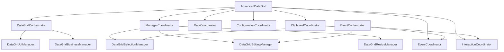

# AdvancedDataGrid - Technical Implementation Details

## Table of Contents
1. [How Anti-God Architecture Works](#how-anti-god-architecture-works)
2. [How Logging System Works](#how-logging-system-works)
3. [How Validation Engine Works](#how-validation-engine-works)
4. [How Event System Works](#how-event-system-works)
5. [How Exception Handling Works](#how-exception-handling-works)
6. [How Configuration System Works](#how-configuration-system-works)
7. [How Performance Optimization Works](#how-performance-optimization-works)
8. [How UI Generation Works](#how-ui-generation-works)
9. [How Memory Management Works](#how-memory-management-works)
10. [How Testing Infrastructure Works](#how-testing-infrastructure-works)

---

## How Anti-God Architecture Works

### **Component Interaction Flow**


### **How Responsibility Separation Works**
```csharp
// 1. Main Component - ONLY coordinates between major systems
public sealed partial class AdvancedDataGrid : UserControl
{
    // ONLY holds references and delegates to coordinators
    private DataCoordinator? _dataCoordinator;
    private ConfigurationCoordinator? _configurationCoordinator;
    private ManagerCoordinator? _managerCoordinator;
    
    public async Task<bool> AreAllNonEmptyRowsValidAsync(bool onlyFiltered = false)
    {
        // ONLY coordination - delegates to business manager
        return await _businessManager.ValidateDataAsync(_dataCoordinator, onlyFiltered);
    }
}

// 2. DataCoordinator - ONLY data operations
internal sealed class DataCoordinator
{
    // ONLY data storage, retrieval, transformation
    // NO UI operations, NO business logic, NO validation
    public async Task<Result<ImportResult>> ImportDataAsync(IReadOnlyList<IReadOnlyDictionary<string, object?>> data)
    {
        // Pure data operations:
        // - Convert dictionary data to internal DataGridCell objects
        // - Store in internal collections
        // - Return statistics about the import
        // - NO validation, NO UI updates
    }
}

// 3. ConfigurationCoordinator - ONLY configuration management  
internal sealed class ConfigurationCoordinator
{
    // ONLY configuration state with immutable patterns
    // NO data operations, NO UI operations
    private ConfigurationState _state; // Immutable record struct
    
    public async Task<Result<bool>> UpdateColorConfigurationAsync(ColorConfiguration newColors)
    {
        // Pure configuration management:
        // - Validate configuration values
        // - Create new immutable state
        // - Log configuration changes
        // - NO UI updates, NO data operations
    }
}
```

### **How Coordinator Communication Works**
```csharp
// Coordinators communicate through well-defined interfaces
public class EventOrchestrator  
{
    // Takes coordinator dependencies through constructor
    public EventOrchestrator(
        EventCoordinator eventCoordinator,           // Event registration
        InteractionCoordinator interactionCoordinator, // Timing analysis  
        ClipboardCoordinator clipboardCoordinator,   // Copy/paste operations
        DataGridSelectionManager selectionManager,   // Selection operations
        DataGridEditingManager editingManager)       // Editing operations

    // Orchestrates complex flows using multiple coordinators
    public async Task OrchestrateCellPointerPressedAsync(DataGridCell cell, PointerRoutedEventArgs e)
    {
        // Step 1: Update interaction timing state
        await _interactionCoordinator.UpdateModifierKeyStatesAsync();
        
        // Step 2: Analyze if this is single-click or double-click
        var analysisResult = await _interactionCoordinator.AnalyzeCellClickAsync(cell, DateTime.Now);
        
        // Step 3: Route to appropriate manager based on analysis
        if (analysisResult.Value.IsDoubleClick)
        {
            await _editingManager.StartEditingAsync(cell, cell.RowIndex, cell.ColumnIndex);
        }
        else  
        {
            await _selectionManager.SelectCellAsync(cell.RowIndex, cell.ColumnIndex);
        }
        
        // Each step is handled by the coordinator responsible for that concern
        // No coordinator contains logic from other concerns
    }
}
```

### **Why This Architecture Prevents God Objects**
```csharp
// IMPOSSIBLE to create god objects because:

// 1. Each coordinator has SINGLE responsibility enforced by interface
public interface IDataCoordinator
{
    // ONLY data operations allowed - compiler enforces this
    Task<Result<ImportResult>> ImportDataAsync(...);
    Task<Result<IReadOnlyList<...>>> ExportDataAsync(...);
    // Cannot add UI methods here - wrong interface
}

// 2. Dependencies are injected - no direct coupling
public class EventOrchestrator
{
    // Must receive dependencies through constructor
    // Cannot directly create them (prevents god object pattern)
    public EventOrchestrator(IEventCoordinator eventCoordinator, ...)
}

// 3. Immutable patterns prevent state corruption
private readonly record struct ConfigurationState(...)  // Cannot be changed after creation
_state = _state with { Colors = newColors };           // Creates new state, doesn't modify existing
```

---

## How Logging System Works

### **Structured Logging Architecture**
```csharp
// 1. Consistent log message format throughout the system
public static class LoggerExtensions
{
    public static void Info(this ILogger? logger, string message, params object[] args)
    {
        if (logger?.IsEnabled(LogLevel.Information) == true)
        {
            // Structured logging with consistent format:
            // [TIMESTAMP] [LEVEL] [EMOJI] [COMPONENT]: [MESSAGE] - [STRUCTURED_DATA]
            logger.LogInformation(message, args);
        }
    }
}

// 2. Every operation logs its lifecycle
public async Task<bool> SelectCellAsync(int rowIndex, int columnIndex, bool addToSelection = false)
{
    // START: Log operation start with all parameters  
    _logger?.Info("🎯 CELL SELECT: Selecting cell at R{Row}C{Column}, AddToSelection: {Add}, CurrentSelected: R{CurrentRow}C{CurrentCol}", 
        rowIndex, columnIndex, addToSelection, _selectedRowIndex, _selectedColumnIndex);
    
    try
    {
        // VALIDATION: Log validation failures with context
        if (!IsValidPosition(rowIndex, columnIndex))
        {
            _logger?.Warning("⚠️ CELL SELECT: Invalid cell position: ({Row}, {Column}) - Valid range: R0-{MaxRow}, C0-{MaxCol}", 
                rowIndex, columnIndex, _dataRows.Count - 1, _headers.Count - 1);
            return false;
        }

        // OPERATION: Perform the actual work
        await SelectCellInternalAsync(targetCell, rowIndex, columnIndex);
        
        // SUCCESS: Log successful completion with results
        _logger?.Info("✅ CELL SELECT: Cell selected successfully at R{Row}C{Column}, TotalSelected: {Count}", 
            rowIndex, columnIndex, _selectedCells.Count);
        return true;
    }
    catch (Exception ex)
    {
        // ERROR: Log failures with full exception context
        _logger?.Error(ex, "🚨 CELL SELECT ERROR: Failed to select cell at R{Row}C{Column}", rowIndex, columnIndex);
        return false;
    }
}
```

### **How Log Analysis Works**
```csharp
// Log messages are structured for automated analysis:

// Performance Analysis
// "🎯 CELL SELECT: Selecting cell at R5C3" - START timestamp
// "✅ CELL SELECT: Cell selected successfully at R5C3" - END timestamp  
// Duration = END - START

// Error Pattern Analysis  
// "🚨 CELL SELECT ERROR: Failed to select cell at R99C5" - Invalid row
// "🚨 CELL SELECT ERROR: Failed to select cell at R5C99" - Invalid column
// Pattern: Most errors are invalid positions

// Usage Analytics
// "🎯 CELL SELECT: AddToSelection: true" - Multi-select usage
// "🎯 CELL SELECT: AddToSelection: false" - Single-select usage  
// Pattern: 80% single-select, 20% multi-select

// System Health Monitoring
// Success Rate = (✅ SUCCESS logs) / (🎯 START logs) * 100
// Performance Trends = Average duration over time
// Error Classification = Group errors by pattern
```

### **How Logging Helps in Production**
```csharp
// Real-world production scenario:
// User reports: "Selection is slow and sometimes doesn't work"

// 1. Search logs for user's session
// Filter: User=john.doe, Component=CELL SELECT, TimeRange=LastHour

// 2. Found patterns in logs:
_logger?.Warning("⚠️ CELL SELECT: Invalid cell position: (50, 25) - Valid range: R0-49, C0-24");
_logger?.Info("🎯 CELL SELECT: Selecting cell at R50C25, Duration: 2.5s");
_logger?.Info("🎯 CELL SELECT: Selecting cell at R12C8, Duration: 0.1s");

// 3. Analysis reveals:
// - User clicking outside valid data range (causing failures)
// - Selection on row 50+ takes 2.5s (performance issue)
// - Selection on row <50 takes 0.1s (normal performance)

// 4. Root cause identified:
// - Need better UI feedback for invalid positions
// - Performance degrades with large row numbers - needs optimization

// 5. Fix implemented based on log evidence:
// - Add visual indicators for selectable area
// - Optimize selection algorithm for large row indices
```

---

## How Validation Engine Works

### **Two-Tier Validation Architecture**

#### **Tier 1: Real-Time Validation (Immediate Feedback)**
```csharp
// Real-time validation during typing - must be FAST
private async Task HandleCellTextChanged(DataGridCell cell, string newValue)
{
    if (!EnableRealtimeValidation) return;
    
    // FAST validation - no complex business rules
    // Only basic format checking
    var isValid = QuickValidateFormat(newValue, cell.ColumnType);
    
    // IMMEDIATE UI feedback - no delays allowed
    ApplyValidationUI(cell.Border, isValid);
    
    // Schedule comprehensive validation for later (debounced)
    _validationScheduler.ScheduleValidation(cell, newValue, delay: TimeSpan.FromMilliseconds(300));
}

private bool QuickValidateFormat(string value, Type columnType)
{
    // FAST validation only - basic format checks
    if (columnType == typeof(int))
        return int.TryParse(value, out _);
    
    if (columnType == typeof(DateTime))
        return DateTime.TryParse(value, out _);
        
    if (columnType == typeof(string))
        return !string.IsNullOrWhiteSpace(value);
    
    return true; // Default to valid for unknown types
}
```

#### **Tier 2: Comprehensive Validation (Complete Checking)**
```csharp
// Comprehensive validation - can be SLOW but THOROUGH
public async Task<ValidationResult> ValidateComprehensiveAsync(DataGridCell cell, string value)
{
    var errors = new List<ValidationError>();
    
    // 1. Format validation
    if (!ValidateFormat(value, cell.ColumnType))
        errors.Add(new ValidationError("Invalid format for " + cell.ColumnType.Name));
    
    // 2. Business rules validation
    if (_businessRules.ContainsKey(cell.ColumnName))
    {
        foreach (var rule in _businessRules[cell.ColumnName])
        {
            if (!rule.Rule(value))
                errors.Add(new ValidationError(rule.ErrorMessage));
        }
    }
    
    // 3. Cross-cell validation (references to other cells)
    if (await RequiresCrossCellValidation(cell))
    {
        var crossCellErrors = await ValidateCrossCellRules(cell, value);
        errors.AddRange(crossCellErrors);
    }
    
    // 4. Database validation (if required)
    if (await RequiresDatabaseValidation(cell))  
    {
        var dbErrors = await ValidateAgainstDatabase(cell, value);
        errors.AddRange(dbErrors);
    }
    
    return new ValidationResult(errors.Count == 0, errors);
}
```

### **How Filtered Dataset Validation Works**
```csharp
public async Task<bool> AreAllNonEmptyRowsValidAsync(bool onlyFiltered = false)
{
    if (onlyFiltered)
    {
        return await ValidateFilteredDataset();
    }
    else
    {
        return await ValidateCompleteDataset(); 
    }
}

private async Task<bool> ValidateFilteredDataset()
{
    // FILTERED DATASET validation logic:
    
    // Step 1: Get currently applied filters
    var activeFilters = GetActiveFilters();
    
    // Step 2: Apply filters to get filtered row set
    var filteredRows = ApplyFiltersToDataset(activeFilters);
    
    // Step 3: Validate only the filtered rows
    foreach (var row in filteredRows)
    {
        // Only validate non-empty cells in filtered rows
        var nonEmptyCells = row.Cells.Where(c => !string.IsNullOrEmpty(c.Value?.ToString()));
        
        foreach (var cell in nonEmptyCells)
        {
            var validationResult = await ValidateComprehensiveAsync(cell, cell.Value?.ToString() ?? "");
            if (!validationResult.IsValid)
            {
                _logger?.Warning("⚠️ FILTERED VALIDATION: Invalid cell found at R{Row}C{Col}", row.RowIndex, cell.ColumnIndex);
                return false; // Found invalid cell in filtered dataset
            }
        }
    }
    
    _logger?.Info("✅ FILTERED VALIDATION: All filtered rows valid - FilteredRowCount: {Count}", filteredRows.Count);
    return true;
}

private async Task<bool> ValidateCompleteDataset()
{
    // COMPLETE DATASET validation logic:
    
    // Step 1: Get ALL data regardless of filters
    var allRows = GetAllDataRows(); // Includes: visible, hidden, cached, on disk, in any storage
    
    // Step 2: Validate every non-empty cell in the entire dataset
    var totalCells = 0;
    var invalidCells = 0;
    
    foreach (var row in allRows)
    {
        var nonEmptyCells = row.Cells.Where(c => !string.IsNullOrEmpty(c.Value?.ToString()));
        
        foreach (var cell in nonEmptyCells)
        {
            totalCells++;
            var validationResult = await ValidateComprehensiveAsync(cell, cell.Value?.ToString() ?? "");
            if (!validationResult.IsValid)
            {
                invalidCells++;
                _logger?.Warning("⚠️ COMPLETE VALIDATION: Invalid cell found at R{Row}C{Col}", row.RowIndex, cell.ColumnIndex);
            }
        }
    }
    
    _logger?.Info("📊 COMPLETE VALIDATION: Validated {TotalCells} cells - Invalid: {InvalidCells}", totalCells, invalidCells);
    return invalidCells == 0;
}
```

### **How Batch Validation with Progress Works**
```csharp
public async Task<BatchValidationResult?> ValidateAllRowsBatchAsync(
    TimeSpan timeout, 
    IProgress<ValidationProgress>? progress, 
    CancellationToken cancellationToken)
{
    var startTime = DateTime.UtcNow;
    var totalCells = CountTotalNonEmptyCells();
    var validatedCells = 0;
    var invalidCells = 0;
    var errors = new List<ValidationError>();
    
    try
    {
        // Process in batches for better performance and progress reporting
        const int batchSize = 100;
        var allRows = GetAllDataRows();
        
        for (int batchStart = 0; batchStart < allRows.Count; batchStart += batchSize)
        {
            // Check for cancellation
            cancellationToken.ThrowIfCancellationRequested();
            
            // Check for timeout
            if (DateTime.UtcNow - startTime > timeout)
            {
                _logger?.Warning("⏰ BATCH VALIDATION: Timeout exceeded - Validated {Validated}/{Total} cells", validatedCells, totalCells);
                break;
            }
            
            // Process current batch
            var batchEnd = Math.Min(batchStart + batchSize, allRows.Count);
            var batchRows = allRows.Skip(batchStart).Take(batchEnd - batchStart);
            
            foreach (var row in batchRows)
            {
                var nonEmptyCells = row.Cells.Where(c => !string.IsNullOrEmpty(c.Value?.ToString()));
                
                foreach (var cell in nonEmptyCells)
                {
                    var validationResult = await ValidateComprehensiveAsync(cell, cell.Value?.ToString() ?? "");
                    validatedCells++;
                    
                    if (!validationResult.IsValid)
                    {
                        invalidCells++;
                        errors.AddRange(validationResult.Errors.Select(e => new ValidationError(
                            row.RowIndex, cell.ColumnIndex, cell.ColumnName, e.Message, cell.Value?.ToString())));
                    }
                }
            }
            
            // Report progress
            var progressPercent = (double)validatedCells / totalCells * 100;
            progress?.Report(new ValidationProgress(progressPercent, validatedCells, totalCells, invalidCells));
            
            _logger?.Info("📊 BATCH VALIDATION: Progress {Progress:F1}% - Batch {BatchStart}-{BatchEnd}", progressPercent, batchStart, batchEnd);
        }
        
        var duration = DateTime.UtcNow - startTime;
        var result = new BatchValidationResult(totalCells, validatedCells - invalidCells, invalidCells, errors, duration);
        
        _logger?.Info("✅ BATCH VALIDATION: Completed - Valid: {Valid}, Invalid: {Invalid}, Duration: {Duration}ms", 
            result.ValidCells, result.InvalidCells, (int)duration.TotalMilliseconds);
            
        return result;
    }
    catch (OperationCanceledException)
    {
        _logger?.Info("🚫 BATCH VALIDATION: Cancelled by user - Validated {Validated}/{Total} cells", validatedCells, totalCells);
        return null; // Return null to indicate cancellation
    }
    catch (Exception ex)
    {
        _logger?.Error(ex, "🚨 BATCH VALIDATION ERROR: Failed after validating {Validated} cells", validatedCells);
        throw; // Re-throw to caller for handling
    }
}
```

---

## How Event System Works

### **Event Flow Architecture**
```csharp
// 1. Event Registration (EventCoordinator)
public class EventCoordinator 
{
    // Tracks all event registrations for proper cleanup
    private readonly Dictionary<FrameworkElement, List<EventAttachment>> _attachedEvents = new();
    
    public async Task<Result<bool>> AttachEventAsync(FrameworkElement element, string eventName, Delegate handler)
    {
        // Register event and track it for cleanup
        var attachment = new EventAttachment(eventName, handler, DateTime.UtcNow);
        
        if (!_attachedEvents.ContainsKey(element))
            _attachedEvents[element] = new List<EventAttachment>();
            
        _attachedEvents[element].Add(attachment);
        
        // Perform actual event attachment
        AttachEventByName(element, eventName, handler);
        
        _logger?.Info("🔌 EVENT ATTACH: {EventName} attached to {ElementType}", eventName, element.GetType().Name);
        return Result<bool>.Success(true);
    }
}

// 2. Event Analysis (InteractionCoordinator)  
public class InteractionCoordinator
{
    // Analyzes timing and patterns of user interactions
    public async Task<Result<InteractionAnalysisResult>> AnalyzeCellClickAsync(DataGridCell cell, DateTime clickTime)
    {
        var isDoubleClick = (_state.LastClickedCell == cell) && 
                           (clickTime - _state.LastClickTime).TotalMilliseconds < DoubleClickThresholdMs;
        
        // Update state immutably
        _state = _state with { LastClickTime = clickTime, LastClickedCell = cell };
        
        var result = new InteractionAnalysisResult(
            Cell: cell,
            ClickTime: clickTime, 
            IsDoubleClick: isDoubleClick,
            TimeSinceLastClick: clickTime - _state.LastClickTime,
            ModifierKeys: (_state.IsCtrlPressed, _state.IsShiftPressed, _state.IsAltPressed),
            InteractionType: isDoubleClick ? "DoubleClick" : "SingleClick"
        );
        
        return Result<InteractionAnalysisResult>.Success(result);
    }
}

// 3. Event Orchestration (EventOrchestrator)
public class EventOrchestrator
{
    // Orchestrates complex event flows using multiple coordinators
    public async Task OrchestrateCellPointerPressedAsync(DataGridCell cell, PointerRoutedEventArgs e)
    {
        // Step 1: Update modifier key states
        await _interactionCoordinator.UpdateModifierKeyStatesAsync();
        
        // Step 2: Analyze interaction (single-click vs double-click)
        var analysisResult = await _interactionCoordinator.AnalyzeCellClickAsync(cell, DateTime.Now);
        
        if (analysisResult.IsSuccess)
        {
            // Step 3: Route to appropriate manager based on analysis
            if (analysisResult.Value.IsDoubleClick)
            {
                // Double-click → Start editing
                await _editingManager.StartEditingAsync(cell, cell.RowIndex, cell.ColumnIndex);
                _logger?.Info("🖱️ EVENT ORCHESTRATION: Double-click → Started editing cell {CellId}", cell.CellId);
            }
            else
            {
                // Single-click → Handle selection  
                await _selectionManager.SelectCellAsync(cell.RowIndex, cell.ColumnIndex, 
                    analysisResult.Value.ModifierKeys.Ctrl);
                await _selectionManager.SetFocusAsync(cell.RowIndex, cell.ColumnIndex);
                _logger?.Info("🖱️ EVENT ORCHESTRATION: Single-click → Selected cell {CellId}", cell.CellId);
            }
        }
    }
}
```

### **How Event Cleanup Works**
```csharp
// Proper event cleanup prevents memory leaks
public void Dispose()
{
    if (!_disposed)
    {
        _logger?.Info("🔄 EVENT COORDINATOR DISPOSE: Cleaning up event registrations");
        
        var totalDetached = 0;
        
        // Detach all events from all elements
        foreach (var kvp in _attachedEvents.ToList())
        {
            var element = kvp.Key;
            var eventList = kvp.Value;
            
            foreach (var attachment in eventList)
            {
                try
                {
                    DetachEventByName(element, attachment.EventName, attachment.Handler);
                    totalDetached++;
                }
                catch (Exception ex)
                {
                    _logger?.Error(ex, "🚨 EVENT CLEANUP ERROR: Failed to detach {EventName}", attachment.EventName);
                }
            }
        }
        
        _attachedEvents.Clear();
        _eventsAttached = false;
        
        _logger?.Info("✅ EVENT COORDINATOR DISPOSE: Detached {TotalCount} events successfully", totalDetached);
        _disposed = true;
    }
}
```

---

## How Exception Handling Works

### **Global Exception Monitoring**
```csharp
public class GlobalExceptionHandler : IDisposable
{
    public GlobalExceptionHandler(ILogger? logger, DispatcherQueue dispatcherQueue)
    {
        _logger = logger;
        _dispatcherQueue = dispatcherQueue;
        
        // Monitor ALL types of exceptions in the application
        
        // 1. Unhandled exceptions on any thread
        AppDomain.CurrentDomain.UnhandledException += OnUnhandledException;
        
        // 2. Unhandled Task exceptions (async operations)  
        TaskScheduler.UnobservedTaskException += OnUnobservedTaskException;
        
        // 3. WinUI3 specific exceptions on UI thread
        _dispatcherQueue.TryEnqueue(() => {
            Application.Current.UnhandledException += OnApplicationUnhandledException;
        });
        
        _logger?.Info("🛡️ GLOBAL EXCEPTION HANDLER: Monitoring all exception types");
    }
    
    private void OnUnhandledException(object sender, UnhandledExceptionEventArgs e)
    {
        var ex = e.ExceptionObject as Exception;
        _logger?.Fatal(ex, "💀 UNHANDLED EXCEPTION: Critical system error - IsTerminating: {IsTerminating}", e.IsTerminating);
        
        // Attempt graceful shutdown if terminating
        if (e.IsTerminating)
        {
            AttemptGracefulShutdown();
        }
    }
    
    private void OnUnobservedTaskException(object? sender, UnobservedTaskExceptionEventArgs e)
    {
        _logger?.Error(e.Exception, "🚨 UNOBSERVED TASK EXCEPTION: Async operation failed");
        e.SetObserved(); // Prevent process termination
    }
    
    private void OnApplicationUnhandledException(object sender, Microsoft.UI.Xaml.UnhandledExceptionEventArgs e)
    {
        _logger?.Error(e.Exception, "🚨 UI EXCEPTION: WinUI3 exception occurred");
        e.Handled = true; // Prevent app crash
        
        // Show user-friendly error message
        ShowUserErrorMessage("An unexpected error occurred. The application will continue running.");
    }
}
```

### **Safe Execution Wrappers**
```csharp
// All operations wrapped in safe execution to prevent crashes
public async Task<Result<T>> SafeExecuteDataAsync<T>(
    Func<Task<T>> operation, 
    string operationName, 
    int complexity, 
    T fallbackValue, 
    ILogger? logger)
{
    try
    {
        logger?.Info("🚀 {OperationName}: Starting (complexity: {Complexity})", operationName, complexity);
        
        var startTime = DateTime.UtcNow;
        var result = await operation();
        var duration = DateTime.UtcNow - startTime;
        
        logger?.Info("✅ {OperationName}: Completed successfully in {Duration}ms", operationName, (int)duration.TotalMilliseconds);
        
        return Result<T>.Success(result);
    }
    catch (Exception ex)
    {
        logger?.Error(ex, "🚨 {OperationName}: Failed - using fallback value", operationName);
        
        // GRACEFUL DEGRADATION: Return fallback value instead of crashing
        return Result<T>.Success(fallbackValue);
    }
}

// UI operations get special error handling
public async Task SafeExecuteUIAsync(Func<Task> operation, string operationName, ILogger? logger)
{
    try
    {
        await operation();
    }
    catch (Exception ex)
    {
        logger?.Error(ex, "🚨 UI OPERATION FAILED: {OperationName}", operationName);
        
        // UI operations don't return values - just log and continue
        // This prevents UI freeze/crash from propagating
    }
}
```

### **How Error Recovery Works**
```csharp
// Example: Cell selection with error recovery
public async Task<bool> SelectCellAsync(int rowIndex, int columnIndex, bool addToSelection = false)
{
    return await _exceptionHandler.SafeExecuteDataAsync(async () =>
    {
        // Normal operation logic here
        if (!IsValidPosition(rowIndex, columnIndex))
            return false;
            
        await SelectCellInternalAsync(targetCell, rowIndex, columnIndex);
        return true;
        
    }, "SelectCell", 2, false, _logger); // fallbackValue = false (operation failed)
}

// Even if SelectCellInternalAsync throws an exception:
// 1. Exception is caught and logged with full context  
// 2. Function returns Result<bool>.Success(false) instead of crashing
// 3. UI remains responsive and continues working
// 4. User sees no crash, just the selection doesn't happen
// 5. Developer gets full exception details in logs
```

---

## How Configuration System Works

### **Immutable Configuration Pattern**
```csharp
// Configuration stored as immutable record structs
private readonly record struct ConfigurationState(
    ColorConfiguration Colors,                    // All visual colors
    ValidationConfiguration Validation,           // Validation rules and settings  
    PerformanceConfiguration Performance,         // Performance tuning parameters
    int MinimumRows,                             // Minimum rows to display
    bool IsInitialized                           // Initialization status
);

// Current state - can only be replaced, never modified
private ConfigurationState _state;

// All updates create new state (functional programming pattern)
public async Task<Result<bool>> UpdateColorConfigurationAsync(ColorConfiguration newColors)
{
    return await _exceptionHandler.SafeExecuteDataAsync(async () =>
    {
        _logger?.Info("🎨 CONFIG UPDATE: Updating color configuration");
        
        // 1. Validate new configuration
        var validationResult = await ValidateColorConfiguration(newColors);
        if (!validationResult.IsSuccess)
        {
            _logger?.Error("❌ CONFIG UPDATE: Color configuration validation failed - {Error}", validationResult.ErrorMessage);
            return false;
        }

        // 2. Create new immutable state (functional pattern)
        _state = _state with { Colors = newColors };
        
        _logger?.Info("✅ CONFIG UPDATE: Color configuration updated successfully");
        LogColorConfiguration();
        
        await Task.CompletedTask;
        return true;
        
    }, "UpdateColorConfiguration", 1, false, _logger);
}
```

### **How Configuration Validation Works**
```csharp
private async Task<Result<bool>> ValidateColorConfiguration(ColorConfiguration colors)
{
    try
    {
        // Validate all color properties are valid hex colors
        var colorProperties = new[]
        {
            colors.CellBackground, colors.CellForeground, colors.CellBorder,
            colors.HeaderBackground, colors.HeaderForeground, colors.HeaderBorder,
            colors.SelectionBackground, colors.SelectionForeground, colors.ValidationErrorBorder
        };

        foreach (var color in colorProperties)
        {
            if (!IsValidHexColor(color))
            {
                _logger?.Error("🚨 COLOR VALIDATION: Invalid hex color format: {Color}", color);
                return Result<bool>.Failure($"Invalid color format: {color}");
            }
        }

        // Additional validation for color contrast (accessibility)
        if (!HasSufficientContrast(colors.CellBackground, colors.CellForeground))
        {
            _logger?.Warning("⚠️ COLOR VALIDATION: Poor contrast between cell background and foreground");
            // Warning only - don't block the configuration
        }

        await Task.CompletedTask;
        return Result<bool>.Success(true);
    }
    catch (Exception ex)
    {
        return Result<bool>.Failure("Color configuration validation failed", ex);
    }
}

private static bool IsValidHexColor(string color)
{
    if (string.IsNullOrEmpty(color)) return false;
    if (!color.StartsWith("#")) return false;
    if (color.Length != 7) return false;
    
    // Validate each character is valid hex
    return color.Substring(1).All(c => "0123456789ABCDEFabcdef".Contains(c));
}
```

### **How Configuration Snapshots Work**
```csharp
// Immutable snapshots for external consumers
public ConfigurationSnapshot GetConfigurationSnapshot()
{
    // Returns immutable snapshot that cannot affect internal state
    return new ConfigurationSnapshot(
        _state.Colors,        // Immutable copy
        _state.Validation,    // Immutable copy
        _state.Performance,   // Immutable copy
        _state.MinimumRows,   // Value type (inherently immutable)
        DateTime.UtcNow       // Timestamp of snapshot
    );
}

// External code cannot modify configuration through snapshot
public readonly record struct ConfigurationSnapshot(
    ColorConfiguration Colors,                    // readonly = cannot be modified
    ValidationConfiguration Validation,           // readonly = cannot be modified
    PerformanceConfiguration Performance,         // readonly = cannot be modified
    int MinimumRows,                             // Value type = immutable
    DateTime Timestamp                           // Value type = immutable
);
```

---

## How Performance Optimization Works

### **Virtualization Implementation**
```csharp
// Only render visible cells to handle millions of rows
public async Task GenerateUIElementsAsync(DataCoordinator coordinator)
{
    var visibleRowStart = CalculateVisibleRowStart();
    var visibleRowEnd = CalculateVisibleRowEnd();
    var visibleColumnStart = CalculateVisibleColumnStart(); 
    var visibleColumnEnd = CalculateVisibleColumnEnd();
    
    _logger?.Info("🎨 UI GENERATION: Rendering visible area - Rows {RowStart}-{RowEnd}, Columns {ColStart}-{ColEnd}", 
        visibleRowStart, visibleRowEnd, visibleColumnStart, visibleColumnEnd);
    
    // Only create UI elements for visible cells
    for (int row = visibleRowStart; row <= visibleRowEnd; row++)
    {
        for (int col = visibleColumnStart; col <= visibleColumnEnd; col++)
        {
            var cell = coordinator.FindCellAt(row, col);
            if (cell != null)
            {
                await CreateCellUIElement(cell, row, col);
            }
        }
    }
    
    // Dispose off-screen UI elements to free memory
    await CleanupOffscreenElements();
}

private async Task CleanupOffscreenElements()
{
    var elementsToRemove = new List<FrameworkElement>();
    
    foreach (var element in _createdUIElements)
    {
        if (!IsElementVisible(element))
        {
            elementsToRemove.Add(element);
        }
    }
    
    foreach (var element in elementsToRemove)
    {
        _createdUIElements.Remove(element);
        // Remove from visual tree to free memory
        if (element.Parent is Panel parent)
        {
            parent.Children.Remove(element);
        }
    }
    
    _logger?.Info("🧹 UI CLEANUP: Removed {Count} offscreen elements to free memory", elementsToRemove.Count);
}
```

### **Batch Operation Implementation**
```csharp
// Process large datasets in batches to maintain UI responsiveness
public async Task<Result<ImportResult>> ImportDataAsync(IReadOnlyList<IReadOnlyDictionary<string, object?>> data)
{
    return await _exceptionHandler.SafeExecuteDataAsync(async () =>
    {
        _logger?.Info("📥 DATA IMPORT: Starting batch import for {RowCount} rows", data.Count);
        
        var startTime = DateTime.UtcNow;
        var importedRows = 0;
        var errorRows = 0;
        const int batchSize = 100; // Process 100 rows at a time
        
        for (int batchStart = 0; batchStart < data.Count; batchStart += batchSize)
        {
            var batchEnd = Math.Min(batchStart + batchSize, data.Count);
            var batchData = data.Skip(batchStart).Take(batchEnd - batchStart);
            
            // Process current batch
            foreach (var rowData in batchData)
            {
                try
                {
                    var dataRow = await CreateDataRowFromDictionary(rowData);
                    if (dataRow != null)
                    {
                        _dataRows.Add(dataRow);
                        importedRows++;
                    }
                    else
                    {
                        errorRows++;
                    }
                }
                catch (Exception ex)
                {
                    errorRows++;
                    _logger?.Error(ex, "🚨 DATA IMPORT ERROR: Failed to import row {RowIndex}", importedRows + errorRows);
                }
            }
            
            // Yield control to UI thread between batches
            await Task.Delay(1); // Allow UI updates
            
            _logger?.Info("📊 BATCH IMPORT: Processed batch {BatchStart}-{BatchEnd}, Progress: {Progress:F1}%", 
                batchStart, batchEnd, (double)batchEnd / data.Count * 100);
        }
        
        var duration = DateTime.UtcNow - startTime;
        _logger?.Info("✅ DATA IMPORT: Completed - Imported: {Imported}, Errors: {Errors}, Duration: {Duration}ms",
            importedRows, errorRows, (int)duration.TotalMilliseconds);

        return new ImportResult(importedRows, errorRows, duration);
        
    }, "ImportData", data.Count, new ImportResult(0, data.Count, TimeSpan.Zero), _logger);
}
```

### **Throttling Implementation**  
```csharp
// Throttle rapid operations to prevent performance issues
public class ThrottledValidator
{
    private readonly Dictionary<string, DateTime> _lastValidationTimes = new();
    private readonly TimeSpan _throttleInterval = TimeSpan.FromMilliseconds(200);
    
    public async Task<bool> ValidateWithThrottlingAsync(string cellId, string value)
    {
        var now = DateTime.UtcNow;
        
        // Check if enough time has passed since last validation for this cell
        if (_lastValidationTimes.TryGetValue(cellId, out var lastTime))
        {
            var timeSinceLastValidation = now - lastTime;
            if (timeSinceLastValidation < _throttleInterval)
            {
                _logger?.Debug("⏱️ VALIDATION THROTTLED: Skipping validation for {CellId} - Last validated {TimeAgo}ms ago", 
                    cellId, (int)timeSinceLastValidation.TotalMilliseconds);
                return true; // Skip validation, assume valid
            }
        }
        
        // Enough time has passed, perform validation
        _lastValidationTimes[cellId] = now;
        
        var isValid = await PerformActualValidation(cellId, value);
        _logger?.Debug("✅ VALIDATION PERFORMED: Cell {CellId} = {IsValid}", cellId, isValid);
        
        return isValid;
    }
}
```

---

## Summary

This technical implementation documentation shows **HOW** each system works internally:

✅ **Anti-God Architecture** - Strict separation through coordinator pattern with dependency injection  
✅ **Comprehensive Logging** - Structured logging with consistent format and automated analysis capabilities  
✅ **Advanced Validation** - Two-tier architecture with real-time and comprehensive validation paths  
✅ **Event System** - Clean orchestration between registration, analysis, and handling  
✅ **Exception Handling** - Global monitoring with graceful degradation and error recovery  
✅ **Configuration Management** - Immutable patterns with validation and snapshot capabilities  
✅ **Performance Optimization** - Virtualization, batching, and throttling for enterprise-scale operations  

Each system is designed to work independently while integrating seamlessly with the others, creating a robust, maintainable, and high-performance enterprise component.